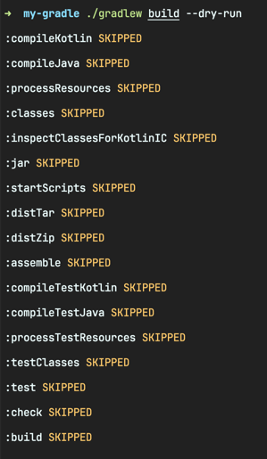
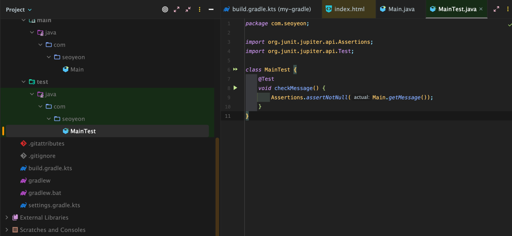

<!-- Date: 2025-01-28 -->
<!-- Update Date: 2025-01-28 -->
<!-- File ID: 25d7848d-014b-4124-9fb7-3ce328b8adbf -->
<!-- Author: Seoyeon Jang -->

# 개요

`assemble` 태스크는 메인 코드를 컴파일하고 패키징하지만, 테스트도 컴파일하고 실행해야 한다. `build` 태스크는 다음과 같이 그 작업을 수행하도록 구성돼있다.



다음과 같이 표준 위치에 테스트케이스를 추가하자.



다음 단계로, 테스트 작업을 실행할 때 그래들이 JUnit을 사용해야 하는 것을 알려줘야 한다.

```groovy
tasks.named < Test > ("test") {
    useJUnitPlatform()
}
```

스택 트레이스를 포함한 전체 목록과 HTML기반 보고서는 `build/reports/test`아래에 생성한다.

# 정리


