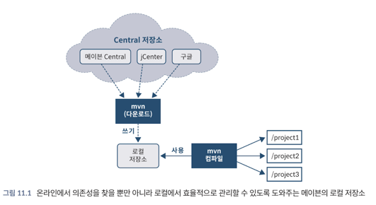
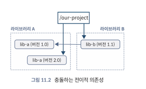

<!-- Date: 2025-01-21 -->
<!-- Update Date: 2025-01-21 -->
<!-- File ID: 34a43434-383e-4f62-8b5c-4c67f11fcceb -->
<!-- Author: Seoyeon Jang -->

빌드 도구가 왜 중요한가?

# 11.1.2 의존성 관리

**자바의 초창기에는 라이브러리를 사용하려면 해당 JAR파일을 어딘가에서 찾아 다운로드하고 애플리케이션의 클래스패스에 넣어야 했다.** (극혐) 이로 인해 여러가지 문제가 발생했다. 특히 모든 라이브러리에 대해
신뢰할 수 있는 중앙 저장소가 없었으므로, 자주 사용하지 않는 의존성에 대한 JAR를 찾기 위해 보물찾기를 해야하는 경우도 있었다.

이는 분명 이상적이지 않았기 때문에 메이븐이 의존성을 찾아 설치할 수 있는 자바 에코시스템 저장소를 제공했다. 메이븐 Central은 오늘까지도 인터넷에서 자바 의존성을 찾는데 사용되는 가장 일반적인 레지스트리다.
그 외에도 구글에서 호스팅하거나 깃허브에서 공유하는 것과 같은 공개 레지스트리와 Artifactory와 같은 제품을 통한 비공개 설치도 존재한다.

모든 코드를 다운로드하는 데 많은 시간이 소요될 수 있으므로 빌드도구는 프로젝트 간에 아티팩트를 공유해서 수고를 줄여줄 수 있는 몇가지 방법을 표준화했다. 바로 캐싱할 로컬 저장소를 사용하면 두번째 프로젝트에서
동일한 라이브러리가 필요해도 다시 다운로드할 필요가 없다. 물론 이 접근 방식은 디스크 공간도 절약할 수 있지만, 아티팩트의 단일 소스가 진정한 장점이다.

> **NOTE** 모듈화된 라이브러리는 module-info.class 파일이 추가된 JAR 파일로 제공된다.

레지스트리는 의존성을 찾고 다운로드할 수 있는 중앙 집중식 공간을 제공하는 것 외에도, **전이적 의존성(transitive dependency)** 을 더 잘 관리할 수 있는 문을 열었다. 자바에서는 프로젝트
자체에서 사용하는 라이브러리가 다른 라이브러리에 종속된 경우를 흔히 볼 수 있다. 2장에서 모듈의 전이적 의존성에 대해 이미 다루었지만, 이 문제는 자바 모듈이 등장하기 훨씬 이전부터 존재했다. 사실 모듈 이전에는
문제가 훨씬 더 심각했다.

JAR 파일은 압축 파일일 뿐이며 JAR의 의존성을 설명하는 메타데이터가 없다. 즉 JAR의 의존성은 JAR에 있는 모든 클래스의 의존성을 합친 것이다.

더 나쁜 점은, 클래스 파일의 형식은 어떤 버전의 클래스가 의존성을 충족시키기 위해 필요한지를 설명하지 않는다. 가진 것은 클래스나 메서드 이름의 심볼릭 설명자 뿐이다. 이는 다음 두가지 사항을 의미한다.

1. 의존성 정보를 담은 외부 소스가 필요하다
2. 프로젝트가 커짐에 따라 전이적 의존성 그래프가 점점 복잡해진다.

오픈소스라이브러리와 개발자 지원 프레임워크가 급증하면서 실제 프로젝트의 전이적 의존성 트리는 계속해서 커져만 갔다.

한가지 좋은 소식은 JVM 생태계의 상황이 자바스크립트보다는 다소 낫다는 점이다. 자바스크립트에는 개발 환경에서 필요한 기본적인 기능과 런타임 라이브러리가 없기 때문에 많은 기본 기능을 외부 의존성으로 관리해야
한다. 이로 인해 동일한 기능의 여러 버전을 제공하는 호환되지 않는 라이브러리와 잘못된 처리, 악의적 공격이 공동체에 지나치게 큰 영향을 미칠 수 있는 민감한 생태계가 만들어졌다(
ex: [2016년의 left-pad 사건](http://mng.bz/5Q64))

반면 자바에는 일반적으로 필요한 많은 클래스가 포함된 런타임 라이브러리(JRE)가 있으며, 이는 모든 자바 환경에서 사용할 수 있다. 그러나 실제 프로덕션 애플리케이션에는 JRE에 포함된 기능 이상의 기능이
필요하며, 수동으로 관리하기에는 의존성 계층이 너무 많은 경우가 대부분이므로 유일한 해결책은 이를 자동화하는 것이다.

## 충돌 발생

의존성을 업그레이드하는 것은 종종 문제를 일으킬 수 있다. 다음은 문제가 될 수 있는 의존성 트리를 보여준다.

우리는 명시적으로 `lib-a`의 2.0 버전을 요청했지만, 의존성인 `lib-b`는 오래된 버전인 1.0을 요청했다. 이것은 의존성 충돌로 알려져 있으며, 이를 어떻게 해결하느냐에 따라 다양한 다른 문제가 발생할
수 있다.

라이브러리 버전이 일치하지 않으면 어떤 유형의 문제가 발생할까? 이는 버전 간 변경 사항의 성격에 따라 다르다. 변경 사항은 다음과 같이 몇가지 범주로 분류할 수 있다.

1. 버전 간에 동작만 변경되는 안정적인 API
2. 버전 간에 새로운 클래스나 메서드가 나타나는 추가 API
3. 버전 간에 메서드 서명이나 인터페이스 확장 변경이 있는 **변경된 API**
4. 버전 간에 클래스 또는 메서드가 제거된 **API 제거**

1 또는 2의 경우, 빌드 도구가 어떤 버전의 의존성을 선택했는지 알 수 없을 수도 있다. 하지만 3의 경우, 즉 라이브러리 버전 간에 메서드 시그니처가 변경된 경우, lib-a 2.0이 lib-b 가 의존하는
메서드의 서명을 변경한 경우, lib-b 가 해당 메서드를 호출하려고 할 때 NoSuchMethodError 예외가 발생한다.

4의 경우 메서드를 제거하면 동일한 종류의 NoSuchMethodError 가 발생한다.

클래스 또한 제거나 이름 변경으로 인해 4의 영향을 받을 수 있으며, 이로 인해 NoClassDefFoundError가 발생할 수 있다. 클래스에서 인터페이스를 제거하는 경우 ClassCastException 이
발생할 수도 있다.

**사실 버전 간 변경 사항에 대한 커뮤니케이션은 모든 언어에서 공통적으로 발생하는 문제다.** 이 문제를 처리하기위해 가장 널리 채택된 접근 방식 중 하나는 **시맨틱 버저닝**이다. 시맨틱 버저닝은 전이적
의존성의 요구사항을 명시하는 어휘를 제공하며, 결과적으로 컴퓨터가 이를 정리하는 데 도움이 된다.

시맨택 버저닝을 사용할 때는 다음 사항을 기억하자.

- 메이저(major)버전 증가(1.X -> 2.X): API에 큰 변경이 있는 경우 (3이나 4와 같은 경우)
- 마이너(minor)버전 증가(1.1 -> 1.2): 역호환성을 유지하면서 추가한 경우 (2와 같은 경우)
- 패치(patch)버전 증가(1.1.0 -> 1.1.1): 버그수정

완벽하지는 않지만 최소한 버전 업데이트에 어느 정도의 변경이 기대되는지를 알려주며, 오픈소스에서 널리 사용된다.

의존성 관리가 쉽지 않은 이유를 알게돼서 걱정이라면, 메이븐과 그래들 모두 도움이 되는 도구를 제공하므로 안심하자. 이 장의 뒷부분에서는 의존성 충돌이 발생했을 때 문제를 해결하기 위해 각 도구가 제공하는 기능을
살펴볼 것이다.

# 정리

