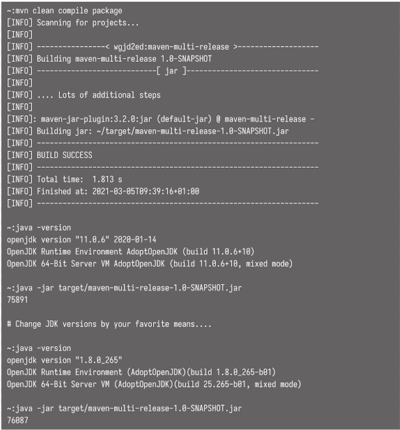

<!-- Date: 2025-01-25 -->
<!-- Update Date: 2025-01-26 -->
<!-- File ID: 05c89999-dfc0-49d0-8ca1-7acd851cca22 -->
<!-- Author: Seoyeon Jang -->

# 개요

JDK 9에서 도입된 기능 중 하나는 **서로 다른 JDK를 타깃으로 서로 다른 코드를 가진 JAR를 패키징할 수 있는 능력이다.** **이를 통해 플랫폼의 새로운 기능을 활용할 수 있으면서, 이전 버전에서도 해당
코드의 사용자를 지원할 수 있다.**


메이븐의 기본 설정은 src/main 디렉토리에서 코드를 찾아 컴파일한다. 해결해야 할 두 가지 복잡한 문제가 있다.
- 메이븐은 `versions` 디렉토리에서도 코드를 찾아야 한다
- 더 나아가 메이븐은 메인 프로젝트와 다른 JDK를 타깃으로 한 소스를 컴파일해야 한다

이 두가지 목표는 자바 클래스 파일을 빌드하는 `maven-compiler-plugin`을 구성해서 달성할 수 있다. 다음 코드에서 별개인 두 개의 <execution> 단계를 소개한다. 첫번째는 JDK 8을 대상으로 하는 기본 코드를 컴파일하고, 두번째 단계에서는 JDK11을 대상으로 하는 버전별 코드를 컴파일한다.

```xml
<plugins>
    <plugin>
        <groupId>org.apache.maven.plugins</groupId>
        <artifactId>maven-compiler-plugin</artifactId>
        <version>3.8.1</version>
        <executions>
            <execution>
                <id>compile-java-8</id>
                <goals>
                    <goal>compile</goal>
                </goals>
                <configuration>
                    <source>1.8</source>
                    <target>1.8</target>
                </configuration>
            </execution>
            <execution>
                <id>compile-java-11</id>
                <phase>compile</phase>
                <goals>
                    <goal>compile</goal>
                </goals>
                <configuration>
                    <compileSourceRoots>
                        <compileSourceRoot>
                            ${project.baseDir}/versions/11/src
                        </compileSourceRoot>
                    </compileSourceRoots>
                    <release>11</release>
                    <multiReleaseOutput>
                        true
                    </multiReleaseOutput>
                </configuration>
            </execution>
        </executions>
    </plugin>
</plugins>
```
이로써 JAR가 올바른 레이아웃으로 빌드되고 패키징된다. 마지막으로 매니페스트를 다중 릴리스로 표시하는 단계가 하나 더 있다. 이것은 `maven-jar-plugin` 에서 설정된다.

```xml
<plugin>
    <groupId>org.apache.maven.plugins</groupId>
    <artifactId>maven-jar-plugin</artifactId>
    <version>3.2.0</version>
    <configuration>
        <archive>
            <manifest>
                <addClasspath>true</addClasspath>
                <mainClass>seoyeon.Main</mainClass>
            </manifest>
            <manifestEntries>
                <Multi-Release>true</Multi-Release>
            </manifestEntries>
        </archive>
    </configuration>
</plugin>
```


이렇게 함으로써, JDK의 새로운 기능을 활용하면서도 오래된 사용자가 여전히 사용할 수 있는 방안이 모두 마련된다.

# 정리


