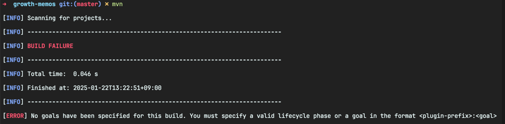
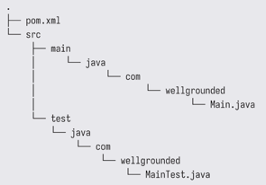

<!-- Date: 2025-01-22 -->
<!-- Update Date: 2025-01-22 -->
<!-- File ID: f372147f-2f92-4d31-be10-0dfa366199aa -->
<!-- Author: Seoyeon Jang -->

# 개요

메이븐은 아파치 소프트웨어 재단의 프로젝트이며 오픈소스다. 설치 지침은 [프로젝트 웹사이트](https://maven.apache.org/install.html) 에서 확인할 수 있다.

일반적으로 메이븐은 개발자의 컴퓨터에 전역적으로 설치된다. 설치를 완료한뒤 터미널에 mvn 을 명령하면, 다음과 같은 출력이 표시된다.



"No goals have been specified for this build"라는 메시지를 봐보자. 이는 메이븐이 우리의 프로젝트에 대해 아무것도 모른다는 것을 나타낸다. 우리는 프로젝트에 대한 정보를
pom.xml 파일에 제공하며, 이 파일이 메이븐 프로젝트의 핵심이다.

> POM은 Project Object Model

비록 완전한 pom.xml 파일은 복잡하고 길어보일 수 있지만, 훨씬 간단한 형태로 시작할 수 있다. 최소한의 pom.xml 파일은 다음과 같다.

```xml

<project>
    <modelVersion>4.0.0</modelVersion>
    <groupId>com.wellgrounded</groupId>
    <artifactId>example</artifactId>
    <version>1.0-SNAPSHOT</version>
    <name>example</name>

    <properties>
        <maven.compiler.source>11</maven.compiler.source>
        <maven.compiler.target>11</maven.compiler.target>
    </properties>
</project>
```

pom.xml 파일에 특히 중요한 두가지 필드를 선언했다. 바로 groupId와 artifactId 다. 이 필드들은 버전과 결합해서 **GAV좌표(Group, Artifact, Version)** 를 형성하는데,
이 좌표는 특정 패키지의 특정 릴리즈를 전 세계적으로 고유하게 식별한다. groupId는 일반적으로 라이브러리를 담당하는 회사, 조직 또는 오픈소스 프로젝트를 지정하며, artifactId는 특정 라이브러리의
이름이다. GAV 좌표는 종종 각 부분을 콜론으로 구분한 형태로 표현한다. 예를 들어 다음과 같이.

- `org.apache.commons:collections4:4.4`
- `com.google.guava:guava:30.1-jre`

이러한 좌표는 로컬로 프로젝트를 구성하는 데 중요할 뿐만 아니라, **의존성을 찾기 위한 주소 역할을 해서 빌드 도구가 해당 의존성을 찾을 수 있게 한다.**

메이븐이 빌드 생명주기를 표준화했던 것과 마찬가지로, 소스코드의 표준 레이아웃도 대중화됐다. **이러한 규약을 따르면 메이븐에 프로젝트의 어떤 정보도 알려줄 필요 없이 컴파일할 수 있다.**



패키지 계층 구조에서 동일한 디렉터리 `src/main/java` 와 `src/test/java`의 병렬 구조를 확인할 수 있다. 이 규칙을 따르면 테스트 코드가 메인 코드와 분리돼 메인 코드를 배포할 때 **테스트
코드를 제외하고 패키징하는 과정이 단순화된다.** 패키지 사용자들이 일반적으로 원하지 않거나 사용하지 않을 테스트 코드를 제외할 수 있다.

이 두가지 외에도 **표준 디렉터리들이 존재한다.** 예를 들어 `src/main/resources` 는 JAR에 포함할 추가적인 코드가 아닌 **파일이 위치하는 일반적인 위치다.**

메이븐을 사용하는 동안은 규칙, 표준 레이아웃, 메이븐이 제공하는 기타 기본값을 따르는 것이 좋다. 숙련된 메이븐 개발자라면 관습을 벗어나 규칙을 어길 수 있다. 하지만 처음 배우는 입장에서는 걷기 전에 뛰려고 하지
말아야 한다.

# 정리


