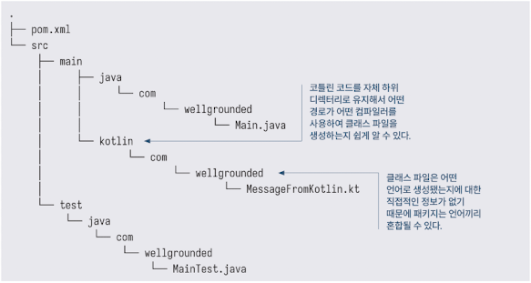

<!-- Date: 2025-01-23 -->
<!-- Update Date: 2025-01-23 -->
<!-- File ID: 79b6d2a8-c585-49b7-a456-e1f82a6ff85d -->
<!-- Author: Seoyeon Jang -->

# 개요

플랫폼으로서 JVM의 장점은 동일한 프로젝트 내에서 여러 언어를 사용할 수 있다는 것이다. 이는 특정 언어가 애플리케이션의 특정 부분에서 더 나은 기능을 제공하거나 애플리케이션을 한 언어에서 다른 언어로 점진적으로
변환할 수 있는 경우에 유용하다.

자바 대신 코틀린에서 일부 클래스를 빌드하도록 간단한 메이븐 프로젝트를 구성하는 방법을 살펴보자. 다행히도 표준 레이아웃은 다음과 같이 언어를 쉽게 추가할 수 있도록 이미 설정돼있다.



자바와 달리 메이븐은 기본적으로 코틀린을 컴파일하는 방법을 알지 못하기 때문에 pom.xml에 `kotlin-maven-plugin`을 추가해야한다. 가장 최신 사용법은 코틀린 문서를 참고하는 것이다.

프로젝트가 완전히 코틀린으로 작성된 경우, 컴파일은 플러그인을 추가하고 compile 목표를 다음과 같이 추가하면 된다.

```xml

<plugin>
    <groupId>org.jetbrains.kotlin</groupId>
    <artifactId>kotlin-maven-plugin</artifactId>
    <version>1.6.10</version>
    <executions>
        <execution>
            <id>compile</id>
            <goals>
                <goal>compile</goal>
            </goals>
        </execution>
        <execution>
            <id>test-compile</id>
            <goals>
                <goal>test-compile</goal>
            </goals>
        </execution>
    </executions>
</plugin>
```

코틀린과 자바를 혼합한다면 약간 더 복잡해진다. 자바를 컴파일하는 메이븐의 기본 maven-compiler-plugin을 재정의해서 코틀린이 먼저 컴파일되도록 해야하며, 그렇지 않으면 자바 코드에서 코틀린 클래스를
사용할 수 없게 된다.

```xml

<build>
    <plugins>
        <plugin>
            <groupId>org.jetbrains.kotlin</groupId>
            <artifactId>kotlin-maven-plugin</artifactId>
            <version>1.6.10</version>
            <executions>
                <execution>
                    <id>compile</id>
                    <goals>
                        <goal>compile</goal>
                    </goals>
                    <configuration>
                        <!-- 코틀린 컴파일러는 코틀린과 자바 코드의 위치를 모두 알아야 한다.-->
                        <sourceDirs>
                            <sourceDir>${project.basedir}/src/main/kotlin</sourceDir>
                            <sourceDir>${project.basedir}/src/main/java</sourceDir>
                        </sourceDirs>
                    </configuration>
                </execution>
                <execution>
                    <id>test-compile</id>
                    <goals>
                        <goal>test-compile</goal>
                    </goals>
                    <configuration>
                        <sourceDirs>
                            <sourceDir>${project.basedir}/src/test/kotlin</sourceDir>
                            <sourceDir>${project.basedir}/src/test/java</sourceDir>
                        </sourceDirs>
                    </configuration>
                </execution>
            </executions>
        </plugin>
        <plugin>
            <groupId>org.apache.maven.plugins</groupId>
            <artifactId>maven-compiler-plugin</artifactId>
            <version>3.8.1</version>
            <executions>
                <execution>
                    <id>default-compile</id>
                    <!--  자바 빌드를 위한 maven-compiler-plugin 의 기본설정 비활성화. 왜냐하면 이 설정은 자바 컴파일을 먼저 실행하도록 강제하기 때문 -->
                    <phase>none</phase>
                </execution>
                <execution>
                    <id>default-testCompile</id>
                    <phase>none</phase>
                </execution>
                <execution>
                    <!-- maven-compiler-plugin 의 compile 과 test-compile 단계를 다시 적용한다. 이제 이것들은 kotlin-maven-plugin 이후에 추가된다. -->
                    <id>java-compile</id>
                    <phase>compile</phase>
                    <goals>
                        <goal>compile</goal>
                    </goals>
                </execution>
                <execution>
                    <id>java-test-compile</id>
                    <phase>test-compile</phase>
                    <goals>
                        <goal>testCompile</goal>
                    </goals>
                </execution>
            </executions>
        </plugin>
    </plugins>
</build>
```

프로젝트는 최소한 코틀린 표준 라이브러리에 대한 의존성이 필요하다. 따라서 다음과 같이 명시적으로 추가한다.

```xml

<dependency>
    <groupId>org.jetbrains.kotlin</groupId>
    <artifactId>kotlin-stdlib</artifactId>
    <version>1.6.10</version>
</dependency>
```

이렇게 하면 다중 언어 프로젝트가 빌드되고 실행할 수 있게 된다.

# 정리


