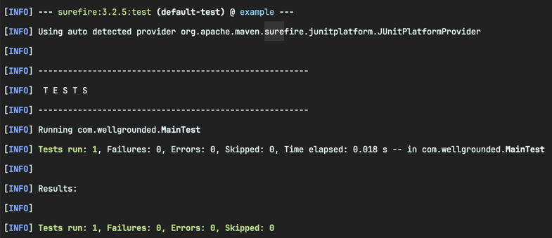

<!-- Date: 2025-01-24 -->
<!-- Update Date: 2025-01-24 -->
<!-- File ID: 7a14ee07-696c-4ad3-9bd3-15996c2e357a -->
<!-- Author: Seoyeon Jang -->

# 개요

코드가 빌드되면 다음 단계는 테스트하는 것이다. 메이븐은 테스트를 생명주기에 깊숙이 통합한다. 실제로 메인 코드의 컴파일은 단 한 단계에 불과하지만, 메이븐은 `test`와 `integration-test` 이
두가지 테스트 단계를 기본적으로 지원한다. `test`는 일반적인 단위 테스트에 사용되는 반면, `integration-test` 단계는 최종 산출물에 대한 E2E(end-to-end) 유효성 검사를 수행하기 위해
JAR과 같은 아티팩트를 구성한 후에 실행된다.

> 통합 테스트도 JUnit으로 실행할 수 있는데, 그 이유는 이름과 달리 JUnit은 단위 테스트 이상의 기능을 갖춘 테스트 실행기이기 때문이다.

거의 모든 프로젝트는 테스트의 이점을 누릴 수 있다. 메이븐의 독자적인 성향에서 예상할 수 있듯이, 테스트는 거의 JUnit을 사용하여 이뤄진다. 다른 프레임워크는 플러그인만 추가하면 된다.

표준 플러그인이 JUnit을 실행하는 방법을 알고 있더라도, 메이븐이 테스트를 컴파일하는 방법을 알 수 있도록 라이브러리를 의존성으로 선언해야 한다.

```xml

<dependency>
    <groupId>org.junit.jupiter</groupId>
    <artifactId>junit-jupiter-api</artifactId>
    <version>5.8.1</version>
    <scope>test</scope>
</dependency>
<dependency>
<groupId>org.junit.jupiter</groupId>
<artifactId>junit-jupiter-engine</artifactId>
<version>5.8.1</version>
<scope>test</scope>
</dependency>
```

이제 단위 테스트를 실행해볼 수 있다.

```shell
$ mvn test
```


메이븐의 기본 JUnit 테스트 실행 플러그인은 maven-surefire-plugin이다.

경우에 따라 실행된 테스트가 0개라고 뜰 수 있다. 이유는 메이븐 버전 때문일 가능성이 큰데, 메이븐 3.8.4 같은 나름의 최신 버전에서도 JUnit 5를 인식하지 못했기 때문이다. 이런 변환 문제에 대해서는
13장에서 더 자세히 살펴보겠지만, 그동안은 플러그인의 버전을 최신 버전으로 업데이트하면 해결된다.

maven-surefire-plugin 2.12 이후로 넘어가면, 플러그인은 JUnit 5를 직접 이해한다.

```xml
<plugin>
    <groupId>org.apache.maven.plugins</groupId>
    <artifactId>maven-surfire-plugin</artifactId>
    <version>3.0.0-M5</version>
</plugin>
```

기본적으로 Surefire 플러그인은 `test` 단계동안 표준 위치인 src/test/* 에 있는 모든 단위 테스트를 실행한다. 만약 `integration-test` 단계를 활용하고 싶다면,
maven-failsafe-plugin 과 같은 **별도의 플러그인을 사용하는 것을 권장한다.** Failsafe는 maven-surefire-plugin을 만든 동일한 그룹에서 유지보수하는데, 특히 통합 테스트
케이스를 대상으로 한다. 다음과 같이 plugin 섹션에 플러그인을 추가하면 된다.

```xml
<plugin>
    <groupId>org.apache.maven.plugins</groupId>
    <artifactId>maven-failsafe-plugin</artifactId>
    <version>3.0.0-M5</version>
    <executions>
        <execution>
            <goals>
                <goal>integration-test</goal>
                <goal>verify</goal>
            </goals>
        </execution>
    </executions>
</plugin>
```

Failsafe 플러그인은 다음과 같은 파일 이름 패턴을 통합테스트로 취급한다. 이 패턴은 재구성할 수도 있다.

- `**/IT*.java`
- `**/*IT.java`
- `**/*ITCase.java`

동일한 플러그인 제품군의 일부이기 때문에 Surefire도 이 규칙을 알고 있으며 `test` 단계에서 이러한 테스트를 제외한다.

통합 테스트를 실행할 때는 `mvn integration-test` 보다는 `mvn verify`를 사용하는 것이 좋다. `verify`에는 `post-integration-test`가 포함돼있으며, 이는 필요한
경우 플러그인이 테스트 후 정리 작업을 연결하는 일반적인 위치다.

# 정리


