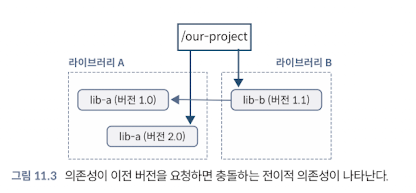
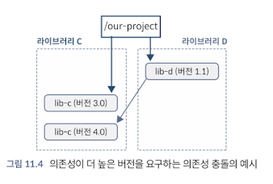
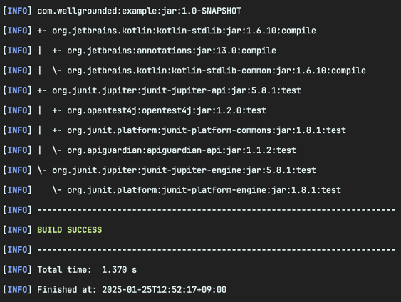
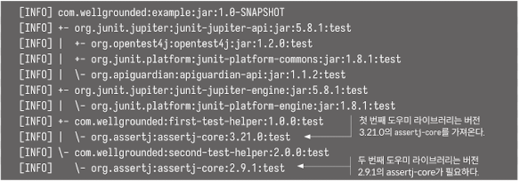
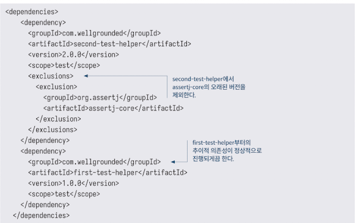
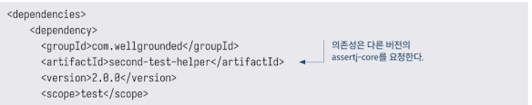
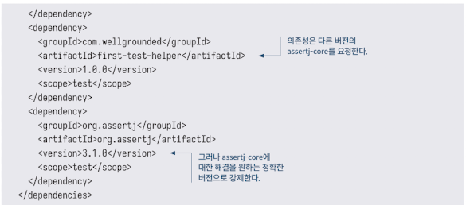

<!-- Date: 2025-01-25 -->
<!-- Update Date: 2025-01-25 -->
<!-- File ID: 3e0bb408-15f5-400d-929d-cb249fcdccae -->
<!-- Author: Seoyeon Jang -->

# 개요

메이븐이 생태계에 가져온 주요 기능 중 하나는 **pom.xml**파일을 통해 의존성 관리 정보를 표현하는 표준 형식을 제공한 것이다. 또한 메이븐은 **라이브러리를 위한 `중앙 저장소`를 구축했다.** 메이븐은
pom.xml과 그 속에 있는 의존성 라이브러리들의 pom.xml 파일들을 탐색해서 **애플리케이션이 필요로 하는 전체 전이적 의존성 집합을 결정**할 수 있다.

트리를 탐색하고 필요한 모든 라이브러리를 찾는 이 프로세스를 의존성 해결(dependency resolution)이라고 한다. 하지만 이 과정은 현대 애플리케이션 관리에서 중요하면서도 가끔은 예상치 못한 문제를
일으킬 수 있는 면을 가지고 있다.

문제가 어디서 발생하는지 알아보기 위해, 이전 프로젝트 설정을 살펴보자. 프로젝트의 의존성이 다음과 같은 트리를 생성했다는 것을 기억하자.

여기서 우리는 명시적으로 `lib-a`의 2.0버전을 요청했지만, 의존성인 `lib-b`는 더 오래된 버전 1.0을 요청했다. 메이븐의 의존성 해결 알고리즘은 라이브러리의 버전 중 루트에 가까운 버전을 선호한다.
구성의 최종결과는 우리의 애플리케이션에서 `lib-a` 2.0을 사용하게 된다. 이것은 잘 작동할 수도 있고 심각하게 망가질 수도 있다.

또 다른 일반적인 시나리오는 그 반대로 루트에 가장 가까운 의존성이 예상되는 전이적 의존성보다 오래된 버전인 경우 문제를 일으킬 수 있다.

이미 `lib-c`를 사용하고 있는 프로젝트에 `lib-d` 에 대한 의존성을 추가하면, `lib-c`의 3.0 버전에는 존재하지 않는 API를 사용하려고 하기 때문에 런타임 예외가 발생할 수 있다.

> NOTE: 이런 가능성을 감안해서, 코드가 직접 상호작용하는 패키지는 pom.xml에서 명시적으로 선언하는 것이 좋다. 만약 이를 하지 않고 의존성 전이에 의존한다면, 직접적인 의존성 업데이트로 인해 예상치 못한
> 빌드 오류가 발생할 수 있다.

의존성 문제를 해결하기 위해서는 먼저 어떤 의존성이 있는지 알아야 한다. 메이븐은 `$mvn dependency:tree`명령어로 이를 확인할 수 있다.

JUnit은 적은 의존성을 가지고 있으므로 전이적 의존성의 문제를 더 자세히 살펴보기 위한 예시로, 어떤 팀이 사용자 정의 어서션을 지원하기 위해 회사 내부 라이브러리 두 개를 사용하려 한다고 해보자. 이 두
라이브러리는 모두 `assertj`라이브러리를 사용하여 구축됐지만, 불행하게도 다른 버전을 사용한다. 다음과 같이 말이다.

가장 좋은 접근 방식은 의존성들 간에 동의할 수 있는 더 새로운 버전을 찾는 것이다, 내부 라이브러리로서, 당연히 가능한 일이다. 더 넓은 오픈소스 세계에서도 종종 가능하다. 하지만 때로는 라이브러리가 유지 관리자를
잃고 오래된 상태로 남아있을 수 있기 때문에 원하는 업데이트를 얻기 어려운 상황에 놓일 수도 있다.

이로 인해 우리는 충돌을 다루기 위한 방법을 찾아야 한다. 자연스러운 해결책을 찾을 수 없는 경우, 두가지 주요 접근 방식이 사용된다.

만약 의존성 중 하나는 모두 동의할 수 있는 버전이지만 메이븐의 해결 알고리즘이 선택하지 않는 경우, 해결 과정에서 트리의 일부를 제외하도록 메이븐에 지시할 수 있다. 두 도우미 라이브러리가 모두 최신
`assert-core`와 잘 작동한다면, 다음과 같이 두 번째 라이브러리가 가져온 더 오래된 버전은 무시하게 할 수 있다.

최악의 경우, 어느 라이브러리도 호환되는 버전이 아닐 수도 있다. 이 경우 **프로젝트에 직접적으로 의존성의 정확한 버전을 지정한다.** 메이븐의 해결 규칙에 따라 프로젝트 루트에 더 가까운 버전을 선택하게 될
것이다. 이렇게 하면 도구가 원하는 작업을 수행할 수 있지만 라이브러리 버전 혼합으로 인한 런타임 오류의 위험을 감수해야하므로 상호작용을 철저히 테스트하는 것이 중요하다.

마지막으로 `maven-enforcer-plugin`은 일치하지 않는 의존성을 발견하면 빌드를 실패하도록 구성할 수 있으므로 잘못된 런타임 동작에 의존해서 문제가 나타나는 것을 피할 수 있다.

# 정리

