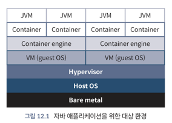
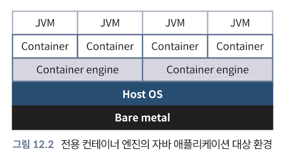

<!-- Date: 2025-01-28 -->
<!-- Update Date: 2025-01-28 -->
<!-- File ID: 723be219-193a-4de7-8bba-667ae510a73c -->
<!-- Author: Seoyeon Jang -->

# 개요

컴퓨팅의 초창기부터 소프트웨어와 소프트웨어가 실행되는 하드웨어 사이에 `추상화 계층`을 도입해왔다. 컨테이너는 이러한 발전의 또 다른 자연스러운 단계다. 이러한 계층을 간단히 살펴보면서 컨테이너가 어떻게 적용되는지
살펴보겠다.

## 1. `베어메탈`

호스트 운영체제가 설치되지 않은 기본, 즉 베어메탈머신으로 돌아가서 시작해보자. 이 베어메탈 머신은 아직 아무런 소프트웨어도 설치되지 않은 상태의 CPU, RAM, 하드 디스크, 네트워킹 등 한정된 리소스 집합을
말한다.

> NOTE: 이 유한한 리소스의 개념은 머릿속에 새겨두어야 할 중요한 개념이다. 개발자들은 컨테이너가 마법처럼 무한한 리소스를 제공한다고 착각하는 경우가 너무 많다.

언제나 기억해야할 점은 호스트 운영체제, 가상머신, 컨테이너 아래에는 베어메탈이라는 **한정된 에셋을 가진 하드웨어가 있다는 것이다.**

## 2. `호스트 운영체제` 또는 `타입 1 하이퍼바이저`

최신 데이터센터의 베어 메탈 머신에는 **호스트 운영체제(host operating system(예: 리눅스))** 나 타입 1 하이퍼바이저(예: VMWare ESXi, 마이크로스프트 Hyper-V)가 설치돼있다.
**하이퍼바이저(hypervisor)** 는 가상 머신을 생성하고 관리할 수 있는 소프트웨어를 가리키는 용어다. 하이퍼바이저는 스택의 여러 계층에 존재할 수 있다. 타입 1 하이퍼바이저는 베어 메탈에 설치돼 경량
운영체제 역할을 하며, 머신의 리소스 대부분을 실행 중인 가상머신에 할당한다.

기존 호스트 운영체제를 실행하든, 하이퍼바이저를 실행하든 이 첫번째 계층은 일반적으로 가볍고, 상위 수준의 추상화를 그 위에 설치할 수 있도록 하는 것 이상의 역할을 하지 않는다.

## 3. `타입 2 하이퍼바이저`

베어 메탈에 리눅스와 같은 기존 운영체제가 설치된 경우, 그다음 계층은 일반적으로 `타입 2 하이퍼바이저(type 2 hypervisor)`다. 타입 1이든 타입2이든 하이퍼바이저는 게스트 운영체제를 사용하는
가상머신의 기본 하드웨어 리소스를 관리한다.

예를 들어 32GB RAM과 16코어 CPU가 탑재된 베어 메탈 머신과 리눅스 호스트 운영체제가 있는 경우에는 타입 2 하이퍼바이저를 실행할 수 있으며, 이 하이퍼바이저는 각각 8GB RAM과 4개의 CPU코어가
탑재된 리눅스 게스트 운영체제를 실행하는 4개의 가상머신을 호스팅할 수 있다. 최신 하이퍼바이저는 일반적으로 자체 실행을 위한 리소스를 많이 차지하지 않는다.

## 4. `가상머신`

가상머신(virtual machine, VM)은 완전히 독립적이다. 사용자에 관한 한, 자체 CPU, RAM, 네트워크, 디스크 리소스가 있다. 프로덕션 환경에서 서버에 로그온할 때 베어메탈 서버가 아닌 가상머신에
로그온할 가능성이 높다.

또한 독립형 가상머신에는 게스트 운영체제라고 하는 자체 운영체제가 있다. 과거에는 이러한 격리된 환경을 제공하기 위해 가상머신이 성능 패널티를 지불했지만, 기술의 발전으로 수년동안 이러한 문제가 많이 해결됐다.

한정된 리소스라는 말을 기억하자. 각 가상머신은 단순히 가상일 뿐이다. 가상머신에 물리적으로 존재하는 리소스보다 더 많은 리소스가 할당되거나 사용자 전용이 아닌 경우 예측할 수 없는 성능 하락이 발생할 수 있다.

## 5. `컨테이너 엔진`

최신 **컨테이너 엔진(container engine)** 기술 이전에는 게스트 운영체제상에서 컨테이너 엔진을 실행하는 것이 일반적이었다. 이 컨테이너 엔진은 그 자체로 여러 컨테이너를 실행할 수 있었다.

이 레이어는 가상머신과 컨테이너 간의 주요 차이점 중 하나를 보여준다. 컨테이너 엔진의 주요 책임 중 하나는 실행중인 컨테이너 간에 단일 운영체제 커널에 대한 액세스를 공유하는 것이다. 이런 설정은 각 컨테이너
엔진에서 각각 자체 운영체제의 완전한 복사본을 가져야하는 가상머신 모델보다 훨씬 가볍다. 그러나 이 이점을 얻기 위해서는 리눅스 커널의 다양한 부분에서 많은 지원이 필요하다.

## 6. `컨테이너`

마지막으로 **컨테이너(container)** 에 도착한다. 컨테이너는 애플리케이션을 실행하기 위해 사용자 정의로 구축하고 격리된 환경이라고 생각하면된다. 컨테이너에는 파일시스템이 있으며 하나 이상의 프로세스를
실행한다. 컨테이너의 프로세스는 모두 커널과 통신할 수 있지만 메모리, CPU, 네트워크, 디스크에 대한 제한을 포함해, 컨테이너를 나머지 세계와 분리하기 위해 많은 제한이 부과된다.

컨테이너 내부에서는 자바 애플리케이션, 데이터저장소 또는 필요한 기타 서비스를 실행한다. 이러한 모든 추상화 계층을 살펴보자.

위 그림에서 호스트 운영체제는 추상화의 최하위계층이다. 하이퍼바이저가 그 다음 계층이고 컨테이너 엔진, 컨테이너, 자바 애플리케이션이 그 뒤를 잇는다.

더 순수한 컨테이너 환경에서는 지난 몇 년동안 다음 그림과 같이 하이퍼바이저와 게스트 운영체제 계층을 제거한 전용 컨테이너 호스트 머신을 볼 수 있다.

훨씬 나아졌다. 여기서 중요한 점은 시스템관리자에게 문의하여 타깃 환경이 어떻게 생겼는지, 각 계층에서 얼마나 많은 베어메탈 유한 리소스가 할당되고 있는지 정확히 파악해야 한다는 것이다.

이러한 추상화 계층 내의 모든 복잡성에도 불구하고 자바 개발자는 주로 배포 대상으로서 컨테이너에 집중하게 되며, 이러한 작업 방식에는 몇가지 중요한 이점이 있다.

# 정리

