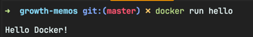
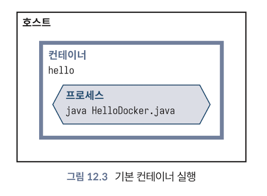

<!-- Date: 2025-01-28 -->
<!-- Update Date: 2025-01-28 -->
<!-- File ID: 252af72b-e18b-4bc8-a23e-e118c8e8e934 -->
<!-- Author: Seoyeon Jang -->

# 개요

도커와 컨테이너의 핵심 아이디어는 엄격하게 통제된 환경에서 잘 정의된 프로세스를 실행할 수 있다는 것이다. docker run 명령을 사용해서 컨테이너를 실행할 수 있다.

이 명령에서 도커는 이미지를 기반으로 새 파일시스템을 생성하고 제한과 제어(예: CPU 및 메모리)를 적용한다음, CMD에서 정의한 기본 프로세스를 시작한다.

CMD 에 나열한 자바 프로세스를 볼 수 있다.

컨테이너를 시작할 때 -e 플래그를 사용하여 컨테이너 내의 환경변수를 변경할 수 있다. 애플리케이션 코드에서는 이런 변수들을 System.getenv() 메서드와 같은 표준 방법으로 읽을 수 있다.

# 정리

