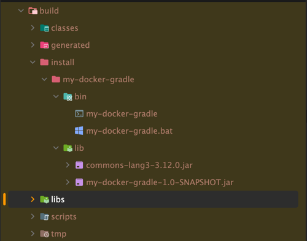

<!-- Date: 2025-01-29 -->
<!-- Update Date: 2025-01-29 -->
<!-- File ID: d17cf4f9-aad8-4e55-b9b9-2bd0534c0f19 -->
<!-- Author: Seoyeon Jang -->

# 개요

11장에서 살펴본 것처럼, 모든 규모의 자바 프로젝트는 일관된 빌드 도구를 사용하면 이점을 얻을 수 있다. 여기서는 데모 목적으로 그래들 빌드를 기반으로 이미지를 빌드하는 방법을 살펴보겠지만, 메이븐 버전도 사용할
수 있다.

최소한 우리의 이미지는 모든 애플리케이션의 JAR 파일(또는 클래스 파일)과 클래스패스의 모든 의존성을 포함해야 한다. 샘플 애플리케이션은 `org.apache.commons:commons-lang3`에 의존성을
가지고 있다.

```groovy
plugins {
    application
    java
}

application {
    mainClass.set("com.seoyeon.Main")
}

tasks.jar {
    manifest {
        attributes("Main-Class" to application . mainClass)
    }
}

group = "me.seoyeon"
version = "1.0-SNAPSHOT"

repositories {
    mavenCentral()
}

dependencies {
    implementation("org.apache.commons:commons-lang3:3.12.0")
}

tasks.test {
    useJUnitPlatform()
}
```

일반적인 `build` 나 `assemble` 과 약간 다른 명령이 필요한데, 다음에서 볼 수 있듯 그래들에서 제공하는 기본 설정에는 `installDist를` 통해 이미 필요한 것이 제공된다.

```shell
$ gradlew installDist
```

이 명령의 단순한 빌드 결과는 다음과 같다.



JAR 파일들을 가져와서 컨테이너에서 실행할 수도 있지만, 그래들은 애플리케이션을 시작히기 위한 몇가지 도우미 스크립트를 생성한다. 이를 활용해보자.

```dockerfile
FROM eclipse-temurin:17-jdk

# /opt/app is where we'll place all of our stuff to run
RUN mkdir /opt/app

# We grab all our contents from the location Gradle's installDist places them
COPY build/install/docker-gradle /opt/app/

EXPOSE 8080

# Uses the generated startup script Gradle creates for us
WORKDIR /opt/app/bin
CMD ["./docker-gradle"]
```

다음에는 이 과정을 완전히 도커 안에서 처리하는 방법을 살펴보자.

# 정리


