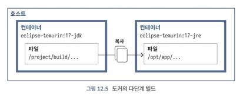

<!-- Date: 2025-01-29 -->
<!-- Update Date: 2025-01-29 -->
<!-- File ID: ba8b7530-2a0f-470d-ace0-e0e8e8c0eaf2 -->
<!-- Author: Seoyeon Jang -->

# 개요

컨테이너의 주요 장점 중 하나는 소프트웨어를 실행할 수 있는 격리된 반복 가능한 환경을 만들 수 있다는 것이다. 이것은 서비스를 배포하는 데 큰 이점이지만, 여기서 그치지 않는다. 많은 프로젝트에서 발생하는 고전적인
문제 중 하나는 개발을 위한 로컬 환경을 설정하는 것이다... 설치 리드미를 게속 따라가면서 고생...(이거 진짜 개고생...) 해본 경험이 있다면 고통에 공감할 것이다. 컨테이너는 이 문제를 해결하는 데 도움이 될
수 있다. 이제 분리된 환경을 어떻게 활용해서 빌드를 변경할 수 있는지 살펴보자.

지금까지의 도커 파일은 우리가 구성하려는 결과 이미지 하나만 포함했다. 하지만 도커를 사용하면 동일한 파일에 여러 이미지를 정의할 수 있으며, 가장 중요한 것은 파일 간에 복사할 수 있다는 것이다. 이 기능을
사용하면 로컬 시스템에 있는 JDK를 완전히 무시한 채 애플리케이션을 빌드할 이미지를 구성한 다음, 그 결과를 배포 이미지에 복사할 수 있다. 이 방법은 보안과 이미지 크기 모두에 이점이 있다.

이 과정을 **다단계 빌드(multistage build)** 라고 부르며, 도커 파일에 여러 개의 FROM 문이 있는 경우이다. 빌드의 중간 단계인 `FROM` 문은 `AS` 키워드를 포함해 도커 파일 내에서
나중에 사용하기 위해 이름을 지정하게 된다.

```dockerfile
# 컴파일을 실행할 컨테이너로 build 라는 이름을 지정한다.
FROM eclipse-temurin:17-jdk AS build
 
# 소스코드의 위치를 생성하고 기본 작업 디렉토리로 설정한다
RUN mkdir /project
WORKDIR /project

# 전체 프로젝트를 컨테이너에 복사한다
COPY . .

RUN ./gradlew clean installDist

# 이제 배포 이미지는 훨씬 더 작은 JRE 만 사용할 수 있다
FROM eclipse-temurin:17-jre

RUN mkdir /opt/app

# COPY --from=build 는 로컬 파일 시스템 대신 빌드 이미지에서 파일을 가져온다
COPY --from=build \
    /project/build/install/my-docker-gradle \
    /opt/app/

WORKDIR /opt/app/bin
CMD ["./my-docker-gradle"]
```

지속적 통합(CI)환경에서는 배포를 위한 애플리케이션을 빌드하기 위해 JDK를 설치하지 않아도 되고 **도커만 있으면 된다.** 다음 그림에서 볼 수 있듯, 빌드에 필요한 모든 구성 요소가 컨테이너 내에 완전히
남아있다.



이것은 이 유형의 빌드에 대한 최소한의 설정에 가깝지만, 빌드 시간과 관련된 몇가지 단점이 있다. 언급했듯, 각 도커 명령은 캐시되는 레이어를 생성하지만, 이런 캐시는 주의하지 않으면 무효화되어버린다.

현재의 도커 파일에서 캐시가 깨지는 💔 한 가지 예는 **프로젝트 디렉터리 전체를 컨테이너로 복사하는 부분이다.** 아무리 사소하더라도 모든 파일 변경이 `COPY . .` 라인을 무효화시키며, 그 이후의 모든
작업을 새롭게 실행해야 한다. 이는 매우 비효율적이다. IDE파일이나 로컬 빌드 출력은 빌드 컨테이너 이미지에 포함되지 않아도 되기 때문이다. 이를 위해 `.dockerignore` 파일을 도커 파일과 함께 놓아
해당 파일을 도커가 무시하게 할 수 있다.

```dockerignore
.git
.idea/
*.iml
*.class

# Ignore build folders
out/
build/
target/
.gradle/
```

각 줄은 도커가 복사할 파일을 찾을 때 무시해야할 패턴을 표현한다.

두번째로 미묘한 문제는 **그래들 래퍼**와 관련이 있다. 빌드를 실행할 때 출력을 주시하면 시작 시 적절한 배포본(Gradle distribution)을 다운로드하는 데 시간이 걸린다는 것을 알 수 있다.
컨테이너는 그래들의 로컬 캐싱 없이 시작되므로, 이 다운로드는 실행될 때마다 반복된다.

이런 반복을 피하려면 그래들의 첫 번째 실행을 별도의 레이어로 분리해야 한다. 이 레이어는 전체 프로젝트를 컨테이너로 복사하기 전에 발생하며, 그래들이 다운로드를 실행하는 데 필요한 최소한의 것만 복사하고 싶기
때문에 레이어의 캐시는 그래들 래퍼를 변경하는 경우(예: 버전 업데이트)에만 깨지게 된다. 다음과 같이 말이다.

```dockerfile
# 그래들 구성을 실행하는 데 필요한 부분만 복사한다
COPY ./gradle ./gradle
COPY ./gradlew* ./settings.gradle* .

# ./gradlew 를 단독으로 실행하면 그래들 배포본이 강제로 다운로드 되는데, 이제 이것은 자체 레이어에 캐시된다.
RUN ./gradlew

COPY . .

RUN ./gradlew clean installDist
```

이것은 컨테이너 이미지 구축 시 적용할 수 있는 최적화의 시작에 불과하다. 중요한 점은 각 레이어에 어떤 내용이 포함돼야 하는지 신중하게 고려하는 것이다. 시스템의 일부가 서로 다른 속도로 변경될 경우, 이들을
별도의 레이어로 분리하는 것이 유용할 수 있다.

도커 이미지를 구축하는 여러가지 방법이 있다. 메이븐과 그래들은 다양한 플러그인을 제공하며, 이를 활용하면 Dockerfile 없이도 이미지를 생성할 수 있다. 또한 Jib과 같은 도구를 사용하면 도커 데몬 없이도
컨테이너 이미지를 빌드하고 배포할 수 있다.

# 정리


