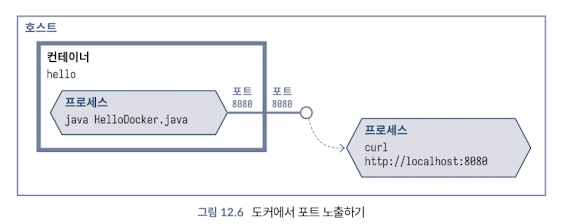
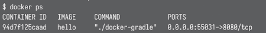

<!-- Date: 2025-01-29 -->
<!-- Update Date: 2025-01-29 -->
<!-- File ID: 41601df8-6863-430d-8111-dc2b6937b2b1 -->
<!-- Author: Seoyeon Jang -->

# 개요
애플리케이션에 독립된 파일 시스템을 제공하는 것과 마찬가지로, 컨테이너는 네트워크에 대해서도 동일한 격리를 제공한다. 예를 들어 샘플 애플리케이션에서 표준 HTTP 서버를 실행하는 코드를 추가하는데, JDK에서 제공하는 기본 HTTP 서버 `com.sun.net.httpserver.HttpServer`를 사용한다고 가정해보자. docker run 으로 컨테이너를 실행하면 해당 HTTP 엔드포인트를 호출할 수 없다는 것을 발견할 것이다.

이 문제를 해결하려면 도커에 포트를 사용할 수 있도록 요청해야 한다.

```shell
$ docker run -p 8080:8080 hello
```

첫번째 값은 컨테이너 외부에서 사용할 수 있는 포트다. 두 번째 값은 컨테이너 내부의 소프트웨어가 수신 대기중인 포트다.



포트 노출은 컨테이너가 배포되는 방식에서 매우 중요한 부분으로, 도커 파일을 통해 다음과 같이 이미지가 제공될 것으로 예상되는 포트를 기록할 수 있다.

```dockerfile
EXPOSE 8080
```

```shell
$ docker run -P hello
```
이를 설정하고 다시 docker build 를 한 후 포트 스위치 없이 실행하면, 도커가 기본적으로 EXPOSE 에서 뚫어놓은 포트를 사용할 수 있도록 설정하지 않는다는 사실에 의아할 수 있다. -P 스위치를 단독으로 제공하면(대문자이고 인수가 없는 것에 유의) 도커는 이미지의 각 EXPOSE 포트를 임의의 포트 또는 임시 포트에 바인딩한다. 어떤 포트가 할당될지 모르므로 임의의 포트를 찾으려면 docker ps 로 찾아야 한다.



`0000:55031->8080/tcp` 값은 컨테이너 외부의 포트 55031이 내부의 포트 8080에 바인딩돼있음을 알려준다.

이 임시포트 작업은 포트가 변하기 때문에 '왜 굳이...?' 같은 기능처럼 보일 수 있으나, 실제 프로덕션 환경에서 컨테이너를 실행할 때 매우 중요한 기능이다. 컨테이너 내부에서는 포트가 겹쳐도 상관 없지만, 외부에서 접근할 때의 포트가 충돌할 수 있기 때문에 임시포트를 사용하는 것이다.

그런데 만약, 컨테이너가 데이터베이스 같은 다른 서비스에 연결해야 한다면?

컨테이너에는 이런 문제를 해결하는 다양한 네트워킹 옵션이 있지만, 이 책의 범위를 벗어난다. 그렇기에 그냥 도커 컴포즈를 사용하자.

# 정리


