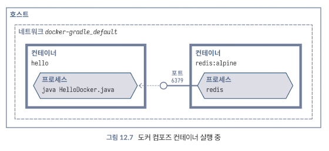

<!-- Date: 2025-01-29 -->
<!-- Update Date: 2025-01-29 -->
<!-- File ID: 731d1f84-09a0-471a-84c4-68d17329bf5a -->
<!-- Author: Seoyeon Jang -->

# 개요
새로운 프로젝트를 위한 끔찍한 설치 목록과 마찬가지로, 애플리케이션은 런타임에 여러 다른 서비스도 필요로 하는 것이 일반적이다. 데이터베이스, 캐시, NoSQL 저장소 등이 있을 수 있으며, **애플리케이션이 로컬에서 작동하려면 이 모든 것이 실행중이어야 한다.**

도커 컴포즈는 컨테이너 세트를 선언하고 실행하는 도구다. 정확한 서비스 세트를 함께 시작할 수 있게 해준다. 

쿠버네티스와 같은 오케스트레이션 도구와 비슷하게 들린다면, 틀린말은 아니다. 두 도구 모두 컨테이너 관리 측면에서 중복되는 부분이 있다. 그러나 **도커 컴포즈는 단일 컴퓨터에서 실행되도록 설계됐으며, 이는 많은 프로덕션 환경에서 합리적인 선택이 아니다.**

기본적으로 설정을 docker-compose.yml 에 기술한다.

```yaml
version: "3.9"
services:
  app:
    build: .
    ports:
      - "8080:8080"
  redis:
    image: "redis:alpine"
```
이것을 실행하면($ docker-compose up -d) 레디스 이미지를 가져오고 애플리케이션 컨테이너와 함께 시작한다.



이는 로컬 개발을 원활하게 진행할 수 있는 좋은 방법이다.

# 정리


