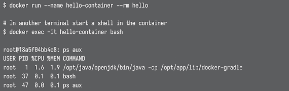
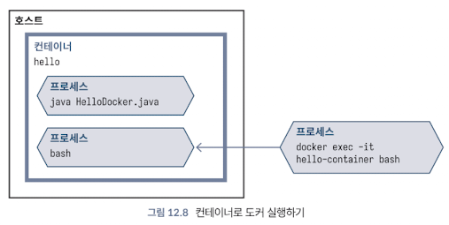
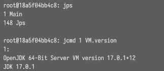

<!-- Date: 2025-01-29 -->
<!-- Update Date: 2025-01-29 -->
<!-- File ID: bcce1132-e3fa-4b24-94d4-6fb31de61168 -->
<!-- Author: Seoyeon Jang -->

# 개요

앞서 컨테이너가 노출한 포트를 결정하기 위해 `docker ps`를 배웠다. 그러나 `docker ps`는 그것보다 더 많은 정보를 제공한다. 특히 기본적으로 컨테이너에는 참조할 수 있는 무작위로 생성된 편리한 이름이 지정된다.

그러나 컨테이너가 실행될 때마다 이름이 변경되는 것은 번거로우므로 docker run 에 옵션 --name 을 지정해주자. 또한 이 매개변수를 --rm 과 함께 사용하면 컨테이너가 종료될 때 컨테이너를 제거할 수 있으며, 그렇지 않으면 두번째로 실행될 때 이름을 재사용할 수 없게 된다.

컨테이너의 이름을 알면 다른 디버깅 단계를 수행할 수 있다. `docker exec`을 사용하면 실행 중인 컨테이너에서 명령을 실행할 수 있다. 앞서 `docker run -it` 로 살펴본 것처럼, 컨테이너에 bash 나 이와 유사한 것이 설치돼있다고 가정하면 다음과 같이 컨테이너 내부에 대화형 쉘을 가져올 수도 있다.

`exec`은 새로운 컨테이너를 시작하지 않고 기존의 컨테이너에 연결한다. 다음 그림은 프로세스들이 하나의 컨테이너 내에서 어떻게 공존하는지를 보여준다.

기본적인 유닉스 명령어에만 국한되지 않는다. 예를 들어 jps 와 jcmd 를 사용하여 컨테이너에서 실행중인 JVM을 검사할 수 있다.

TODO 디버깅

# 정리

