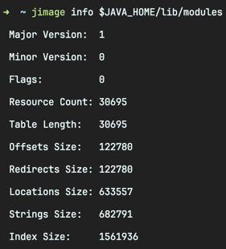
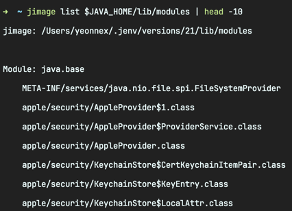
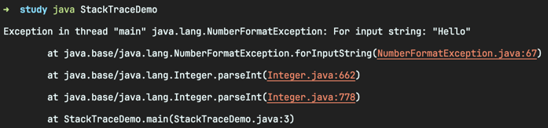
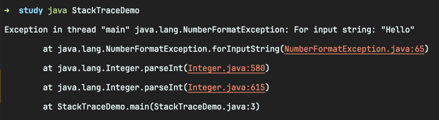
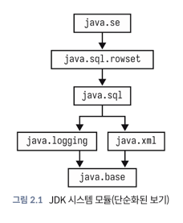
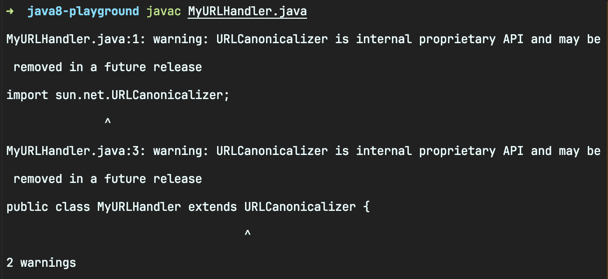
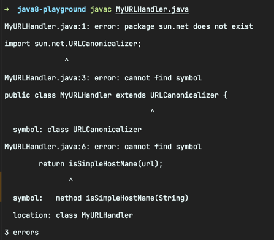

<!-- Date: 2024-12-31 -->
<!-- File ID: 1891fdcf-df08-4086-98b9-bd863e5b5c58 -->
<!-- Update Date: 2025-01-02 -->
<!-- Author: Seoyeon Jang -->

# 개요

자바 9의 경우 새로운 기능으로 도입된 것이 자바 플랫폼 모듈이다.
이는 수년 동안 논의됐던 자바 플랫폼의 주요 개선 사항이자 변경 사항이다.

이 글에서는 모듈이 필요한 이유뿐만 아니라 모듈화 개념을 명확하게 설명하는 데 사용되는 새로운 구문과
애플리케이션에서 모듈을 사용하는 방법에 대해 알아보자.
이렇게 하면 빌드할 때 JDK와 타사 모듈을 사용하고 **앱 또는 라이브러리를 모듈로 패키징**할 수 있다.

> 모듈은 코드를 패키징하고 배포하는 새로운 방법이다.

자바 모듈 시스템을 사용하더라도 **결과물은 여전히 JAR 파일**로 만들어진다.
하지만 기존의 JAR파일과는 **구조적 차이**와 **동작 방식**에서 중요한 차이가 있다.

## 🔍 기존 JAR 파일과 모듈 JAR 파일의 차이점

1. 기존 JAR(전통적인 방식)

- JAR 파일은 단순히 `.class`파일과 `META_INF`디렉토리를 포함하는 압축파일
- 어떤 패키지가 어떤 JAR에 포함되어있는지 **명시적인 정의가 없음**
- 모든 클래스가 다른 JAR에서 무제한으로 접근 가능
- 의존성 관리가 불명확하여 **런타임에 ClassNotFoundException**같은 문제가 발생할 수 있음

2. 모듈 JAR(자바 9 이후의 모듈 시스템)

- `module-info.java`라는 파일을 포함
- 이 파일에 **모듈의 이름, 공개할 패키지, 의존하는 모듈**을 명시
- `module-info.java`가 컴파일되면 `module-info.class`로 JAR 안에 포함
- 다른 모듈에서 **공개(explicit)된 패키지만 접근 가능**하고, 비공개 패키지는 캡슐화
- 모듈 간의 의존성이 명확히 정의됨

### 📦구조 예시

1. 기존 방식(Classic JAR)

```
myapp.jar
 ├── com/example/Main.class
 ├── com/example/Service.class
 └── META-INF/MANIFEST.MF
```

2. 모듈 방식(Modular JAR)

```
mymodule.jar
 ├── module-info.class
 ├── com/example/Main.class
 ├── com/example/Service.class
 └── META-INF/MANIFEST.MF
```

2.1 module-info.java 예시

```java
module mymodule {
    exports com.example; // 이 패키지만 외부에 공개
    requires anothermodule; // anothermodule 에 의존
}
```

## 왜 같은 JAR 인데 다르게 동작하는가?

- **모듈 시스템은 런타임에 JAR파일을 모듈 단위로 로딩**
- JVM이 **모듈 그래프**를 생성해 불필요하거나 불명확한 의존성 문제를 **컴파일 시점**에 감지
- 즉, 런타임에러(ClassNotFoundException)를 **컴파일 단계에서 방지**가능
- 특정 패키지를 **exports**하지 않으면 다른 모듈에서 해당 패키지에 접근할 수 없음

모듈의 도입은 애플리케이션 아키텍처에 깊은 영향을 미치며, 모듈은 프로세스 풋프린트, 시작 비용, 웜업 시간과 같은 측면에
관심있는 현대 프로젝트에 많은 장점을 제공한다.
모듈은 또한 복잡한 의존성으로 자바 애플리케이션을 괴롭히는 소위 **JAR지옥(JAR hell)**문제를 해결하는 데 도움이 된다.

## 배경 설명

모듈은 자바 9부터 도입된 자바 언어에서 기본적으로 새로운 개념이다.
모듈은 런타임에 의미를 가지는 응용 프로그램 배포 및 의존성의 단위다.
이는 기존 자바 개념과는 다르다.

### 기존 자바의 개념

- JAR파일은 런타임에는 보이지 않으며, 단순히 클래스 파일들을 포함하고 있는 압축된 디렉터리다.
- **패키지**는 **실제로 접근 제어**를 위해 **클래스를 그룹화**하기 위한 **네임스페이스**다.
- 의존성은 클래스 레벨에서만 정의된다
- 접근 제어와 리플렉션이 결합돼 명확한 배포 단위 경계 없이 최소한의 시행으로, 근본적으로 개방적인 시스템을 생성한다.

반면 모듈은 다음과 같은 특징을 가진다.

### 모듈 시스템에 도입된 자바의 개념

- 모듈은 모듈 간의 의존성 정보를 정의하므로 컴파일 또는 애플리케이션 시작 시점에서
  모든 종류의 해결(resolution)과 연결(linkage)문제를 감지할 수 있다.
- 적절한 캡슐화를 제공해서 내부 패키지와 클래스를 조작하려는 사용자로부터 안전하게 보호할 수 있다.
- 최신 자바 런타임에서 이해하고 사용할 수 있는 메타데이터가 포함된 적절한 배포 단위이며,
  리플렉션을 통해 메타데이터를 동적으로 조회하고, 모듈이 제공하는 클래스나 패키지, 의존성 정보를 런타임에 탐색 가능
    - 이를 통해 애플리케이션이 실행 중에도 모듈간의 관계를 파악하고, 필요에 따라 적절한 동작을 동적으로 결정하거나,
      클래스 및 API를 동적으로 로드하여 유연한 시스템 구축 가능

자바 플랫폼 모듈은 버전 8에 존재했던 자바 세계에 누락된 개념을 구현한 것이다.

> 자바 모듈은 종종 특별한 JAR파일로 패키징된다(jimage등). 즉 형식에 구속되지 않는다.

모듈 시스템의 목표는 배포단위(모듈)를 가능한 한 서로 독립적으로 만드는 것이다.

### 프로젝트 직소?

모듈 기능을 제공하기 위한 OpenJDK 내 프로젝트는 **프로젝트 직소**(Project Jigsaw)로 알려져 있다.
이 프로젝트는 다음과 같은 목표를 가진다.

- JDK 플랫폼 소스 모듈화하기
- 프로세스 풋프린트 줄이기
- 애플리케이션 시작 시간 개선하기
- 자바에서 처음으로 **진정한 의미의 엄격한 캡슐화** 허용
- 이전에는 불가능했던 새로운 접근 제어 모드를 자바 언어에 추가하기

이러한 목표는 다시 JDK와 자바 런타임에 더욱 밀접하게 초점을 맞춘 후, 다음과 같은 다른 목표로 추진됐다.

- 단일 모놀리식 런타임 JAR(`rt.jar`) 끝내기
- JDK 내부를 적절히 캡슐화해서 보호하기

이러한 2차 목표는 플랫폼의 내부와 구현 측면에 더 밀접하게 연관되어 있기 때문에 좀 더 설명이 필요하다.

### 모놀리식이 아닌 모듈식 자바 런타임

기존의 JAR 형식은 기본적으로 클래스를 포함하고 있는 **zip**파일일 뿐이다.
이 형식은 플랫폼 초창기부터 사용됐으며 자바 클래스와 애플리케이션에 최적화되지 않았다.
플랫폼 클래스에 JAR 형식을 사용하지 않으면 시작 성능이 훨씬 향상되는 등 여러 분야에 도움이 될 수 있다.

모듈은 프로그램의 생명 주기에서 서로 다른 시점(각각 컴파일/링크 타임과 런타임)에 사용되는
두가지 **새로운 형식(JMOD 및 JIMAGE)**을 제공한다.

**JMOD 형식**은 기존의 JAR 형식과 다소 유사하지만, 자바 8에서처럼 별도의 공유 객체 파일을 제공하지 않고,
네이티브 코드를 단일 파일의 일부로 포함할 수 있도록 수정됐다.
메이븐에 모듈을 게시하는 등 대부분의 개발자의 경우 자체 모듈을 JMOD보다는 모듈식 JAR로 패키징하는 것이 좋다.

**JIMAGE 형식**은 자바 런타임 이미지를 나타내는 데 사용된다.
자바 8 이전까지는 두 가지 런타임 이미지(JDK와 자바 실행환경(JRE))만 존재했지만, 이는 대부분 역사적 우연이었다.
오라클은 완전한 모듈화를 향한 디딤돌로 자바 8(및 콤팩트 프로파일)과 함께 Server JRE를 도입했다.
이 이미지는 기본적으로 서버 측 애플리케이션 요구사항에 맞춰 더 작은 공간을 차지하기 때문에 일부 기능(예: GUI프레임워크)을 제거했다.

모듈식 애플리케이션에는 프로그램 시작 전에 의존성 집합을 정확히 알 수 있을 만큼 충분한 메타데이터가 있다.
따라서 **필요한 것만 로드하면 되므로** 훨씬 더 효율적이다. 더 나아가 애플리케이션과 함께 제공할 수 있고
범용 자바의 전체 설치가 아닌 애플리케이션에 필요한 것만 포함된 사용자 정의 런타임 이미지를 정의할 수도 있다.
이 마지막 가능성은 이 글의 마지막 부분에서 `jlink`도구를 볼 때 만나게 될 것이다.

지금은 자바 런타임 이미지에 대한 세부 정보를 표시하는 데 사용할 수 있는 `jimage` 도구를 만나보자.
예를 들어 자바 21 전체 런타임(즉 JDK에 포함돼 있는 것)을 봐보자.


`rt.jar`에서 벗어남으로써 시작 성능이 향상되고 애플리케이션에 필요한 부분만으로 최적화할 수 있다.
더 이상 `rt.jar`내에 있는 JDK의 클래스 라이브러리를 다시 가져올 수 없다.
그러나 이는 모듈 시스템의 목표 중 하나인 자바 프로그래머의 플랫폼 내부 접근성을 줄이기 위한 하나의 단계에 불과하다.

### 내부의 캡슐화

자바 플랫폼과 사용자 간의 약속은 구현의 세부 사항이 아닌 인테페이스 수준에서 하위 호환성이 유지되도록 하는 항상 의도된 API의 약속이다.

하지만 자바 개발자들은 약속을 지키지 않았고, **시간이 지남에 따라 공개적으로 사용하기 위해 만들어진 것이 아닌, 플랫폼 구현의 일부를
사용하는 경향이 있었다.**

이는 큰 문제가 되는데... OpenJDK 플랫폼 개발자들은 사용자 애플리케이션을 손상시킬 염려 없이 새로운 기능과 더 나은 성능을 위해
JVM과 플랫폼 클래스의 구현을 자유롭게 수정해서 최신화할 수 있기를 원하기 때문이다.

플랫폼 내부를 크게 변경하는 데 있어 가장 큰 장애물은 자바 8에 존재하는 접근 제어에 대한 자바의 방식이다.
자바는 공개(`public`), 비공개(`private`), 보호(`protected`), 패키지비공개(`package-private`)만으로 접근 제어 수준을
정의한다. 리플렉션이나 관련 패키지에 추가 클래스 생성 등 다양한 방법으로 이러한 제한을 우회할 수 있으며, 내부를
완벽하게 보호할 수 있는 완벽한 방법은 없다...

과거에는 내부 구조에 접근하기 위해 우회 방법을 사용하는 것이 타당하게 받아들여지는 경우가 많았다.
그러나 플랫폼이 성숙해지면서 원하는 거의 모든 기능에 액세스할 수 있는 공식적인 방법이 추가됐다.
따라서 보호되지 않는 내부 기능은 그에 상응하는 장점도 없이 플랫폼의 취약점이 됐으며, 모듈화는 이러한 레거시 문제를 해결하기 위한 한가지 방법이었다.

요약하자면, 프로젝트 직소는 런타임 크기를 줄이고, 시작 시간을 개선하고, 내부 패키지 간의 의존성을 정리하는 등 여러가지 문제를 한번에 해결할 수 있는 방법이었다.
이러한 문제는 점진적으로 해결하기 어려운 문제였다. 특히 성숙한 소프트웨어 플랫폼에서는 이러한 유형의 시스템 전반에 대한
개선 기회가 자주 오지 않기 때문에 직소 팀은 이러한 상황을 활용하고자 했다.

### 모듈식 JVM

이를 확인하기 위해 매우 간단한 다음 프로그램을 보자.

```java
public class StackTraceDemo {
    public static void main(String[] args) {
        var i = Integer.parseInt("Hello");
    }
}
```

이 코드를 컴파일하고 실행하면 다음과 같은 런타임 예외가 발생한다.

다음은 자바 8의 예외 스택 트레이스다.


스택 트레이스 형식이 자바 8에서 사용되던 형식과 다소 변경된 것을 확실히 알 수 있다.
특히 스택 프레임은 이제 패키지이름, 클래스 이름, 라인 번호뿐만 아니라 모듈이름(`java.base`)으로도 구분된다.
이는 플랫폼의 모듈적 특성이며, 가장 단순한 프로그램에도 존재한다는 것을 분명히 보여준다.

## 모듈 그래프

모듈화의 핵심은 모듈이 서로 의존하는 방식을 나타내는 **모듈 그래프**다.
모듈은 몇 가지 새로운 구문을 통해 의존성을 명시하며, 이러한 의존성은 컴파일러와 런타임이 신뢰할 수 있는 확실한 보증이 된다.
한 가지 중요한 개념은 모듈 그래프는 **유향 비순환 그래프**여야 하므로 수학적으로 순환 의존성이 있을 수 없다는 것이다.

> 최신 자바 환경에서는 모든 애플리케이션이 모듈형 JDK 위에서 실행되므로 '모듈형 모드'와 '레거시 클래스 패스 모드'같은 것은 존재하지 않는다.

기본기를 갖춘 자바 개발자라면 모든 프로그램이 JVM에서 실행되는 방식을 변경한 새로운 하위 시스템에 대한 지식이 도움이 된다.

위 그림에서는 JDK의 주요 모듈 일부의 단순화된 보기를 볼 수 있다.
`java.base`모듈은 항상 모든 모듈의 의존성이라는 점에 유의하자.

위 그림에서 볼 수 있는 비교적 단순한 일련의 모듈 경계를 자바 8의 JDK 상태와 비교해볼 필요가 있다.
모듈 이전에는 자바의 최상위 코드 단위가 패키지였으며, 자바 8에는 표준 런타임에 거의 1,000개에 달하는 패키지가 있었다.

모듈 이전의 JDK를 오늘날과 같이 잘 정의된 형태로 재구성하는 것은 쉽지 않았고, JDK모듈화를 구현하는데는 오랜 시간이 걸렸다.

## 내부 보호하기

모듈이 해결해야 할 주요 문제 중 하나는 사용자 자바 프레임워크와 내부 구현의 세부 사항이 과도하게 결합돼 있다는 점이다.
예를 들어 다음 자바 8코드는 내부 클래스를 확장하여 저수준 **URL 정규화도구**(URL canonicalizer)에 액세스한다.

다음 코드는 데모 용도로 모듈과 접근 제어에 대해 논의할 수 있는 구체적인 예제다. 실제로는 내부 클래스에 직접 액세스해서는 안된다.

```java
public class MyURLHandler extends URLCanonicalizer {
    public boolean isSimple(String url) {
        return isSimpleHostName(url);
    }
}
```

URL 정규화 도구는 URL 표준에서 허용하는 다양한 형식 중에서 하나의 URL을 가져와 표준 형식으로 바꾸는 코드다.
자바 8을 사용해서 컴파일을 시도하면 다음과 같이 내부 API에 액세스한다는 경고가 표시된다.

**그러나 기본적으로 컴파일러는 여전히 액세스를 허용하며, 그 결과 JDK의 내부 구현에 긴밀하게 연결된 사용자 클래스가 생성된다.**
이 연결은 취약하며 호출된 코드가 이동하거나 교체되면 끊어진다.

> URLCanonicalizer 클래스는 자체 패키지뿐만 아니라 여러 다른 패키지에서 호출돼야 하므로 패키지 비공개가 아닌 공개 클래스여야 하며,
> 이는 누구나 액세스할 수 있음을 의미한다.

이 문제에 대한 해결책은 자바의 접근 제어 모델을 한 번 변경하는 것이다.
이 변경 사항은 JDK를 호출하는 사용자 코드와 서드파티 라이브러리를 호출하는 애플리케이션에 모두 적용된다.

## 새로운 접근 제어에 대한 의미

모듈은 자바의 접근 제어 모델에 새로운 개념인 패키지 **엑스포트(export)**개념을 추가한다.
자바 8이전 버전에서는 모든 패키지의 공개 클래스에 있는 공개 메서드를 호출할 수 있다.
이를 다른 프로그래밍 언어에 대한 유명한 인용문에서 따와서 샷건 프라이버시라고 부르기도 한다.

> 펄은 강제적인 프라이버시에 대한 집착이 없다. 펄은 샷건을 가지고 있기 때문이 아니라
> 초대되지 않았기 때문에 거실에 들어오지 않기를 바란다.
>
> - 래리 웰

펄 언어가 모듈화나 캡슐화와 같은 프라이버시 기능을 지원하지 않는다는 것을 비판하는 내용이다.
자바의 경우 샷건 프라이버시는 큰 문제였다. 점점 더 많은 라이브러리가 불가능한 기능을 제공하기 위해 내부 API를 사용하고 있었고,
이는 플랫폼의 장기적인 보안을 해칠 위험이 있었다.

자바 8이전에는 전체 패키지에 접근 제어를 적용할 방법이 없었다.
즉 JDK팀은 공용 API를 정의할 수 없었고, 해당 API의 클라이언트가 이를 무력화하거나 내부 구현에 직접 연결할 수 없다는 것을
확실히 알 수 없었다.

패키지에서 `java`나 `javax`로 시작하는 모든 것이 공개 API이고 그 외의 모든 것은 내부 전용이라는 관습은 **단지 관습일 뿐이다.**
이미 살펴본 것처럼 가상머신이나 클래스 로딩 매커니즘은 이를 강제하지 않는다.

하지만 모듈을 사용하면 상황이 달라진다. 어떤 패키지가 모듈의 공용 API로 간주되는지를 나타내기 위해
`exports`키워드가 도입됐다.
모듈형 JDK에서는 `sun.net`패키지가 엑스포트되지 않으므로 이전 자바 8 URL 정규화 코드가 컴파일되지 않는다.

이러한 오류 메시지 형식에 주목해야 한다.
오류 메시지는 `sun.net`패키지가 더 이상 보이지 않는다고 명시하고 있으며, 컴파일러는 심볼조차 볼수 없다.
이는 자바 접근 제어가 작동하는 방식의 **근본적인 변화다.**
내보낸 패키지의 메서드에만 액세스할 수 있다. 더 이상 공개 클래스의 공개 메서드가
모든 코드에 자동으로 표시되는 일은 없다.


