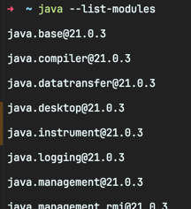

<!-- Date: 2025-01-05 -->
<!-- Update Date: 2025-01-05 -->
<!-- File ID: 9fffa5ea-612a-4942-a663-d4ede9d0cf78 -->
<!-- Author: Seoyeon Jang -->

# 개요

자바에는 클래스 로딩이 있다. 지금 알아야 할 가장 중요한 것은 다음 **네 가지 유형의 모듈**이 존재하는데,
이 중 일부는 로드 시 동작이 약간 다르다는 것이다.

- 플랫폼 모듈
- 애플리케이션 모듈
- 자동 모듈
- 이름 없는 모듈

반면에 이미 클래스 로딩에 익숙하다면 모듈의 등장으로 클래스 로딩이 작동하는 방식에서 몇몇 세부 사항이 변경됐다는 것을 알고 있을 것이다.

최신 JVM에는 모듈을 인식하는 클래스로더가 있으며, JRE클래스가 로드되는 방식이 자바 8과 상당히 다르다.
한가지 핵심 개념은 모듈(또는 모듈이 포함된 디렉토리)에 대한 일련의 경로인 **모듈 패스**다.
이는 기존 자바 클래스 패스와 유사하지만 별개의 개념이다.

> 4장에서 클래스 로딩에 대해 제대로 배운다.

클래스 로딩에 대한 모듈식 접근 방식의 기본 원칙은 다음과 같다.

- 모듈은 과거 방식의 `클래스 패스`가 아니라 `모듈 패스`에서 해결한다.
- 시작 시 JVM은 비순환적이어야 하는 모듈 그래프를 확인한다.
- 하나의 모듈은 그래프의 루트이며 실행이 시작되는 곳이다. 여기애는 진입점이 될 메인 메서드가 있는 클래스를 포함한다.

이미 모듈화된 의존성을 **애플리케이션 모듈**이라고 하며 모듈 패스에 배치된다.
모듈화되지 않은 의존성은 익숙한 클래스 패스에 배치되며 마이그레이션 매커니즘을 통해 모듈 시스템에 적용된다.

모듈 해석은 깊이 우선 탐색을 사용하고 그래프가 비순환적이므로 해결 알고리즘은 선형 시간 내에 종료된다.
네가지 유형의 모듈 각각에 대해 좀 더 자세히 알아보자.

### 플랫폼 모듈

모듈형 JDK 자체의 모듈이다. 이러한 모듈은 자바 8에서는 모놀리식 런타임(`rt.jar`)의 일부였을 것이다.
다음과 같이 `--list-modules`플래그를 통해 사용가능한 **플랫폼 모듈**의 목록들 가져올 수 있다.

```shell
$ java --list-modules
```



> 모듈의 정확한 목록과 이름은 사용 중인 자바 버전에 따라 다르다.
> 예를 들어 오라클의 GraalVM 구현에는 `com.oracle.graal.graal_enterprise`, `com.oracle.js.scriptengine` 및 `org.graalvm.sdk`와 같은
> 일부 추가적인 모듈이 있을 수 있다.

플랫폼 모듈은 일부 패키지를 지정된 모듈들에게만 내보내고 일반적으로 사용할 수 없도록 하는 **자격 제한 내보내기**(qualified exporting)매커니즘을 많이 사용한다.

배포에서 가장 중요한 모듈은 항상 다른 모듈의 암시적 의존성인 `java.base`다. 여기에는 `java.lang`, `java.util`, `java.io` 및 기타 다양한 기본 패키지들이 포함돼잇다.
이 모듈은 사실상 응용 프로그램을 실행할 수 있는 **최소한의 자바 런타임**에 해당한다.

반면에 **수집자 모듈**(aggregator module)은 어떤 코드도 가지지 않지만 바로가기(shortcut)매커니즘을 제공해서 **애플리케이션이 매우 광범위한 의존성 집합을
일시적으로 가져올 수 있도록 하는 역할을 한다.** 예를 들어, `java.se` 모듈은 전체 자바 SE 플랫폼을 가져온다.

### 애플리케이션 모듈

이러한 유형의 모듈은 애플리케이션의 모듈화된 의존성 또는 애플리케이션 자체를 나타내는 모듈이다.
이 유형의 모듈은 때로 **라이브러리 모듈**이라고도 불린다.

> 플랫폼 모듈과 애플리케이션 모듈 사이에는 기술적인 차이가 없다. 순전히 관점의 차이일 뿐.
> 이들을 로드하는 데 사용하는 클래스로더에 대해서는 4장에서 설명!

애플리케이션이 의존하는 서드파티 라이브러리는 애플리케이션 모듈이다.
예를 들어 JSON을 다루기 위한 Jackson 라이브러리는 버전 2.10부터 모듈화됐으며 애플리케이션(일명 라이브러리)모듈로 간주된다.

애플리케이션 모듈은 일반적으로 플랫폼 모듈과 다른 애플리케이션 모듈에 모두 의존한다. 이러한 모듈의 의존성(예를 들어 `java.se` 의존성)을 최대한 제한하고,
요구하지 않도록 하는 것이 좋다.

### 자동 모듈

모듈 시스템의 의도적인 설계 특징 중 하나는 모듈에서 클래스 패스를 참조할 수 없다는 것이다. 어떤 모듈이 아직 모듈화되지 않은 코드에 의존해야 하는 경우 이 제한은
문제가 될 수 있다.

해결책은 모듈화되지 않은 JAR파일을 모듈 패스로 옮기고 클래스 패스에서 제거하는 것이다.
이렇게 하면 JAR이 **자동 모듈**(automatic module)이 된다. 모듈 시스템이 JAR의 이름에서 파생된 모듈의 이름을 자동으로 생성한다.

자동 모듈은 포함된 모든 패키지를 내보내고 모듈 패스에 있는 다른 모듈을 자동으로 의존성으로 추가한다.
자동 모듈은 의존성을 명시적으로 선언하거나 API를 공개하지 않기 때문에 적절한 모듈 의존성 정보를 갖고 있지 않다.
즉 자동 모듈은 모듈 시스템에서 일급 객체가 아니며 진정한 자바 모듈과 동일한 수준의 보장을 제공하지 않는다.

JAR의 MANIFEST.MF 파일에 `Automatic-Module-Name`항목을 추가해서 이름을 명시적으로 선언할 수 있다.
이는 개발자가 모듈 이름을 예약하고 모듈 코드와의 상호 운용을 통해 이점을 얻을 수 있기 때문에 자바 모듈로 마이그레이션 할 때 중간 단계로 자주 수행된다.

예를 들어 `Apache Commons Lang`라이브러리는 아직 완전히 모듈화되지는 않았지만 자동 모듈 명으로 `org.apache.commons.lang3`를 제공한다.
그러몀ㄴ 다른 모듈은 해당 모듈의 유지 관리자가 완전한 모듈로 전환을 완료하지 않았더라도 이 자동 모듈에 의존한다고 선언할 수 있다.

### 이름 없는 모듈

클래스 패스에 있는 모든 클래스와 JAR은 단일 모듈에 추가되는데, 이 모듈이 바로 **이름 없는 모듈**(UNNAMED)이다.
이는 이전 버전과의 호환성을 위해 수행되지만 일부 코드가 이름 없는 모듈에 항상 남아있기 때문에 모듈 시스템의 효율성이 떨어질 수 있다는 단점이 있다.

완전한 비모듈식 앱(예: 자바 11런타임 위에서 실행되는 자바 8앱)의 경우 클래스 패스의 내용이 이름 없는 모듈에 덤프되고 루트 모듈은 `java.se`로 간주된다.

모듈화된 코드는 이름 없는 모듈에 의존할 수 없으므로 실제로 모듈은 클래스패스의 어떤 항목에도 종속될 수 없다.
이러한 상황을 해결하기 위해 자동 모듈이 자주 사용된다.
공식적으로 이름 없는 모듈은 프리모듈러 동작을 복제하기 때문에 JDK와 모듈 패스에 있는 모든 모듈에 종속된다.

# 정리


