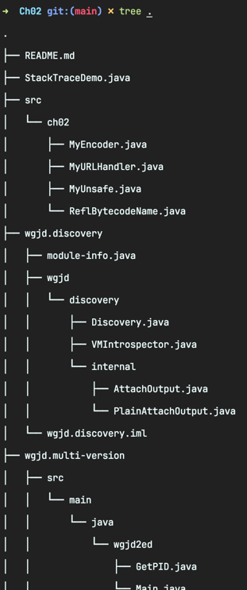

<!-- Date: 2025-01-05 -->
<!-- Update Date: 2025-01-05 -->
<!-- File ID: 61171b30-e63a-48a3-a7fa-feb79cf697b0 -->
<!-- Author: Seoyeon Jang -->

# 개요

모듈형 애플리케이션의 첫번째 에제를 만들어보자.
이를 위해서는 모듈 그래프(물론 DAG)를 작성해야 한다. 그래프에는 **루트 모듈**(root module)이 있어야 하며,
이 경우 앱의 진입점 클래스를 포함하는 모듈이다.
애플리케이션의 모듈 그래프는 루트 모듈의 모든 모듈 의존성에 대한 **전이적 폐쇄**다.

1장에서 만든 HTTP사이트 검사 도구를 모듈형 앱에 맞게 조정하자.

# 정리

