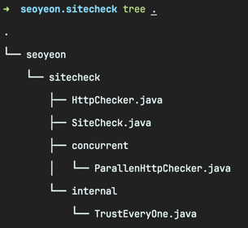
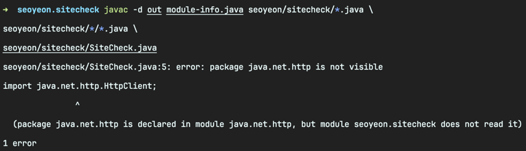

<!-- Date: 2025-01-05 -->
<!-- Update Date: 2025-01-07 -->
<!-- File ID: 61171b30-e63a-48a3-a7fa-feb79cf697b0 -->
<!-- Author: Seoyeon Jang -->

# 개요

모듈형 애플리케이션의 첫번째 에제를 만들어보자.
이를 위해서는 모듈 그래프(물론 DAG)를 작성해야 한다. 그래프에는 **루트 모듈**(root module)이 있어야 하며,
이 경우 앱의 진입점 클래스를 포함하는 모듈이다.
애플리케이션의 모듈 그래프는 루트 모듈의 모든 모듈 의존성에 대한 **전이적 폐쇄**다.

1장에서 만든 HTTP사이트 검사 도구를 모듈형 앱에 맞게 조정하자.


모든 코드가 하나의 파일에 있어야 할 때처럼 정적 내부 클래스로 표현하지 않고 특정 관심사를 자체 클래스로 분리한다.
또한 **별도의 패키지로 분할해서 모든 패키지를 내보내지는 않을 것이다.**

모듈 파일은 다음과 같다.

```java
module seoyeon.sitecheck {
    requires java.net.http;
    exports seoyeon.sitecheck;
    exports wgjd.sitecheck.concurrent;
}
```

java.net.http 모듈에 대한 의존성에 주목하자. 만약 module-info.java 에 해당 의존성을 누락했을 때 어떤 일이 발생할까?
주석 처리하고 javac 를 사용하여 컴파일하면 다음과 같은 컴파일 에러를 뿜는다.


**모듈 시스템**이 **누락된 모듈을 감지**하고 누락된 모듈을 의존성으로 추가하는 해결방법을 제안하여 도움을 주려고 한다.
이렇게 변경하면 예상대로 모듈이 문제없이 빌드된다.
그러나 더 복잡한 문제는 컴파일 단계를 변경하거나 모듈 시스템을 제어하기 위한 스위치를 통해서 수동 개입을 해야할수도 있다.

# 정리