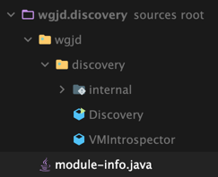

<!-- Date: 2025-01-05 -->
<!-- Update Date: 2025-01-05 -->
<!-- File ID: 84a9ae17-3999-4b5d-90e0-780e658c8ace -->
<!-- Author: Seoyeon Jang -->

# 개요

자바 플랫폼 모듈은 단일 엔티티로 선언되고 로드되는 패키지와 클래스의 모음인 개념적 단위로 정의된다.
각 모듈은 **모듈 기술자**(module descriptor)라고 하는 새로운 파일(`module-info.java`)을 선언해야 하는데,
이 파일에는 다음 내용이 포함돼있다.

- 모듈명
- 모듈 의존성
- 공개 API(내보낸 패키지)
- 리플렉션 액세스 권한
- 제공되는 서비스
- 소비되는 서비스

이 파일은 소스 계층구조 내에서 적절한 위치에 배치해야 한다. 예를 들어 메이븐 스타일 레이아웃에서 전체 모듈이름(`wgjd.discovery`)
은 다음의 디렉터리 구조의 예에 표시되는 것처럼 `src/main/java` 바로 뒤에 나타나며 `module-info.java`와 패키지 루트를 포함한다.


> 모듈 프로젝트가 빌드되면 모듈 설명자는 `module-info.class`라는 클래스 파일로 컴파일된다.

모듈 설명자의 간단한 에는 다음과 같다.

```java
module wgjd.discovery {
    exports wgjd.discovery;

    requires java.instument;
    requires jdk.attach;
    requires jdk.internal.jvmstat;
}
```

여기에는 `module`, `exports`, `requires` 라는 세 가지 새로운 키워드가 있다.
`module`키워드는 단순히 범위의 시작을 선언한다.

> module-info.java 라는 이름은 package-info.java를 연상시키는데, 어느정도 관련이 있다.
> 패키지는 런타임에서 실제로 보이지 않기 때문에 전체 패키지에 적용하는 애너테이션 메타데이터에 대한 후크를 제공하기 위한 방법이 필요했다.
> 이 방법이 package-info.java였다. 모듈 세계에서는 훨씬 더 많은 메타데이터를 모듈에 연결할 수 있으므로 비슷한 이름을 선택했다.

## 모듈 내보내기와 의존 모듈 선언하기

`exports`키워드는 인수로 패키지 이름을 기대한다.

```java
exports wgjd.discovery;
```

즉 예제 `discovery`모듈은 `wgjd.discovery`패키지를 내보내지만 설명자가 다른 패키지를 언급하지 않기 때문에 `wgjd.discovery.internal`은
내보내지 않으며 일반적으로 `discovery`모듈 외부의 코드에서 사용할 수 없다.

모듈 설명자에서 여러 줄의 `exports`가 가능한데, 실제로 매우 일반적이다. 특정 외부 모듈만 모듈에서 지정된 패키지에 액세스할 수 있음을 나타내는 `exports ... to ...` 구문을 사용해서
더 세밀한 제어가 가능하다.

`requires`키워드는 현재 모듈의 의존성을 선언하며 항상 패키지 이름이 아닌 모듈 이름이 인수로 필요하다.
`java.base`모듈에는 자바 런타임의 가장 기본적인 패키지와 클래스들이 포함돼 있다.
다음과 같이 `jmod`명령으로 살펴볼 수 있다.


나열된 패키지들은 모든 자바 프로그램에서 사용되므로 `java.base`는 항상 모든 모듈의 암시적 의존성이어서 `module-info.java`에 명시적으로
선언할 필요가 없다. 이는 java.lang 이 모든 자바 클래스에 대해 암시적으로 임포트되는 것과 같은 방식이다.

모듈 이름에 대한 규칙과 관례는 다음과 같다.

- 모듈은 글로벌 네임스페이스에 있다.
- 모듈이름은 고유해야한다.
- 가능하면 표준적으로 `com.company.project`를 사용한다.

모듈의 중요한 기본 개념 중 하나는 전이성이다. 이 개념은 모듈의 컨텍스트뿐만 아니라 자바의 보다 친숙한 라이브러리(즉 JAR파일) 의존성(11장에서 다룸)에서도
발생하므로 이 개념을 자세히 살펴보자.

## 전이성

**전이성**(transitivity)은 자바에만 한정된 용어가 아닌, 컴퓨팅 분야에서 자주 사용되는 일반적인 개념이다.
코드 유닛이 올바르게 작동하려면 다른 유닛들이 필요하고, 그 유닛들 자체가 다른 유닛들을 필요로 할 때 발생하는 상황을 묘사한다.

A가 B를 필요로 하는 두 개의 모듈 A와 B를 생각해보자. 이 경우에는 가능한 두 가지 경우가 있다.

- A는 B에서 직접적으로 의존해야하는 어떤 타입도 내보내지(export) 않는다.
- A가 직접적으로 의존해야 하는 타입 일부 API에 B를 포함한다.

A가 B에 정의된 타입을 반환하는 메서드를 내보내는 경우, A의 클라이언트(A를 필요로 하는 모듈)도 B를 의존(requires)하지 않는 한 A를 사용할 수 없게 되며,
이는 A의 클라이언트에게 불필요한 오버헤드를 초래할 수 있다.

모듈 시스템은 이 문제를 해결하기 위해 몇 가지 간단한 구문(`requires transitive`)을 제공하는데, 이를 사용하면 모듈 A가 다른 모듈을 전이적으로 필요로 하는 경우,
A에 종속된 모든 코드는 암시적으로 전이적 의존성도 함께 가져온다.

이런 경우에는 `requires transitive`의 사용을 피할 순 없겠지만, 일반적으로 모듈을 작성할 때는 전이성 사용을 최소화하는 것이 모범사례로 간주된다.
전이 의존성에 대해서는 11장에서 빌드 도구에 대해 설명할 때 더 자세히 설명하겠다.

# 정리


