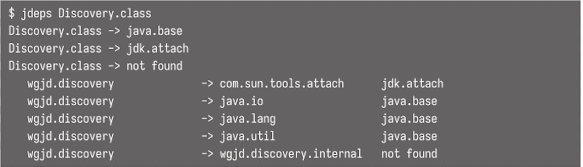

<!-- Date: 2025-01-25 -->
<!-- Update Date: 2025-01-25 -->
<!-- File ID: 155d8464-0fdd-4fee-a374-c8e6acad29d7 -->
<!-- Author: Seoyeon Jang -->

# 개요

콤팩트 프로파일은 자바 8의 기능이다. 콤팩트 프로파일은 크기가 축소된 런타임 환경이다. 컴팩트 프로파일은 자바 9에 도입될 모듈화를 위한 유용한 디딤돌로 자바 8에 도입됐다.

프로파일의 주요 사용 사례중 하나는 서버 애플리케이션 등인데, 예를 들어 역사적으로 보안 취약점이 많은 자바의 GUI 기능, 특히 Swing 및 AWT 와 관련이 있다. 이런 패키지는 서버에서 굳이 필요가 없으므로...

Compact1은 애플리케이션을 배포할 수 있는 가장 작은 패키지 세트다. 여기에는 매우 친숙한 50개의 패키지가 포함돼있다.

- java.io
- java.lang
- java.math
- java.net
- java.text
- java.util
- java.util.concurrent.atomic
- java.util.function
- java.crypto.interfaces
- java.net.ssl
- java.security.auth.x500

Compact2는 훨씬 더 크며, XML, SQL, RMI 및 보안에 필요한 패키지가 포함돼있다. 기본적으로 윈도우와 GUI 구성 요소를 제외한 전체 JRE를 포함한다. 이는 `java.se`모듈과 유사하다.

Compact1 프로파일은 가장 작은 런타임에 가깝기 때문에 어떤 면에서는 `java.base`모듈의 프로토타입 형태와 유사하다. 애플리케이션이나 라이브러리가 Compact1 만을 의존성으로 사용하여 실행할 수 있다면 이상적으로는 그렇게 해야 한다.

앱이 Compact1 또는 다른 프로파일로 실행될 수 있는지 여부를 결정하는데 도움을 주기 위해 JDK는 **jdeps**를 제공한다. 이는 패키지 또는 클래스의 의존성을 검사하기 위해 자바 8 및 11과 함께 제공되는 정적 분석 도구다. 이 도구는 애플리케이션을 실행해야하는 프로파일을 식별하는 것부터 문서화되지 않은 내부 JDK API(ex: sun.misc 클래스)를 호출하는 개발자 코드를 식별하는 것, 전이적 의존성을 추적하는 것 까지 다양한 방식으로 사용할 수 있다. 자바 8에서 11로 마이그레이션 하는데 매우 유용하며 JAR와 모듈에서 모두 작동한다. 

가장 간단한 형태로 **jdeps**는 클래스나 패키지를 가져와 의존성인 패키지의 간단한 목록을 제공한다. 예를 들어 discovery 예제는 다음과 같다.

# 정리

