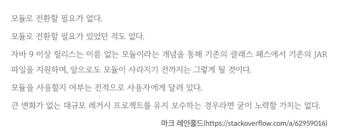

<!-- Date: 2025-01-25 -->
<!-- Update Date: 2025-01-25 -->
<!-- File ID: 69565db4-f647-446f-8150-aedc28c0c29a -->
<!-- Author: Seoyeon Jang -->

# 개요

모듈은 코드를 패키징하고 배포하는 근본적으로 새로운 방식이다. 팀이 모듈을 본격적으로 채택할 준비가 될 때까지는 클래스 패스와 JAR 파일을 사용하는 기존의 (구식)방법도 사용할 수 있다.

실제로 마크 레인홀드(오라클의 자바 수석 아키텍트)는 애플리케이션이 모듈성을 채택해야하는 '필요성'에 대해 다음과 같이 말했다.

모듈로의 전환이 굳이... 일수도 있다는 것이다. 만약 마이그레이션을 하게된다면, 실제로는 복잡할 수 있으므로 다음과 같은 프로세스를 따르는 것이 좋다.

1. 자바 11로 업그레이드한다(클래스패스만 해당)
2. 자동 모듈 이름을 설정한다
3. 모든 코드를 가지고 있는 **모놀리식 모듈**을 도입한다
4. 필요에 따라 개별 모듈로 분리한다

일반적으로 3단계에서는 구현 코드가 너무 많이 노출된다. 

아직 자바 8을 사용중이고 모듈식 빌드로 마이그레이션할 준비가 되지 않은 경우에도 다음과 같은 작업을 수행해서 마이그레이션을 위한 코드를 준비할 수 있다.

- MANIFEST.MF에 자동 모듈 이름을 도입
- 배포 아티팩트에서 분할된 패키지를 제거
- jdeps 및 컴팩트 프로파일을 사용해서 불필요한 의존성 줄이기

이 중 첫번째 방법을 사용하기 위해서는 이 장의 앞부분에서 설명했던 것처럼 명시적인 자동 모듈이름을 사용하면 전환이 쉬워진다. 또한 모듈이 사용할 이름을 이미 선점했기 때문에 라이브러리 소비자가 모듈로의 전환에 대비할 수 있다는 장점도 있다. 다른 두 가지 구체적인 권장사항(분할 패키지, 자바 8컴팩트 프로파일)에 대해 자세히 살펴보자.

# 정리

