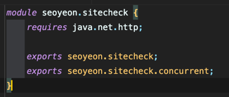
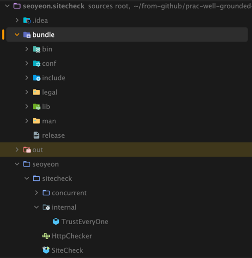

<!-- Date: 2025-01-26 -->
<!-- Update Date: 2025-01-26 -->
<!-- File ID: b17a77f8-08ad-4604-917e-3575a86ac844 -->
<!-- Author: Seoyeon Jang -->

# 개요

모듈 너머에 무엇이 있을까? 모듈의 핵심은 자바 언어에 누락된 추상화, 즉 소스코드 컴파일러와 런타임에서 신뢰할 수 있고 의존성을 보장하는 배포 단위라는 개념을 도입하는 것이다.

신뢰할 수 있는 모듈식 의존성 정보에 대한 이 아이디어는 배포 가능한 소프트웨어의 현대적인 세계에 여러 가지로 적용된다. 자바에서 모듈은 도구와 생태계가 모듈을 완벽하게 지원하고 모듈이 제공하는 이점이 더 잘
알려짐에 따라 느리지만 꾸준히 채택되고 있다.

이 메모에서는 모듈과 함께 플랫폼에 추가된 새로운 기능인 jlink 를 소개하면서 마무리하겠다. 이것은 애플리케이션과 함께 축소된 자바 런타임을 패키징하는 기능이다. 이 기능을 사용하는 애플리케이션에는 다음의 이점이
있다.

- 애플리케이션과 JVM을 하나의 독립된 디렉터리로 패키지화할 수 있다
- 애플리케이션과 JRE번들의 설치 공간과 전체 다운로드크기를 줄일 수 있다
- 자바 애플리케이션과 호스트에 설치된 JVM 간의 상호작용을 디버깅할 필요가 없으므로 지원 오버헤드를 줄일 수 있다

jlink가 생성하는 독립형 디렉토리는 배포 가능한 아티팩트(예: 리눅스`.rpm` 또는 `.deb`, 맥 `dmg` 또는 윈도우 `msi`)로 쉽게 패키징할 수 있으므로 최신 자바 애플리케이션을 위한 간단한 설치
환경을 제공한다.

여기 간단한 module-info.java 가 있다.

이것은 다음 명령을 통해 jlink 번들로 빌드할 수 있다.

```shell
$ jlink --module-path $JAVA_HOME/jmods/:out --output bundle/ --add-modules seoyeon.sitecheck
```



한가지 주의할 점은 jlink는 훌륭한 기술이지만 다음의 제한사항이 있다.

- 완전히 모듈화된 의존성을 갖는 애플리케이션에서만 작동함
- 비모듈화코드와는 호환되지 않음
- 자동 모듈만으로는 충분하지 않음

이는 JRE에 필요한 모든 부분이 번들에 포함된 것인지 확실하게 확인하기 위해 jlink는 모듈 그래프의 강력한 선언적 정보에 의존하므로, 각 의존성에 대해 module-info.class 가 필요하기 때문. 이
정보가 없으면 축소된 JRE를 빌드하는 것은 안전하지 않을 수 있기 때문이다.

안타깝게도 실제 세계에서는 많은 애플리케이션이 의존하는 라이브러리들이 아직 완전히 모듈화되지 않은 경우가 많다. 이는 jlink의 유용성을 크게 감소시킨다. 이 문제를 해결하기 위해 도구 제작자들은 모듈화되지 않은
라이브러리에서 진정한 모듈을 다시 패키징하고 합성하기 위한 플러그인을 개발했다. 이에 대해서는 11장에서 더 자세히 다룬다. 이러한 도구들을 사용하려면 빌드시 시스템을 사용해야 한다. 따라서 jlink의 실제예제는
빌드 도구를 다룰 때까지 미룬다.

# 정리
- 모듈은 자바의 새로운 개념이다. 모듈은 `패키지를 그룹화`하고 모듈 전체에 대한 메타데이터, 의존성, 공개 인터페이스에 대한 정보를 제공한다. 이러한 제약 조건은 컴파일러와 런타임에 의해 강제된다.
- 모듈은 배포 구조가 아니다(예: 다른 파일 형식). 모듈화된 라이브러리와 애플리케이션은 여전히 JAR파일을 통해 배포하고 표준 빌드 도구를 통해 다운로드할 수 있다.
- 모듈로 전환하려면 자바 애플리케이션 개발 방식에 변화가 필요하다.
  - module-info.java 파일의 새로운 문법은 모듈 시스템 내에서 클래스와 메서드가 노출되는 방식을 제어한다.
  - 클래스 로딩은 모듈이 정의하는 제한 사항을 인식하고 비모듈화된 코드의 로딩을 처리한다.
  - 모듈로 빌드하려면 새로운 명령줄 플래그와 자바 프로젝트의 표준 레이아웃을 변경해야 한다.
- 모듈은 여러 이점을 제공한다.
  - 모듈은 세분화된 제어가 가능하기 때문에 장기적인 유지 보수성을 위해 애플리케이션을 설계하는 데 더 나은 방법임
  - 모듈은 특히 컨테이너에서 에셋의 사용량을 줄이는 데 핵심적인 역할을 함
  - 모듈은 정적 컴파일처럼 다른 새로운 기능을 위한 길을 열어줌
- 다중 릴리즈 JAR 및 컴팩트 프로파일과 같은 도구를 사용하면 지금 당장 마이그레이션할 수 없더라도 기존 자바 8프로젝트를 모듈식 생태계와 통합할 수 있도록 준비할 수 있음


