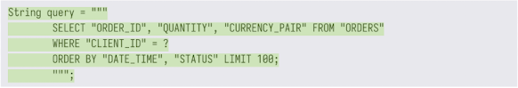
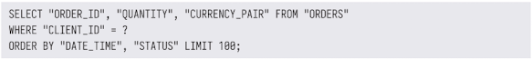

<!-- Date: 2025-01-30 -->
<!-- Update Date: 2025-01-30 -->
<!-- File ID: 1ba8d857-4681-4ee2-ac4d-2f14ca6df6f7 -->
<!-- Author: Seoyeon Jang -->

# 개요

자바 17에는 사용자가 확인할 수 있는 주요 언어 업그레이드뿐만 아니라 많은 내부적인 개선 사항(특히 성능 업그레이드)이 포함돼있다. 하지만 이 장에서는 개발자가 자바를 작성하는 방식을 변화시킨 주요 기능에 중점을 두겠다.

## Text 블록

첫번째 버전인 자바 1.0부터 개발자들은 자바의 문자열에 대해 불만을 제기해왔다. 그루비나 스칼라, 코틀린과 같은 다른 프로그래밍 언어와 비교할 때 자바의 문자열은 원시적으로 느껴졌기 때문이다. 자바는 지금까지 특정 문자(특히 `"` 및 `\`)를 이스케이프 처리해야하는, 즉 큰따옴표로 감싼 문자열만 제공했다. 이로 인해 복잡한 이스케이프 문자열을 만들어야 했었다...

Text 블록 프로젝트는 프리뷰 기능으로 여러차례 반복됐으며, 이제 자바 17의 표준 기능으로 자리잡았다. 이 프로젝트는 여러 줄에 걸쳐 확장되는 문자열 리터럴을 허용해서 자바 구문에서 문자열의 개념을 확장하는 것을 목표로 한다. 그 결과, 가독성 떨어지는 일련의 이스케이프 시퀀스가 필요하지 않다.

>NOTE: 다른 프로그래밍 언어와 달리 자바 Text 블록은 현재 보간(interpolation)을 지원하지 않지만, 향후에 도입하기 위해 적극적 검토중이라고 한다.

자바 17 이전에는 JSON 이나 SQL 코드를 작성하고 읽는 것이 매우 불편했으며, 실제로 많은 팀에서 외부 의존 라이브러리를 사용했다. Text 블록이 출시된 이후에는 더이상 필요하지 않다!

두 가지를 주목해야 한다.

1. Text 블록은 `"""` 시퀀스로 시작 및 종료
2. Text 블록은 각 줄의 시작 부분에 공백으로 들여쓰기를 할 수 있으며 이때 공백은 무시됨

query 변수를 출력하면, 문자열이 출력된다.

Text 블록은 문자열 리터럴과 마찬가지로 (문자열 타입의) 상수 표현식이기 때문에 이런 일이 가능하다. 차이점은 다음과 같이 클래스 파일에 상수를 기록하기 전에 javac 에서 Text 블록을 처리한다는 점이다.

1. 줄 종결 문자는 LF(\u000A), 즉 유닉스 줄 종료 규칙으로 변환
2. 예제처럼 자바 소스코드의 추가 들여쓰기를 허용하기 위해 블록을 둘러싼 여분의 공백 제거
3. 블록의 모든 이스케이프 시퀀스 해석

이런 순서로 수행되는데는 이유가 있다. 특히 이스케이프 시퀀스를 마지막에 해석하는 이유는 블록에 리터럴 이스케이프 시퀀스(예: `\n`)가 이전 단계에서 수정되거나 삭제되지 않고 포함될 수 있음을 의미한다.
# 정리

