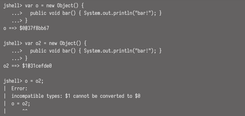

<!-- Date: 2025-01-30 -->
<!-- Update Date: 2025-01-30 -->
<!-- File ID: cee9eb92-da47-40d3-8885-69bdb46dd765 -->
<!-- Author: Seoyeon Jang -->

# 개요
모든 자바의 변수와 필드에는 명확한 타입이 있어야 한다.

자바에서 익명 클래스의 경우에도 타입은 여전히 이름을 가지고 있다. 다만 컴파일러가 이름을 할당하며 이는 자바 언어에서 유효한 타입 이름이 아니다(하지만 JVM 내에서는 유효하다). 예를 들어 이를 jshell에서 확인할 수 있다.



익명 클래스가 정확히 동일한 방식으로 선언됐지만, 컴파일러는 여전히 두 개의 서로 다른 익명 클래스인 `$0`과 `$1`을 생성하고 자바 타입 시스템에서 변수의 타입이 다르기 때문에 할당을 허용하지 않는다.

> 명시적인 타입 이름 대신 클래스의 전체적인 형태(예: 어떤 필드와 메서드가 있는지)를 타입으로 사용할 수 있는 언어도 있다. 이를 구조적 타이핑이라고 한다.

만약 record 가 자바의 전통을 깨고 record에 구조적 타이핑을 도입했다면 이는 큰 변화를 가져왔을 것이다. 결과적으로 'record는 명목적인 튜플이다'라는 설계적 선택은 record가 다른 언어에서 튜플을 사용하는 경우와 유사한 상황에서 가장 잘 작동할 것으로 기대한다는 의미다. 이는 복합맵 키나 메서드로부터의 다중 반환을 모방하는 등의 사용사례를 포함한다. 예를 들어 복합 맵 키는 다음과 같을 수 있다.

```text
record CurrencyPair(String base, String quote) {}

enum Side {
    BUY, SELL
}

record OrderPartition(CurrencyPair pair, Side side) {}

Map<OrderPartition, OrderDetails> orders = new HashMap<>();
orders.put(new OrderPartition(new CurrencyPair("USD", "EUR"), Side.BUY), new OrderDetails(...));
```

그러나 record가 현재 자바 빈을 사용하는 기존 코드를 대체하는데 꼭 필요한 것은 아니다. 여러 이유가 있는데, 특히 자바 빈은 변경 가능하지만 record는 변경불가능하다는 점!

불변성 제한 및 상속 불가 등의 제약적인 특성이 있기 때문에,,, 레코드가 일반 클래스를 대체할 수 없다.

# 정리


