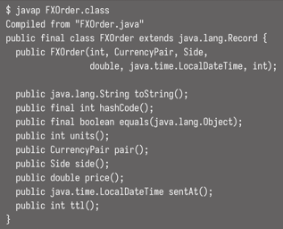

<!-- Date: 2025-01-30 -->
<!-- Update Date: 2025-01-30 -->
<!-- File ID: c8cb5550-871a-4737-ba81-3aa51bcd7ee2 -->
<!-- Author: Seoyeon Jang -->

# 개요

record 는 새로운 형태의 자바 클래스다. record는 상용구 감소와 문법 보다는 언어 의미론에 더 중점을 두고 있다.

record의 아이디어는 자바 언어를 확장해서 클래스를 `'필드, 오직 필드만'`으로 명시하는 방법을 만드는 것이다. 클래스에 대해 그런 선언을 하면, 컴파일러가 자동으로 모든 메서드를 생성하고 hashCode()와
같은 메서드에 모든 필드를 사용함으로써 우리를 도울 수 있다.

> NOTE: '레코드는 필드의 투명한 운반자다'라는 의미가 곧 문법을 정의하는 방식이다. 접근자 메서드 및 기타 상용구는 레코드 정의에서 자동으로 만들어진다.

자바에 대한 가장 일반적인 불만은 클래스가 유용하게 사용되기 위해 많은 코드를 작성해야 한다는 것이다. 다음과 같이 말이다.

- toString()
- hashCode() 와 equals()
- Getter 메서드
- 공개 생성자

간단한 도메인 클래스의 경우,이런 메서드들은 보통 지루하고 반복적이며 기계적으로 생성될 수 있는 유형의 작업이다. record가 없었던 시점에는 이를 직접적으로 처리할 수 있는 방법이 없었다. 이러한 답답함은 다른
사람의 코드를 읽을 때 더욱 심각해진다. 예를 들어 작성자가 클래스의 모든 필드를 사용하는 hashCode()와 equals()를 사용하는 것처럼 보일 수 있지만, 각 줄을 일일이 확인하지 않는 한 어떻게 확신할 수
있을까? 리팩토링 중 필드가 추가되면서 메서드를 다시 만들지 않은 경우라면?

record는 이러한 문제를 해결한다. 타입이 record 로 선언되면 강력한 선언이 이뤄지며 컴파일러와 런타임에서 그에 맞게 처리된다.

record 와 몇가지 다른 기능을 사용해서 도메인 모덷링을 개선하고 결과적으로 더 깔끔하고 장황하지 않으면서 간단한 코드를 작성하는 방법을 살펴보자. FX를 거래할 때 주문을 생각해보자. 기본 주문 유형은 다음과
같이 구성할 수 있다.

```java
import java.time.LocalDateTime;

public final class FXOrderClassic {
    private final int units;
    private final CurrencyPair pair;
    private final Side side;
    private final double price;
    private final LocalDateTime sentAt;
    private final int ttl;

    public FXOrderClassic(
            int units,
            CurrencyPair pair,
            Side side,
            double price,
            LocalDateTime sentAt,
            int ttl) {
        this.units = units;
        this.side = side;
        this.price = price;
        this.sentAt = sentAt;
        this.ttl = ttl;
    }

    // 게터, equals(), hashCode()
}
```

레코드는?

```java
public record FXOrder(
        int units,
        CurrencyPair pair,
        Side side,
        double price,
        LocalDateTime sentAt,
        int ttl
) {
}
```

이 레코드 선언을 작성함으로써, 단순히 타이핑을 절약하는 것뿐만 아니라 훨씬 더 강력하고 의미론적인 선언을 한다. FXOrder 타입은 제공된 상태만을 가지며, 모든 인스턴스는 필드값을 담은 투명한 그릇일 뿐이다.

javap로 클래스 파일을 살펴보면 컴파일러가 상용구 코드를 자동으로 생성한 것을 볼 수 있다.



실제로 생성자 및 접근자 메서드는 모두 이전과 똑같이 동작한다. 그러나 `toString()` 및 `equals()`와 같은 메서드는 다음과 같이 일부 개발자에게는 의외일 수 있는 구현을 사용한다. 즉
toString()(및 equals()와 hashCode())메서드는 invokedynamic 기반의 매커니즘을 사용해서 구현된다. 이는 4장과 16장에서 만나게 될 강력한 기법이다.

또한 모든 레코드 클래스의 슈퍼타입으로 새로운 클래스인 java.lang.Record가 있다는 것을 알 수 있다. 이것은 추상 클래스이며 equals(), hashCode(), toString()을 추상 메서드로
선언한다.

자바의 열거형은 디자인패턴(유한한 수의 타입 세이프 인스턴스)을 구현한 구문 오버헤드를 최소화하는 특수한 형태의 클래스로, 컴파일러가 코드를 생성한다. 마찬가지로 자바의 레코드는 최소한의 구문으로 패턴(데이터
캐리어, 일명 just holds fields)을 구현한 특수한 형태의 클래스다. 우리가 기대하는 모든 상용구 코드는 컴파일러에 의해 자동 생성된다.

다만, 필드만을 보유한 데이터 캐리어라는 단순한 개념은 직관적으로 이해가 되지만, 구체적으로 무엇을 의미하는가?

- 하이버네이트에서 그들을 프록시할 수 있나?
- 전통적인 자바 빈과 완전히 호환되나?
- 이름 제거와 형식 유연성을 지원하나?
- 패턴 매칭과 구조 분해가 지원될까?

# 정리


