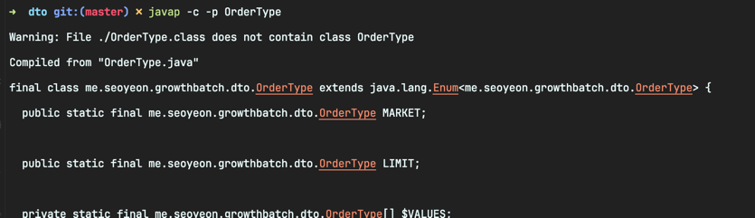

<!-- Date: 2025-01-31 -->
<!-- Update Date: 2025-01-31 -->
<!-- File ID: 70e66f33-22fe-4f66-a865-55a1798eb754 -->
<!-- Author: Seoyeon Jang -->

# 개요
자바의 열거형은 잘 알려진 언어 기능이다. 이를 통해 해당 유형이 가질 수 있는 모든 값을 타입 세이프한 상수들로 구성된 유한 집합으로 모덷링할 수 있다.

```java
enum OrderType {
    MARKET,
    LIMIT
}
```

이 열거형을 디컴파일해서 컴파일러가 생성한 것을 확인해보자.



클래스 파일 내에서 열거형의 가능한 모든 값은 `public static final` 변수로 정의되며, 뒤이어 나오는 생성자는 private 이므로 추가적인 인스턴스를 생성할 수 없다.

사실상 열거형은 싱글톤 패턴과 비슷하지만, 클래스의 인스턴스가 하나만 있는 것이 아니라 유한한 개수가 있다는 점이 다르다.

sealed 는 특정 클래스나 인터페이스만 상속하도록 제한하는 기능이다. 즉 sealed 클래스로 정의하면, 그 클래스를 상속할 수 있는 타입이 제한된다는 말이다.


# 정리


