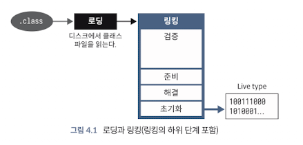

<!-- Date: 2025-01-11 -->
<!-- Update Date: 2025-01-11 -->
<!-- File ID: b369cf79-2571-406c-b1b0-77377ea649e8 -->
<!-- Author: Seoyeon Jang -->

# 개요

JVM을 바라보는 한가지 방법은 **실행 컨테이너**라고 보는 것이다. 이 관점에서 JVM의 목적은 클래스 파일을 소비하고 그 안에 포함된 바이트코드를 실행하는 것이다.
이를 위해 JVM은 클래스 파일의 내용을 바이트 데이터 스트림으로 조회해서 사용 가능한 형태로 변환한 후 실행 상태에 추가해야 한다.

이 다소 복잡한 프로세스는 여러 가지 방법으로 나눌 수 있지만, 여기서는 **로딩(loading)** 과 **링킹(linking)** 으로 나눈다.

> 로딩과 링킹에 대한 논의는 핫스팟 코드에 특정한 몇 가지 세부 사항을 언급하지만, 다른 구현체들에서도 비슷한 작업을 수행해야 한다.

첫번째 단계는 클래스 파일을 구성하는 바이트의 데이터 스트림을 가져오는 것이다. 이 프로세스는 파일 시스템에서 읽어오는 바이트배열로 시작한다.

일단 스트림을 확보한 후에는 스트림을 파싱해서 유효한 클래스 파일 구조를 포함하고 있는지를 확인해야 한다(이를 형식 검사, format checking이라고 함).
포함하고 있다면 후보 klass 가 생성된다. 여기에서 후보 klass가 작성되는 동안 몇가지 기본적인 검사(예: 로드 중인 클래스가 실제로 선언된 슈퍼 클래스에 액세스할 수 있는가?
final 메서드를 재정의하려고 시도하는가?)가 수행된다.

로딩 프로세스가 끝나도 클래스에 해당하는 데이터 구조는 아직 다른 코드에서 사용할 수 없으며, 특히 완전히 기능이 구현된 klass가 아니다.

따라서 이제 클래스를 링크한 후 초기화해야 사용할 수 있다. 논리적으로 이 단계는

- 검증,
- 준비,
- 해결

- 이렇게 세 가지 하위 단게로 나뉜다.

그러나 실제 구현에서는 코드가 깔끔하게 분리되지 않을 수 있으므로 소스코드를 읽을 계획이라면, 이 메모의 설명은 프로세스에 대한 개략적 또는 개념적 설명이기 때문에
실제 구현 코드와 정확한 상관관계가 없다는 점에 유의하자.

이를 숙지하고 계속 이야기해보자면, **검증**은 클래스가 자바 사양의 요구 사항을 준수하고 실행중인 시스템에 런타임 오류나 기타 문제를 일으키지 않는지 확인하는 단계로 이해할 수 있다.

각 단계를 차례로 살펴보자.

### 1. 검증

검증(validation)은 여러가지 독립적인 문제로 구성된 매우 복잡한 프로세스다. 예를 들어 JVM은 상수 풀에 포함된 기호정보가 자체 일관성이 있고 상수에 대한 기본
동작 규칙을 준수하는지 확인해야 한다.

또 다른 주요 관심사이자 검증에서 가장 복잡한 부분은 메서드의 **바이트코드를 확인하는 것**이다.
여기에는 바이트코드가 제대로 동작하면서 JVM의 환경제어를 우회하지 않는지 확인하는 것이 포함된다.

수행되는 주요 검사는 다음과 같다.

- 바이트코드가 허용되지 않거나 악의적인 방법으로 스택을 조작하려고 시도하지 않는지 확인한다.
- 모든 분기 명령어(예: if 또는 루프)에 적절한 대상 명령어가 있는지 확인한다.
- 메서드가 올바른 정적 유형의 매개변수 수로 호출되는지 확인한다.
- 로컬 변ㅅ에 적절한 타입의 값만 할당됐는지 확인한다.
- 던질 수 있는 각 예외에 대해 적절한 캐치 핸들러가 있는지 확인한다.

이러한 검사는 성능 등 여러 이유로 수행되는데, 이런 검사를 통해 **런타임 검사를 건너뛸 수 있으므로** 해석한 코드가 더 빠르게 실행될 수 있다.
또 일부는 런타임에 바이트코드를 기계어로 컴파일(JIT컴파일)하는 작업을 간소화할 수 있다.

### 2. 준비

클래스 준비(preperation)에는 메모리를 할당하고 클래스의 정적 변수를 초기화할 수 있도록 준비하는 작업이 포함되지만, 변수를 초기화하거나 JVM바이트코드를
실행하지는 않는다.

### 3. 해결

해결(resolution)은 링킹할 클래스의 상위 유형(및 클래스가 구현하는 모든 인터페이스)가 이미 링킹됐는지 확인하고, 그렇지 않은 경우 해당 타입들을 링킹한다.
이러 인해 재귀적인 링크 프로세스가 발생할 수 있다.

로드해야하는 모든 추가적인 타입을 찾아서 해결하면 JVM은 원래 로드하도록 요청받은 클래스를 초기화할 수 있다.

### 4. 초기화

이 마지막 단계에서는 모든 정적 변수가 **초기화**되고 모든 정적 초기화 블록이 실행된다.
이 단계가 중요한 이유는 이제야 JVM이 새로 로드된 클래스의 바이트코드를 실행하기 때문이다.

이 단계가 완료되면 클래스가 완전히 로드돼 사용할 준비가 된 것이다. 런타임에서 클래스를 사용할 수 있으며 클래스의 새로운 인스턴스를 생성할 수 있다.

# 정리

