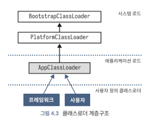
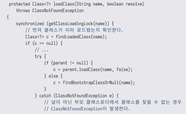
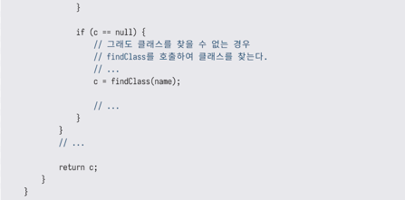
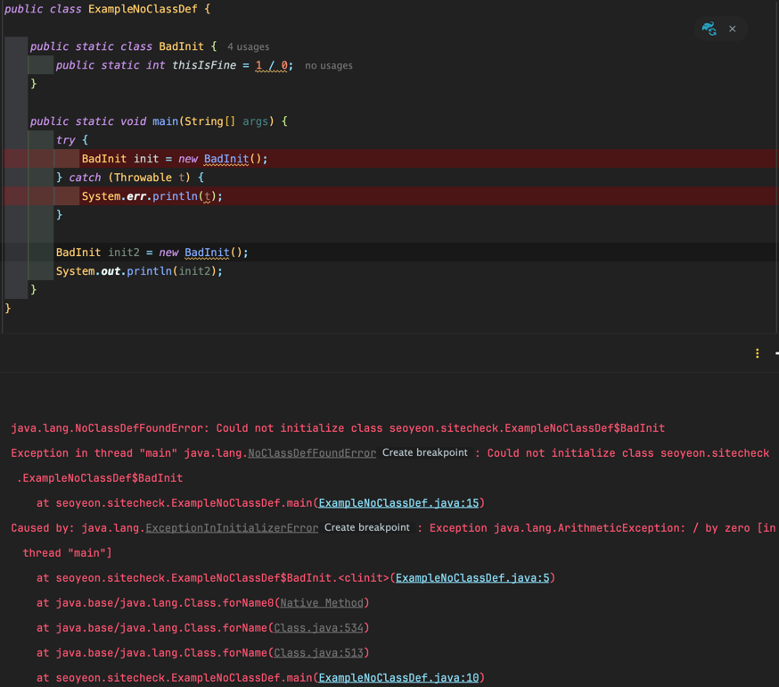
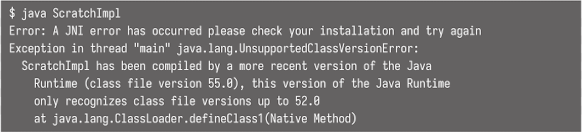
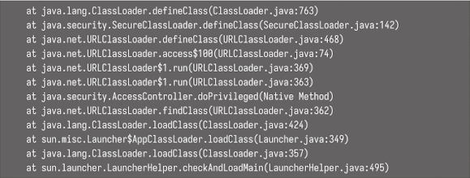
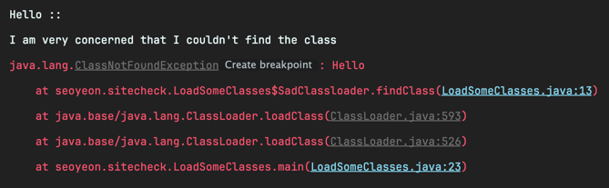

<!-- Date: 2025-01-14 -->
<!-- Update Date: 2025-01-16 -->
<!-- File ID: 979ad3a6-93f6-40ec-b1ef-121fc8326bcc -->
<!-- Author: Seoyeon Jang -->

# 개요

더 복잡한 환경에서는 종종 `java.lang.ClassLoader`를 (직접 또는 간접적으로) 서브클래싱하는 여러 **사용자 정의 클래스로더**(custom class loader)클래스를 추가할 수 있다. 이는
클래스로더 클래스가 final 이 아니기 때문에 가능하며, 실제로 개발자는 각자의 필요에 맞는 자체 클래스로더를 작성하는 것이 좋다.

사용자 정의 클래스로더도 그저 하나의 자바 타입이므로 일반적으로 **상위 클래스로더**(parant class loader)인 클래스로더에서 로드해줘야 한다. 이를 클래스 상속이나 부모 클래스와 혼동해서는 안된다.
대신 클래스로더는 일종의 위임(delegation)관계다.

다음 그림에서 클래스로더의 위임 계층구조와 서로 다른 로더가 어떻게 연관되는지 확인할 수 있다.


사용자 정의 매커니즘의 핵심은 ClassLoader 에 정의된 `loadClass()`와 `findClass()`메서드에서 찾을 수 있다. 주요 진입점은 `loadClass()`이며 ClassLoader에 있는 관련
코드의 단순화된 형태는 다음과 같다.



기본적으로 `loadClass()` 매커니즘은 클래스가 이미 로드됐는지 확인한 다음, 부모 클래스로더에 요청한다. 클래스 로딩에 실패하면 (`parent.loadClass(name, false)` 호출을 둘러싼 *
*try-catch**에 주목하자) 로딩 프로세스는 `findClass()`로 위임된다.
java.lang.ClassLoader에서 `findClass()`의 정의는 매우 간단하며, **ClassNotFoundException**을 던진다.

이 시점에서 이 장의 시작 부분에서 제기했던 질문으로 돌아가서 **클래스 로딩 중에 발생할 수 있는 몇가지 예외와 오류 타입을 살펴보자.**

## 1. 클래스 로드 중 발생할 수 있는 예외들

ClassNotFoundException 의 의미는 비교적 간단하다. 클래스로더가 지정된 클래스를 로드하려고 시도했지만 로드할 수 없었다는 것이다. 즉 로드가 요청된 시점에 해당 클래스를 JVM이 알 수 없었고,
JVM이 해당 클래스를 찾지 못했다는 뜻이다.

다음은 NoClassDefFoundError 다. 이 오류는 예외가 아니라 **오류(error)** 라는 점에 유의하자. 이 오류는 요청된 클래스의 존재를 알고 있지만 내부 메타데이터에서 해당 클래스에 대한 정의를
찾지 못했음을 나타낸다. 예를 살펴보자.



이는 JVM이 `BadInit`클래스를 로드하려고 시도했지만... 실패했음을 보여준다. 그럼에도 불구하고 프로그램은 예외를 포착하고 계속 진행하려고 한다.
그러나 클래스를 두번째 만났을 때 JVM의 내부 메타데이터 표에 클래스가 인식됐지만 유효한 클래스가 로드되지 않은 것으로 나타났다.

JVM은 클래스 로드 시도에 실패할 경우 **네거티브 캐싱**을 효과적으로 구현해서 로드를 다시 시도하지 않고 대신 오류(NoClassDefFoundError)를 던진다.

또 다른 일반적인 오류는 클래스 로드 작업이 **런타임이 지원하는 것보다 상위버전의 자바 소스코드 컴파일러로 컴파일된 클래스 파일을 로드하려고 할 때 발생하는 UnsupportedClassVersionError다.
** 예를 들어 자바 11로 컴파일된 클래스를 자바 8에서 실행하려고 한다고 하면 다음과 같은 에러가 난다.




자바 11 형식의 바이트코드에는 자바 8 런타임에서 지원하지 않는 기능이 포함돼있을 수 있으므로 계속 로드를 시도하는 것은 안전하지 않다. 자바 8 런타임이므로 스택 추적에 모듈식 항목들이 없다는 점에 유의하자.

마지막으로 `NoClassDefFoundError`, `VerifyError`, `UnsatisfiedLinkError`를 포함한 계층 구조의 기본 클래스이자 몇 가지 다른 가능성을 가진 `LinkageError`에
대해서도 언급해야 한다.

## 첫번째 사용자 정의 클래스 로더

가장 간단한 형태의 사용자 정의 클래스 로딩은 ClassLoader를 서브클래싱하고 `findClass()`를 **오버라이드**하는 것이다. 이렇게 하면 앞서 설명한 `loadClass()`로직을 재사용하고
클래스로더의 복잡성을 줄일 수 있다.

첫번째 예제는 SadClassLoader 다. 실제로는 아무 일도 하지 않지만, 기술적으로 프로세스에 참여하고 있음을 출력을 통해 알 수 있다.

```java
public class LoadSomeClasses {

    public static class SadClassloader extends ClassLoader {
        public SadClassloader() {
            super(SadClassloader.class.getClassLoader());
        }

        @Override
        protected Class<?> findClass(String name) throws ClassNotFoundException {
            System.out.println("I am very concerned that I couldn't find the class");
            throw new ClassNotFoundException(name);
        }
    }

    public static void main(String[] args) {
        if (args.length > 0) {
            var loader = new SadClassloader();
            for (var name : args) {
                System.out.println(name + " ::");
                try {
                    var clazz = loader.loadClass(name);
                } catch (ClassNotFoundException e) {
                    e.printStackTrace();
                }
            }
        }
    }
}
```



사용자 정의 클래스로더에 대한 일반적인 관례 중 하나는 슈퍼클래스 생성자를 호출하고 로딩중인 클래스로더를 인수로 제공하는 인수 없는 생성자를 제공하는 것이다.(이로써 로딩중인 클래스로더가 부모로 설정된다.)

많은 사용자 정의 클래스로더는 이 예시보다 더 복잡하지 않으며, 필요한 특정 기능을 제공하기 위해 `findClass()`를 재정의하는 것이 전부다. 예를 들어 네트워크를 통해 클래스를 찾는 것이 여기에 포함될 수
있다. 기억에 남는 한 가지 사례로, 사용자 정의 클래스로더는 JDBC를 통해 데이터베이스에 연결하고 암호화된 바이너리 열에 액세스하여 사용할 바이트를 가져오는 방식으로 클래스를 로드했다...! 이는 규제가 엄격한
환경에서 매우 민감한 코드를 사용하지 않을 때는 데이터를 암호화하여 안전하게 보호해야 한다는 요구사항을 충족하기 위한 것이었다.

그러나 `findClass()`를 재정의하는 것 이상의 작업을 수행할 수도 있다. 예를 들어 `findClass()`가 **final**이 아니기 때문에 재정의할 수 있으며, 실제로 일부 사용자 정의 클래스로더는
앞서 살펴본 일반적인 로직을 변경하기 위해 재정의하기도 한다.

마지막으로 ClassLoader에 정의된 `defineClass()`메서드도 있다. 이 메서드는 이 장의 앞부분에서 설명한 '로드와 링크' 프로세스를 수행하는 사용자가 액세스 가능한 메서드이기 때문에 클래스 로딩의
핵심이다. 이 메서드는 바이트 배열을 받아 클래스 객체로 변환한다. 이는 클래스패스(classpath)에 없는 새로운 클래스를 런타임에 로드하는 데 사용되는 기본 매커니즘이다.

`defineClass()` 호출은 올바른 JVM 클래스 파일 형식의 바이트 버퍼가 전달된 경우에만 작동한다. 그렇지 않은 경우 로드나 검증 단계에 실패해서 최종적으로 로드에 실패한다.

> 이 메서드는 런타임에 만들어져서 소스코드가 없는 클래스를 로드하는 것과 같은 고급 기술에 사용할 수 있다. 이 기법은 자바에서 람다 표현식 매커니즘이 작동하는 방식이다. 이 주제에 대해서는 17장에서 더 자세히
> 설명한다.

`defineClass()`메서드는 protected 메서드이자 final 메서드이면서 java.lang.ClassLoader에 정의돼있으므로 ClassLoader의 서브 클래스만 액세스할 수 있다.
따라서 사용자 정의 클래스로더는 항상 defineClass()의 기본 기능에 액세스할 수 있지만 검증 또는 기타 저수준 클래스 로딩 로직을 변경할 수는 없다. 검증 알고리즘을 변경할 수 없다는 것은
매우 안전하교 유용한 기능으로, 잘못 작성된 커스텀 클래스로더가 JVM이 제공하는 기본 플랫폼 보안을 손상시킬 수 없도록 한다.

핫스팟 가상머신(가장 일반적인 JVM 구현)의 경우, `defineClass()`는 네이티브 메서드 `defineClass1()`에 위임해서 몇 가지 기본 검사를 수행한 다음
`JVM_DefindClassWithSource()`라는 C 함수를 호출한다.

이 함수는 클래스 로딩 작업이 JVM 내부에서 실제로 시작되고 처리되는 첫 번째 함수이며, 자바와 네이티브 코드 간의 연결을 제공하며, 클래스 로딩 프로세스의 중심 역할을 한다.
핫스팟은 C++메서드 ClassFileParser::parseClassFile()을 통해 새 클래스를 로드하기 위해 C SystemDictionary를 사용한다. 이 코드는 실제로 링크 프로세스의 많은 부분을
실행하는데, 특히 검증 알고리즘을 실행한다.

클래스 로딩이 완료되면 메서드의 바이트코드는 메서드를 나타내는 핫스팟의 메타데이터 객체에 배치된다. 이 메타데이터 객체들을 **methodOops**라고 한다. 그다음, 이들은 바이트코드 인터프리터가 사용할 수
있도록 준비된다. 성능상의 이유로 실제로는 바이트코드가 methodOops에 의해 보관되지만, 개념적으로는 메서드 캐시라고 생각할 수 있다.

이제 클래스 로딩을 사용하여 의존성 주입을 구현하는 방법을 알아보면서 사용자 정의 클래스로더의 또 다른 몇가지 예를 살펴보자.

# 정리


