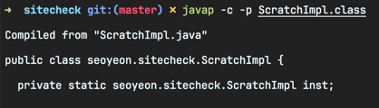
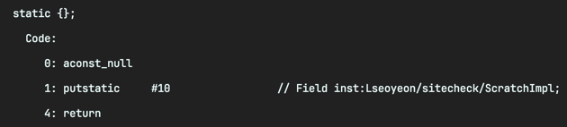
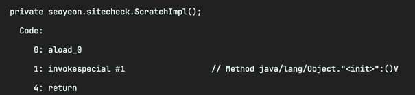
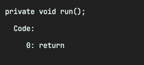
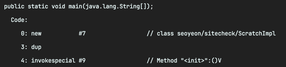
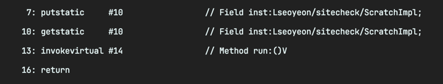

<!-- Date: 2025-01-17 -->
<!-- Update Date: 2025-01-17 -->
<!-- File ID: fc1759ce-e5e2-4288-9f75-8e04d25aaac6 -->
<!-- Author: Seoyeon Jang -->

# 개요

-c 스위치와 함께 javap 를 사용하면 클래스를 분해할 수 있다. 이 예제에서는 앞서의 ScratchImpl 클래스를 사용하겠다. 메서드를 구성하는 바이트코드를 중점적으로 살펴보자. 또한 -p 스위치를 사용해서
비공개 메서드의 바이트코드를 볼 수 있다.

javap 출력의 각 부분에는 많은 정보가 있으므로 조금씩 섹션별로 살펴보자. 먼저 헤더다. 여기에는 크게 예상치 못한 내용이나 흥미로운 내용은 없다.

다음은 정적 블록이다. 변수 초기화가 이루어지는 곳으로, 인스턴스를 null 로 초기화하는 것을 나타낸다.

putstatic 이 정적 필드에 값을 넣는 바이트코드라는 것을 짐작할 수 있다.

다음은 생성자다.

자바에서는 void 생성자가 항상 암묵적으로 수퍼클래스 생성자를 호출한다. 바이트코드에서 이를 확인할 수 있다. **invokespecial** 명령어다. 일반적으로, 모든 메서드 호출은 JVM은 다섯가지
`invoke` 명령어 중 하나로 변환된다.

생성자 호출에는 타깃이 필요한데, 이는 aload_0 명령어에 의해 제공된다. 이 명령어는 참조(주소)를 로드하고, 0번째 로컬 변수를 로드하기 위한 단축 형태를 사용한다. 이 0번 로컬 변수는 현재 객체인
this를 나타낸다.

run() 메서드에는 사실상 코드가 거의 없다. 테스트용으로 간단하게 만든것이기 때문이다. 이 메서드는 즉시 호출자에게 반환되며 값을 반환하지 않는다.

main 메서드에서는 inst 를 초기화하고 약간의 객체 생성을 수행한다. 이는 우리가 인식할 수 있는 매우 일반적인 바이트코드의 패턴을 보여준다.

이 세가지 바이트코드 명령어(new, dup, <init> 메서드의 invokespecial)의 패턴은 항상 새로운 인스턴스 생성을 나타낸다.

new 오퍼레이션 코드는 새 인스턴스를 위한 메모리를 할당하고, 그 참조를 스택의 맨 위에 놓는다. dup 오퍼레이션 코드는 스택의 맨 위에 있는 참조를 복제한다(이제 두 개의 복사본이 있다). 객체를 완전히
생성하기 위해 생성자의 본문을 호출해야 한다. <init> 메서드는 생성자의 본문에 해당하는 코드를 포함하고 있으므로, invokespecial을 사용해서 해당 코드 블록을 호출한다.

메서드가 호출될 때, 수신자 객체에 대한 참조(있는 경우)와 메서드에 대한 인수들이 스택에서 소비된다. 이 때문에 먼저 dup을 수행해야 하는 것이다. 그렇지 않으면 새로 할당된 객체는 invoke에 의해 그 유일한
참조가 소비되고, 이 시점 이후에는 접근할 수 없게 된다.

이제 main메서드의 남은 바이트코드를 살펴보자.

명령 7은 생성된 싱글톤 인스턴스의 주소를 저장한다. 명령 10은 그 값을 다시 스택의 맨 위에 올려놓는다. 이렇게 하면 명령 13이 해당 인스턴스의 메서드를 호출할 수 있게 된다. 이는 invokevirtual
오퍼레이션 코드를 사용해 수행되는데, 이것이 자바의 '표준' 인스턴스 메서드 호출을 수행한다.

> **NOTE** 일반적으로 javac 에 의해 생성된 바이트코드는 간단한 표현이다.

# 정리

