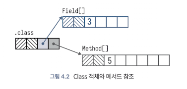

<!-- Date: 2025-01-11 -->
<!-- Update Date: 2025-01-11 -->
<!-- File ID: a8e99d0d-fbf0-4ff9-807f-53250aa9c7ae -->
<!-- Author: Seoyeon Jang -->

# 개요

로딩과 링킹 프로세스의 최종 결과는 새로 로드되고 링크된 타입을 나타내는 Class 객체다. 이제 JVM에서 완전히 작동하지만
성능상의 이유로 Class 객체의 일부 측면은 필요할 때만 초기화된다.

> Class 객체는 일반 자바 객체다. 다른 객체와 마찬가지로 자바 힙(heap)에 존재한다.

이제 코드에서 새로운 타입을 사용해서 인스턴스를 생성할 수 있다. 또한 타입의 Class 객체에는 **상위타입**에 해당하는 Class 객체를 반환하는 `getSuperclass()`
와 같이 여러가지 유용한 메서드가 제공된다.

Class 객체는 메서드, 필드, 생성자 등에 대한 간접적인 액세스를 위해, 리플렉션 API(Reflection API)와 함께 사용할 수 있다.
Class 객체에는 Method, Field 그리고 클래스의 멤버에 해당하는 다양한 다른 객체에 대한 참조가 존재한다.
리플렉션 API를 통해 클래스의 기능에 대해 간접적으로 접근하는 데 사용할 수 있다.

지금까지 런타임의 어느 부분이 새로 로드되는 클래스가 될 바이트 스트림을 찾아 링킹하는지 정확히 설명하지 않았다. 이 역할은 **클래스로더가 처리한다.**
클래스로더는 추상 클래스인 ClassLoader의 하위 클래스이다.

# 정리

