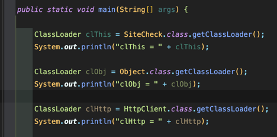
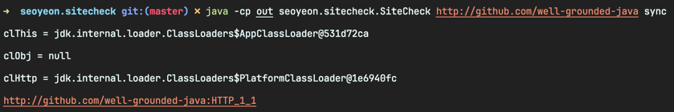

<!-- Date: 2025-01-11 -->
<!-- Update Date: 2025-01-11 -->
<!-- File ID: 5b950e5f-2775-4b76-a78d-0104b0f6e86b -->
<!-- Author: Seoyeon Jang -->

# 개요

자바는 기본적으로 동적 런타임을 갖춘 객체지향 시스템이다. 그렇기 때문에 자바의 타입은 런타임에 살아있으며 🎣, 특히 새로운 타입의 추가를 통해 실행 중인
자바 플랫폼의 타입 시스템을 수정할 수 있다. 자바 프로그램을 구성하는 타입은 런타임에 알 수 없는 타입으로 확장할 수 있다(final 타입이 아니거나 sealed 클래스
중 하나가 아닐 경우에 한해서). 클래스 로딩 기능은 사용자에게 노출돼있다. **클래스로더**는 ClassLoader를 확장하는 자바의 클래스일 뿐이며, 그 자체로 자바의 타입이다.

> 최신 자바 환경에서는 모든 클래스로더가 모듈식이다. 클래스의 로드는 항상 모듈의 컨텍스트 내에서 수행된다.

ClassLoader 클래스에는 클래스 파일의 저수준 구문 분석을 담당하는 로드와 링크 부분을 포함해서 몇 가지 네이티브 메서드가 있지만 사용자 클래스로더는 클래스 로딩의
이런 부분을 재정의할 수 없다.

플랫폼은 다음과 같은 일반적인 클래스로더와 함께 제공되며, 플랫폼의 시작 및 정상 작동 중에 다양한 작업을 수행하는 데 사용된다.

- BootstrapClassLoader(또는 **원시 클래스로더**): JVM을 시작하는 프로세스 초기에 인스턴스화되므로 일반적으로 JVM 자체의 일부라고 생각하는 것이 가장 좋다.
  가장 기본 시스템인 `java.base`를 로드하는 데 사용된다
- PlatformClassLoader: 최소한의 시스템이 부트스트랩된 후 플랫폼 클래스로더는 애플리케이션이 의존하는 나머지 플랫폼 모듈을 로드한다. 이 클래스로더는 로더에 의해 실제로 로드됐는지
  아니면 부트스트랩에 의해 로드됐는지에 관계없이 모든 플랫폼 클래스에 액세스하기 위한 기본 인터페이스다. 이것은 내부 클래스의 인스턴스다.
- AppClassLoader 애플리케이션 클래스로더: 가장 널리 사용되는 클래스로더다. 이 로더는 애플리케이션 클래스를 로드하고 대부분의 최신 자바 환경에서 대부분의 작업을 수행한다.
  모듈형 JVM에서 애플리케이션 클래스로더는 자바 8과 이전 버전에서와 같이 더 이상 URLClassLoader의 인스턴스가 아닌 내부 클래스의 인스턴스다.

2장의 `seoyeon.sitecheck` 모듈에서 SiteCheck의 main 메서드 상단에 몇가지 코드를 추가해서 이 새로운 클래스로더들이 실제로 작동하는 것을 확인해보자.

```jshelllanguage
var clThis = SiteCheck.class.getClassLoader();
    System.out.println(clThis);

    var clObj = Object.class.getClassLoader();
    System.out.println(clObj);

    var clHttp = HttpClient.class.getClassLoader();
    System.out.printf(clHttp);
```




Object에 대한 클래스로더(java.base에 있음)가 null 이라고 출력된다. 이는 보안 때문인데, 부트스트랩 클래스로더는 실제로는
버그나 악용의 가능성이 너무 높아서 자바 런타임에서는 클래스로더를 표시하고 사용할 수 없게 했기 때문이다.

클래스로더는 핵심 역할 외에도 `JAR파일`이나 클래스패스의 다른 위치에서 리소스(이미지나 구성파일과 같이 클래스가 아닌 파일)을 로드하는 데 사용되는 경우가 많다.
이는 `try-with-resources`와 결합해서 다음과 같은 코드를 생성하는 패턴에서 자주 볼 수 있다.

```java

try(
var is = TestMain.class.getResourceAsStream("/resource.csv");
var br = new BufferedReader(new InputStreamReader(is));  
){ // ... 
        }
```

클래스로더는 이 매커니즘을 몇 가지 다른 형태로 제공하며 URL 또는 InputStream을 반환한다.

# 정리


