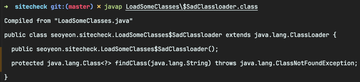
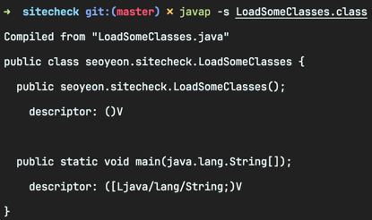

<!-- Date: 2025-01-16 -->
<!-- Update Date: 2025-01-16 -->
<!-- File ID: 5630cea6-b7d4-4142-8dd2-de01a6386520 -->
<!-- Author: Seoyeon Jang -->

# 개요

클래스에 선언된 메서드 확인부터 바이트코드 인쇄에 이르기까지 **javap**는 수많은 유용한 작업에 사용할 수 있다.
이 장 앞부분의 클래스 로딩 예제에 적용된 가장 간단한 형태의 **javap** 사용법을 살펴보자.

내부 클래스는 별도의 클래스로 컴파일됐으므로 해당 클래스도 살펴볼 필요가 있다.

기본적으로 **javap**는 public, protected, defult(패키지 내로 제한됨) 접근 제한자로 표시된 메서드를 표시한다. 또한 `-p` 스위치는 private 메서드와 필드도 표시한다.

## 메서드 시그니처를 위한 내부 형식

JVM은 **javap**에서 표시되는, 사람이 읽을 수 있는 형식과는 약간 다른 형식으로 **메서드 시그니처(method signature)** 를 내부적으로 사용한다. JVM을 더 깊이 탐구함에 따라 이러한 내부
이름을 더 자주 볼 수 있을 것이다.

압축 형식으로 타입 이름이 압축된다. 예를 들어 int 는 I 로 표시된다. 이러한 압축 형식을 **타입 기술자(type descriptor)** 라고 한다.(타입은 아니지맘ㄴ 메서드 시그니처에 나타나는 void 도
포함된다.)

| 설명자          | 타입                                 |
|--------------|------------------------------------|
| B            | Byte                               |
| C            | Char(a 16-bit Unicode character)   |
| D            | Double                             |
| F            | Float                              |
| I            | Int                                |
| J            | Long                               |
| L<type name> | 참조타입(예: Ljava/lang/String 문자열의 경우) |
| S            | Short                              |
| V            | Void                               |   
| Z            | Boolean                            | 
| [            | Array-of                           |

경우에 따라 타입 기술자가 소스 코드에 나타나는 타입 이름보다 길 수 있다(예: `Ljava/lang/Object;`는 Obejct 보다 길지만, 타입 기술자는 항상 완전한 경로명으로 표시되므로 직접 해석할 수
있다).

javap는 시그니처 타입 기술자를 출력하는 유용한 스위치 -s 를 제공하기 때문에 표를 사용해서 타입 기술자를 찾아볼 필요가 없다. 다음과 같이 javap를 스위치와 함꼐 호출해서 앞에서 살펴본 일부 메서드에 대한
시그니처를 표시할 수 있다.

그 내부 클래스는 다음과 같다.

보다시피 메서드 시그니처의 각 타입은 타입 기술자로 표현된다.

다음 절에서는 타입 기술자의 또 다른 용도를 살펴보겠다. 이것은 클래스 파일에서 매우 중요한 부분인 **상수 풀**에 있다.

# 정리

