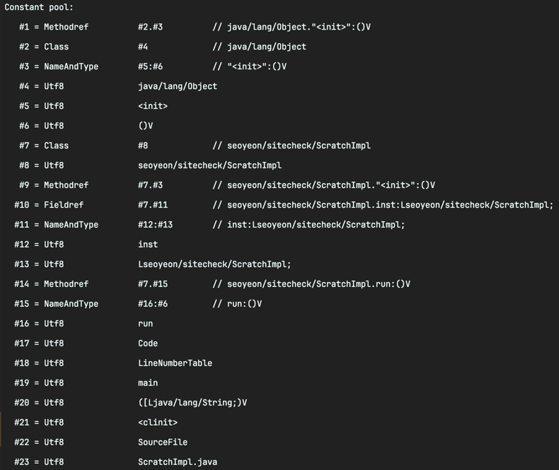

<!-- Date: 2025-01-16 -->
<!-- Update Date: 2025-01-16 -->
<!-- File ID: 9744d315-afb2-47a0-8957-29d34ae9e1fc -->
<!-- Author: Seoyeon Jang -->

# 개요

상수 풀(constant pool)은 클래스 파일의 다른 (상수) 요소에서 편리한 바로가기를 제공하는 영역이다. 심볼 표를 명시적으로 사용하는 C나 펄과 같은 언어를 공부한 적이 있다면 상수 풀을 다소 유사한 JVM
개념으로 생각할 수 있다.

간단한 예제를 통해 상수 풀을 볼 수 있다.

```java
public class ScratchImpl {

    private static ScratchImpl inst = null;

    private ScratchImpl() {
    }

    public static void main(String[] args) {
        inst = new ScratchImpl();
        inst.run();
    }

    private void run() {
    }
}
```

상수 풀의 정보를 보려면 **javap -v** 를 사용하면 된다. 이 명령은 상수 풀 뿐만 아니라 많은 추가적인 정보를 출력하지만, 상수 풀 항목에 초점을 맞춰보겠다.

```shell
$ javap -v ScratchImpl.class
```



클래스 로딩의 검증 단계에는 클래스 파일의 정적 정보가 일관성이 있는지 확인하는 단계가 있다. 이 예시는 런타임이 새로운 클래스를 로드할 때 수행하는 무결성 검사의 종류를 보여준다.

# 정리

지금까지 클래스 파일의 기본적인 구조에 대해 알아봤다. 다음 주제로 넘어가 바이트코드의 세계에 대해 살펴보자. 소스코드가 바이트코드로 변환되는 과정을 이해하면 코드가 어떻게 실행되는지 더 잘 이해할 수 있다.

