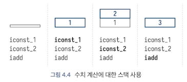

<!-- Date: 2025-01-20 -->
<!-- Update Date: 2025-01-20 -->
<!-- File ID: 34935778-6eb2-4af8-b94c-5efd5017c581 -->
<!-- Author: Seoyeon Jang -->

# 개요

바이트코드를 이해하려면 **JVM이 사용하는 스택 머신의 작동을 이해하는 것**이 중요하다. JVM이 하드웨어 CPU(예: x64 또는 ARM 칩)처럼 보이지 않는 가장 확실한 이유는 프로세서 레지스터가 없고 대신 모든 계산과 연산에 **스택을 사용한다는 점인데**, 이를 평가스택(evaluation stack)이라고 한다.(가상머신 사양에서는 공식적으로 피연산자 스택(operand stack)이라고 하며, 여기서는 이 두 용어를 혼용하곘다.)

평가 스택은 메서드 내에서 지역적으로 사용되며, 메서드가 호출될 때마다 새로운 평가 스택이 생성된다. 물론, JVM은 각 자바 스레드마다 호출 스택(call stack)을 가지고 있으며, 어떤 메서드가 실행됐는지 기록한다(이는 자바에서 스택 추적의 기반이 된다). **스레드별 호출 스택과 메서드별 평가 스택의 차이를 명확하게 하는 것이 중요하다.**

다음은 평가 스택이 두 개의 정수 상수에 더하기 연산을 수행하는 데 어떻게 사용되는지 보여준다. 각 단계 아래에 해당하는 JVM 바이트코드가 표시되는데, 이 바이트코드는 이 장의 뒷부분에서 다룰 것이다.



클래스가 실행 환경에 링크될 때 해당 클래스의 바이트코드를 검사한다. 이런 검사의 대부분은 스택상의 타입 패턴을 분석하는 작업으로 이뤄진다.

>스택상의 값을 조작하는 작업은 스택상의 값이 올바른 타입을 갖고 있는 경우에만 동작한다. 예를 들어 스택에 객체의 참조를 넣고 그것을 정수로 취급하여 산술 연산을 수행하려고 시도하는 경우에는 정의되지 않거나 잘못된 결과가 발생할 수 있다.

클래스 로딩의 검증 단계에서는 새로 로드된 클래스의 메서드가 스택을 남용하지 않는지 확인하기 위해 광범위한 검사를 수행한다. 이를 통해 잘못된(또는 고의적으로 악의적인)클래스가 시스템에 허용돼 문제를 일으키는 것을 방지할 수 있다.

메서드가 실행되면 새로운 값을 계산하기 위해 평가 스택으로 사용할 메모리 영역이 필요하다. 또한 실행중인 모든 스레드에는 현재 어떤 메서드가 실행중인지 기록하는 호출스택(스택 추적을 통해 보고되는 스택)이 필요하다. **이 두 스택은 경우에 따라 상호작용한다.**

```java
var numPets = 3 + petRecords.getNumberOfPets("Ben");
```
이를 평가하기 위해 JVM은 피연산자 스택에 3을 넣는다. 그다음 메서드를 호출해서 Ben이 보유한 애완동물 수를 계산해야 한다. 이를 위해 수신자 객체(메서드가 호출되고 있는 petRecords)를 평가 스택으로 푸시하고 그 뒤에 호출 인수를 넣는다.

그다음 invoke 오퍼레이션 코드 중 하나를 사용해 getNumberOfPets() 메서드를 호출하면 호출된 메서드로 제어권이 이전되고 방금 입력한 메서드가 호출 스택에 나타난다. 그러나 JVM이 새 메서드에 진입하면 새로운 피연산자 스택을 사용하기 시작하므로, 호출자의 피연산자 스택에 이미 있는 값은 호출된 메서드에서 계산된 결과에 영향을 줄 수 없다.

getNumberOfPets()이 완료되면 반환값이 호출자의 피연산자 스택에 놓이며, 이 과정은 getNumberOfPets()가 호출 스택에서 제거되는 과정의 일환이다. 그다음 덧셈연산은 두 값이 가져와서 더한다.

이제 바이트코드를 살펴보자. 이는 많은 특수한 경우가 있으므로 주요 기능에 대한 개요만 제시한다.
# 정리


