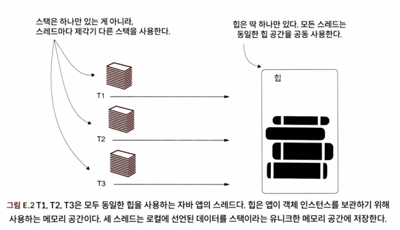
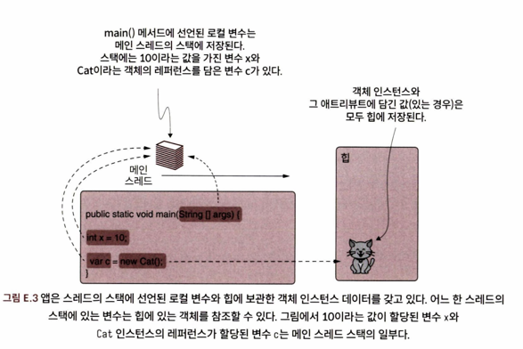
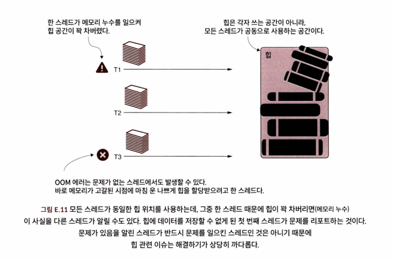
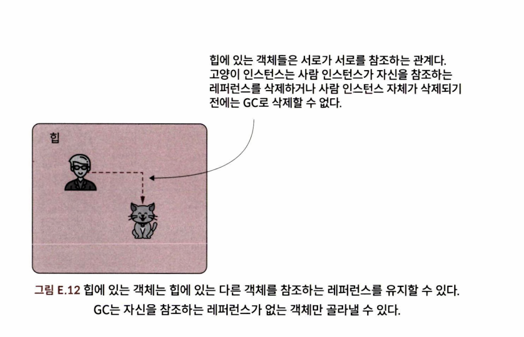
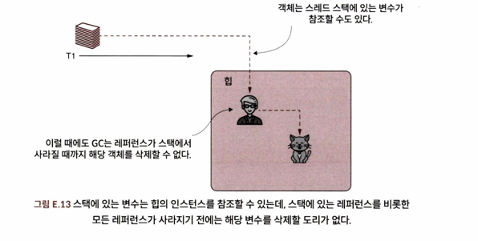
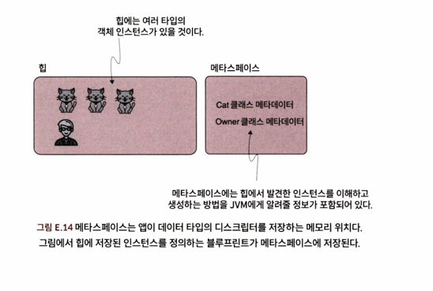

<!-- Date: 2025-12-25 -->
<!-- Update Date: 2025-01-01 -->
<!-- File ID: 4e59f024-bb0b-4dd2-9a06-75ab4275a410 -->
<!-- Author: Seoyeon Jang -->


자바 가상머신(JVM)이 자바 앱의 메모리를 어떻게 관리하는지 알아보자.
자바 앱에서 조사해야하는 가장 까다로운 문제 중에는 **앱이 메모리를 관리하는 방식에 관한 것들이 많다.**
다행히 몇 가지 기술을 잘 활용하면 최소한의 시간으로 문제를 분석하고 근본 원인을 찾을 수 있다.
하지만 그 전에 자바 앱이 메모리를 어떻게 관리하는지 기본적인 내용을 알아야 한다.

앱의 메모리는 **한정된**리소스다.

요즘 시스템은 앱이 실행되는 동안 넉넉한 양의 메모리를 제공하지만, 그래도 앱이 이 리소스를 어떻게 소비하는지 잘 관찰할 필요가 있다.
세상에 그 어떤 시스템도 무제한 메모리를 제공할 수는 없기 때문이다. 메모리 문제는 결국 성능 문제(앱 속도 저하, 배포 비용 증가, 느린 기동 속도 등)로 발현되며,
경우에 따라 OOM 에러 발생 등 전체 프로세스가 완전히 중단될 수 있기 때문이다.

JVM이 실행 프로세스를 위해 메모리를 구성하는 방법을 알아보자.
앱에 메모리를 할당하는 세 가지 방법(스택, 힙, 메타스페이스)이 있다.
`스택`은 스레드의 로컬 변수와 해당 데이터를 저장하는 메모리 공간이다.
`힙`은 객체 인스턴스가 저장되는 메모리 공간이다.
`메타스페이스`는 객체 타입의 메타데이터가 저장되는 메모리 공간이다.

## JVM이 앱의 메모리를 구성하는 방법

JVM은 관리 방식이 각각 다른 여러 메모리 위치에서 앱이 사용하는 데이터를 구성한다.
메모리 관련 문제를 조사하려면 JVM이 메모리를 어떻게 관리하는지 제대로 알아야 한다.

편의상 자바 앱이 실행 중에 데이터를 두 가지 방법, 즉 스택과 힙에서 관리한다고 가정하자.
데이터가 정의된 방식에 따라 앱은 스택과 힙 중 한 곳에서 데이터를 관리한다.
하지만 어느 데이터가 어디로 흘러갈지 논하기 앞서, 앱은 둘 이상의 스레드를 가지고 데이터를 동시에 처리시킬 수
있다는 사실을 상기시켜보자. 앱의 모든 스레드가 사용하는 힙은 하나의 커다란 단일 메모리 공간이다.
또 각 스레드는 스택이라는 자신만의 유니크한 메모리 공간을 갖고 있다.

스택은 스레드 소유의 메모리 공간이다. 각 스레드는 다른 스레드와 공유하지 않는 자기만의 특정한 스택을 가진다.



```java
public int sum(int x, int y) { // 변수 x,y,sum 의 값은 스택에 저장된다.
    int sum = x + y;
    return sum;
}
```

힙은 객체 인스턴스의 데이터가 저장되는 메모리 공간이다. 예를 들어 다음 코드처럼 Cat 클래스를 선언하면
생성자 `new Cat()`으로 인스턴스를 생성할 때마다 힙에 쌓인다.

```java
public class Cat {

}
```

클래스에 선언된 애트리뷰트 역시 JVM이 힙에 저장한다. Cat 클래스에 name과 age 애트리뷰트가 선언되어 있으면
JVM은 인스턴스별로 두 애트리뷰트를 힙에 저장한다.

```java
public class Cat {
    private String name;
    private int age;
}
```



## 스레드가 로컬 데이터를 저장하는 데 사용하는 스택

스택의 매커니즘을 좀 더 파헤쳐보자. 로컬 값이 스택에 저장되고 **각 스레드마다 유니크한 스택 공간을 가진다고 했다.**
그럼 앱은 이런 값들을 메모리에 어떻게 저장하고 삭제할까? 일단 스택의 메모리 관리 매커니즘을 명확하게 이해한 다음, 스택과 관련하여 어디가 잘못되어
문제가 될 수 있는지 살펴보자.

먼저 이 메모리 공간을 '스택'이라고 부르는 이유는 뭘까?
스레드의 스택은 말 그대로 스택이라는 자료구조의 원리를 따른다.
**스택**은 언제나 최근에 추가된 원소가 가장 먼저 삭제되는 정렬된 컬렉션이다.
각 레이어가 다른 레이어 위에 저장되는 레이어의 스택인 셈이다. 모든 기존 레이어 위에 새 레이어가 추가되며 쌓이고
항상 최상위 레이어만 삭제할 수 있다. 이러한 원소의 추가/삭제 매커니즘을 **후입선출**이라고도 한다.

앱이 스레드 스택의 데이터를 관리하는 방식도 이런 식이다. 코드 블록의 시작부가 실행되면 그때마다 스레드 스택에
새 레이어가 생성된다. 일반적인 스택 원리에 따라 새 레이어는 최상위 레이어로서 가장 먼저 삭제되는 대상이다.

앱이 처음 호출되었던 main 메서드로 복귀하면 스레드 스택 최하단에 자리 잡았던 main 메서드 레이어도 함께 사라진다.
즉, 메서드가 메모리에 저장한 데이터도 없어진다는 뜻이다. 이로써 불필요한 메모리 할당이 해제되고 그만큼 새로운 데이터를
저장할 공간이 늘어난다. 코드 블록은 마지막 커맨드가 실행되거나, return 커맨드를 만나거나, 아니면 예외가 발생한 경우에 종료된다.

스택에는 디폴트 메모리 공간이 할당되며, 그 크기는 사용하는 JVM에 따라 다르다. 이 한계치는 조정할 수 있지만 무한대로 만들 수는 없다.
스택 오버플로는 스택이 꽉 차서 더 이상 레이어를 추가할 수 없을 때 발생하는 에러다.
이 지경에 이르면 코드는 StackOverflowError를 던지며 스택이 꽉 찬 스레드는 완전히 중단된다.

각 스레드는 자신만의 스택을 갖고 있기 때문에 StackOverflowError는 스택이 가득 찬 스레드에만 영향을 미친다.
프로세스는 실행을 계속할 수 있고 다른 스레드는 전혀 영향을 받지 않는다. 또 StackOverflow는 스택 트레이스를 생성하는데,
문제를 일으킨 코드를 식별하는 데 유용하다.

## 앱이 객체 인스턴스를 저장하는 데 사용하는 힙

힙은 자바 앱의 모든 스레드가 공유하는 메모리 공간이다. 객체 인스턴스는 힙에 저장된다.

> 힙은 상당히 복잡한 자료구조다. 스트링 풀(string pool)이나 힙 제너레이션(heap generation)을 참조해보자.

다시 한번 말하지만 힙은 모든 스레드가 공유하는 메모리 공간인 까닭에 힙에서 경쟁상태 같은 스레드 문제가 발생하기 쉽다.

모든 스레드가 동일한 메모리 위치에 각자 생성한 객체 인스턴스를 추가하기 때문에 한 스레드가 다른 스레드의 실행에 영향을 미칠 수 있는 것이다.
어느 한 스레드에서 (메모리에 인스턴스를 추가했지만 삭제를 하지 않아) 메모리 누수(memory leak)가 발생하면 다른 스레드가 사용할 메모리가 모자라게 되어
전체 프로세스에 악영향을 미친다.

OOM 에러 문제의 근본 원인은 메모리 누수의 영향을 받은 스레드가 아닌, 다른 스레드에 의해 발생하는 경우가 대부분이다.
메모리에 어떤 것을 추가하려고 했지만 더이상 여유 공간이 없어 실패한 최초의 스레드가 OOM 에러를 보내는 것이다.



가비지 컬렉터(GC)는 힙에서 불필요한 데이터를 삭제하는 장치다.
GC는 어떤 객체를 아무도 참조하지 않을 때 해당 객체가 더 이상 쓸모없다는 사실을 안다.
만약 앱에서 이렇게 필요하지 않은 객체를 가리키는 제때 삭제되지 않으면 GC는 그 객체를 삭제할 수 없다.
이러한 상황이 메모리가 가득 찰 때까지 계속되면 메모리 누수(OOM)이 발생했다고 말하는 것이다.

메모리 누수의 가장 흔한 사례는 객체 레퍼런스를 끊임없이 추가하는 컬렉션이다. 이런 레퍼런스가 제때 삭제되지 않드면
컬렉션이 메모리에 살아있는 한 GC는 컬렉션을 삭제하지 못하기 때문에 메모리 누수가 발생한다. 특히, 스태틱 객체를 조심해야 한다.
스태틱 변수는 한번 생성되면 사라지지 않으므로 명시적으로 그 레퍼런스를 삭제하지 않는 한 스태틱 변수로 참조하는 객체는 프로세스가 죽을 때까지 잔존한다.



객체 인스턴스는 스택에서도 참조할 수 있지만, 보통 스택에서의 레퍼런스를 메모리 누수를 일으키지 않는다.
앱이 레이어를 생성한 코드 블록의 끝에 도달하면 스택 레이어가 자동으로 사라지기 때문이다.
하지만 이 또한 경우에 따라 스택 레퍼런스가 문제를 일으킬 수는 있다.
전체 코드 블록에서 실행을 가로막는 데드락이 발생했다고 하자.
스택의 레이어가 삭제되지 않은 채 객체를 주구장창 가리킨다면 결국 메모리 누수로 이어질 것이다.



## 데이터 유형을 저장하기 위한 메타스페이스 메모리 위치

메타스페이스(metaspace)는 힙에 저장된 인스턴스를 생성하기 위해 JVM이 데이터 타입을 저장하는 메모리 공간이다.
힙에 있는 객체 인스턴스를 처리하려면 이 정보가 반드시 필요하다.

OOM 에러가 더러 메타스페이스에도 영향을 미치는 경우가 있다.

메타스페이스가 가득 차 앱에 새로운 데이터 타입을 저장할 공간이 고갈된 경우, 앱은 OOM 에러를 던져 메타스페이스가 가득 찼다고 알린다.
