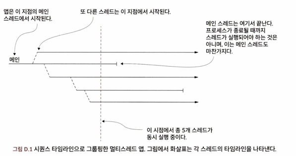

<!-- Date: 2025-12-25 -->
<!-- Update Date: 2025-01-01 -->
<!-- File ID: 2d686be8-1469-453e-870d-052238e41614 -->
<!-- Author: Seoyeon Jang -->

스레드는 앱이 실행하는 독립적이고 순차적인 커맨드(independant sequantial set of instructions)의 집합이다.
오늘날 거의 모든 자바앱은 멀티스레드로 실행된다.

# 스레드란 무엇인가?

**스레드**는 실행 중인 프로세스에서 독립적인 일련의 작업(sequence of operations)이다.

멀티스레드 앱을 시퀀스 타임라인으로 나타내보자. 이 앱은 하나의 스레드(메인 스레드)에서 시작되고 있다.
그러다 다른 스레드를 시작하고, 그 스레드는 또 다른 스레드를 시작하는 식으로 계속 진행된다.
각 스레드는 다른 스레드와 독립적이라는 사실을 잊지 말아야 한다. 가령, 메인 스레드는 앱 자체보다 훨씬 먼저 실행이 종료될 수 있다.
모든 스레드가 중단되면 프로세스도 중단된다.

