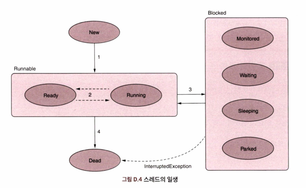

스레드 실행을 이해할 때 스레드 수명 주기를 파악하는 일이 필수다. 스레드는 실행 도중 여러 상태를 거친다.
프로파일러나 스레드 덤프를 사용할 때 스레드의 상태를 자주 언급하게 되는데, 이것은 스레드의 상태를 파악할 때 아주 중요하다.

앱의 동작을 추적하고 조사하려면 스레드가 어떤 상태에서 다른 상태로 어떻게 바뀌는지 알아야 한다.

자바 스레드가 거치는 주요 상태는 다음과 같다.

- **New**(시작): 인스턴스화 직후(시작되기 전) 스레드의 상태다. 이 상태에서 스레드는 단순 자바 객체로, 앱은 아직 스레드에 정의된 커맨드를 실행할 수 없다.
- **Runnable**(실행가능): `start()` 메서드가 호출된 이후다. JVM은 스레드의 커맨드를 실행할 수 있으며, 다음 두 하위 상태(substate)중 하나가 된다.
  - **Ready**(준비): 스레드는 실행되지 않지만 JVM 은 언제라도 스레드를 실행할 수 있는 상태
  - **Running**(실행 중): 스레드가 실행 중인 상태. 현재 CPU 가 커맨드를 실행하고 있다.
- **Blocked**(차단됨): 스레드가 시작은 되었으나 일시적으로 실행가능(runnable)상태가 아닌 경우다. 따라서 JVM은 커맨드를 실행할 수 없다.
                    이 상태는 스레드를 실행할 수 없도록 일시적으로 JVM에서 스레드를 '숨겨' 스레드 실행을 제어하려고 할 때 유용하다.
                    차단된 상태에서 스레드는 다음 하위 상태 중 하나에 있다.
  - **Monitored**(모니터링됨): 스레드가 동기화 블록(동기화 블록의 액세스를 제어하는 객체)의 모니터에 의해 중단되고 해당 블록을 실행하기 위해 해제를 기다리는 상태
  - **Waiting**(대기 중): 실행 도중 모니터의 `wait()`메서드가 호출되어 현재 스레드가 중단된 상태. `notify()` 또는 `notifyAll()` 메서드가 호출
                        될 때까지 스레드는 차단된 상태를 유지한다.
  - **Sleeping**(잠자기): Thread 클래스의 `sleep()`메서드가 호출되어 현재 스레드를 지정된 시간동안 중단한다.
                        중단 시간은 `sleep()`메서드에 인수로 전달한다. 이 시간이 경과한 후에는 스레드가 다시 실행가능한 상태가 된다.
  - **Parked**(파킹됨): 대기 중 상태와 거의 같다. 누군가 `park()`메서드를 호출하면 현재 스레드는 이 상태로 바뀌며, 이후 `unpark()` 메서드가 호출될 
                        때까지 계속 차단된다.
- **Dead**(종료됨): 스레드는 커맨드 집합을 실행 완료하거나, Error 나 Exception 때문에 중단되거나 다른 스레드에 의해 중단될 경우 종료된다.
                    이렇게 종료된 스레드는 재시작할 수 없다.

위 그림을 보면 스레드 상태가 어떻게 전이되는지 알 수 있다.

- 누군가 `start()`메서드를 호출하면 스레드는 New에서 Runnable로 바뀐다.
- Runnable 상태가 되면 스레드는 Ready 와 Running 사이를 들락날락한다. 어떤 스레드를 언제 실행할지는 JVM이 결정한다.
- 다음과 같은 경우, 스레드는 Blocked 상태가 될 수 있다.
  - Thread 클래스의 `sleep()`메서드가 호출되어 현재 스레드가 일시적으로 차단된다.
  - 누군가 `join()`메서드를 호출하여 현재 스레드가 다른 스레드를 기다리게 만든다.
  - 누군가 모니터의 `wait()`메서드를 호출하여 `notify()` 또는 `notifyAll()`메서드가 호출될 때까지 현재 스레드의 실행을 중단시킨다.
  - 동기화 블록의 모니터는 다른 액티브 스레드가 동기화 블록의 실행을 마칠 때까지 스레드 실행을 중단시킨다.
- 스레드는 실행을 완료하거나 다른 스레드가 끼어들어 중단되면 Dead(종료) 상태로 바뀐다.
    Blocked에서 Dead로의 상태 전이는 JVM이 허용하지 않는다. 차단된 스레드를 다른 스레드가 끼어들면 InterruptedException 이 발생한다.

