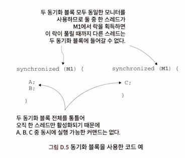
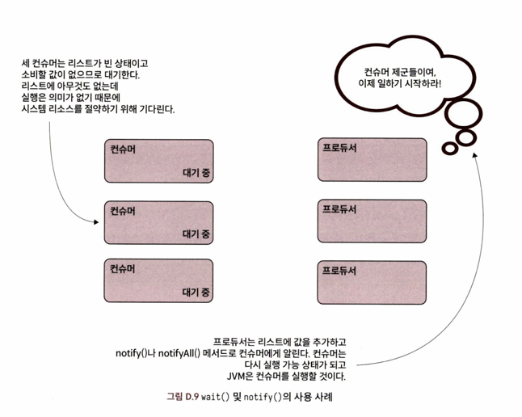
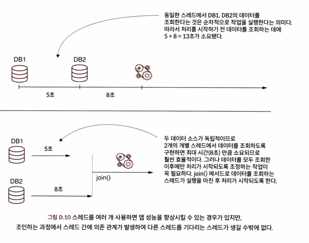
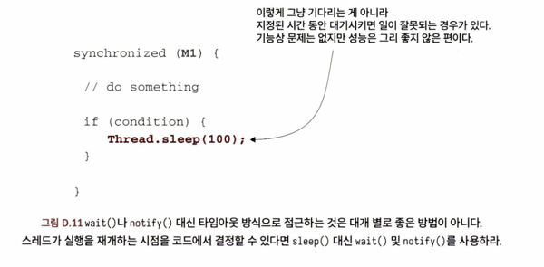

멀티스레드 아키텍처에서 스레드를 제어하기 위해 사용하는 스레드 동기화 기법을 알아보자.
스레드를 동기화하는 가장 일반적인 방법 몇가지를 살펴보자.

## 1. 동기화 블록
동기화 코드 블록은 스레드를 동기화하는 가장 간단한 방법이다.
동기화 코드를 통해 한 번에 하나의 스레드만 허용함으로써 주어진 코드의 동시 실행을 사전 차단하겠다는 의도다.

여기에는 두 가지 옵션이 있다.

- **블록 동기화**(block synchronization): 주어진 코드 블록에 `synchronized` 수정자(modifier)를 적용한다.
````java
synchonized(a) { // 괄호 안 객체는 동기화 블록의 모니터다.
    // 어떤 일을 한다. 동기화 커맨드 블록은 중괄호로 감싼다.
}
````
- **메서드 동기화**(method synchronization): 메서드에 `synchronized` 수정자를 적용한다.
```java
synchonized void m() {
    // 중괄호로 감싼 메서드의 전체 코드 블록이 동기화된다.
}
```
쓰이는 형태는 약간 달라도, 사용하는 방법은 둘 다 동일하다. 모든 동기화 블록에는 두 가지 중요한 구성요소가 있다.
- **모니터**(monitor): 동기화 커맨드의 실행을 관장하는 객체
- **커맨드 블록**(block of instuction): 동기화한 실제 커맨드

메서드 동기화는 모니터가 빠진 것처럼 보이지만, 구문 자체에 이미 모니터 객체가 암묵적으로 포함되어 있다.
비스태틱(nonstatic)메서드는 인스턴스 "this"를, 스태틱 메서드는 클래스의 타입 인스턴스를 각각 모니터로 사용한다.

모니터(null일 수 없음)는 동기화 블록에 특별한 의미를 부여하는 객체이다.
스레드가 동기화 블록에 들어가면 모니터에서 락을 얻는다. 락을 가진 스레드가 락을 해제할 때까지 다른 스레는 동기화 블록에 들어갈 수 없다.



두 동기화 블록은 각각 앱의 다른 파트를 구성하지만 둘 다 동일한 모니터인 M1(동일한 객체 인스턴스)를 사용하므로
이 스레드는 한 번에 두 블록 중 어느 한 곳에서만 실행 가능하다.

## 2. wait(), notify(), notifyAll() 사용
미지정 시간(undefined time)동안 대기하라는 요청을 받은 스레드 역시 차단될 수 있다.
동기화 블록의 모니터에서 `wait()`메서드를 사용하면 스레드를 무한 대기시킬 수 있다.
그럼 다른 스레드가 모니터의 `notify()` 또는 `notifyAll()`메서드를 사용하여 대기 중인 스레드에게 작업을 계속하라고 '알려줄(tell)'수 있다.
이 두 메서드는 실행을 해도 의미가 없는 스레드를 강제로 중단시킴으로써 앱의 성능을 개선하는 데 자주 쓰인다.
단, 잘못 사용하면 앱이 데드락에 빠지거나 스레드 실행이 해제되지 않은 채 무한 대기할 수도 있으니 유의해야 한다.

여러 스레드가 리소스를 공유하는 프로듀서-컨슈머 로직을 가진 앱을 생각해보자.
프로듀서 스레드는 공유 리소스에 값을 추가하고 컨슈머 스레드는 이 값을 삭제한다.
공유 리스소에 아무 값도 없으면 어떻게 될까? 이런 경우 컨슈머는 실행을 하는 의미가 없다.
엄밀히 말해 실행은 가능해도 소비할 값이 없으므로 JVM이 이런 행위를 방치하면 불필요한 시스템 리소스가 낭비되는 것이다.
공유 리소스에 값이 없으면 컨슈머를 대기시키고, 프로듀서가 새 값을 추가한 이후에만 실행을 재개하도록 만드는 것이 합리적이다.


## 3. 스레드 조인
다른 스레드가 실행을 완료할 때까지 대기시켰다가 어느 시점에서 스레드를 조인하는 방식도 자주 쓰이는 동기화 기법이다.
`wait/notify`패턴과 다른 점은 스레드가 알림을 받을 때까지 기다리지 않는다는 것이다. 스레드는 그냥 다른 스레드가 실행을 마칠 때까지 기다릴 뿐이다.

서로 다른 독립적인 두 데이터 소스에서 가져온 데이터에 따라 모종의 처리를 해야한다고 해보자.
데이터 조회 시간은 첫번째 데이터소스에서 약 5초, 두번째 데이터소스에서 약 8초가 걸린다. 작업을 순차실행하면 총 데이터 처리 시간은 5+8 = 13초다.
하지만 더 나은 접근방식이 있다. 두 데이터소스는 서로 독립적이므로 스레드를 2개 사용하면 데이터를 동시에 가져올 수 있다.
데이터를 처리하는 스레드는 데이터를 조회하는 두 스레드가 모두 완료될 때까지 기다렸다 일을 시작해야 한다.
다시 말해, 처리 스레드(일반적으로 Main 스레드)는 두 조회 스레드에 조인하는 것이다.



## 4. 정해진 시간 동안 스레드 차단
스레드를 주어진 시간 동안 대기시켜야할 때도 있다. 이런 경우 스레드는 'time waiting(시간 초과 대기)' 또는 'sleeping(잠자기)' 상태가 된다.

스레드를 timed waiting 상태로 만드는 가장 일반적인 방법은 다음과 같다.

- `sleep()`: Thread 클래스에 있는 스태틱 메서드 `sleep()`을 사용하면 코드를 실행중인 스레드가 정해진 시간 동안 기다리게 할 수 있다.
- `wait(long timeout)`: 타임아웃 매개변수를 받는 `wait()`메서드는 주어진 타임아웃 시간(밀리초)이 지나면 스레드를 자동으로 깨운다.
- `join(long timeout)`: `join()`메서드와 동일하나, 주어진 타임아웃 시간이 지나면 자동으로 조인한다.

앱에서 자주 목격되는 안티패턴은 `wait()`대신 `sleep()`메서드로 스레드를 대기시키는 것이다.
위의 예로 든 프로듀서-컨슈머 앱도 그러하다. `wait()`대신 `sleep()`을 사용할 수 있지만, 프로듀서가 실행되어 공유 리소스에 값을 추가할 시간을 확보하려면
컨슈머는 얼마나 오래 잠들어야 할까? 정답은 없다. 스레드를 100밀리초 동안 재우는 것이 너무 길 수도 있고 짧을 수도 있다. 이런 식으로 접근하면 최적의 성능을
얻을 수가 없다.



## 5. 스레드와 블로킹 객체 동기화하기
JDK에는 스레드 동기화에 특화된 도구 세트가 많다. 그중 멀티스레드 아키텍처에서 가장 널리 알려진 클래스는 다음과 같다.
- **Semaphore**(세마포어): 주어진 코드 블록을 실행할 수 있는 스레드의 수를 제한할 의도로 사용하는 객체
- **CyclicBarrier**(사이클릭배리어): 주어진 코드 블록을 실행하기 위해 적어도 특정 개수 이상의 스레드가 액티브 상태인지 확인하는 용도로 쓰이는 객체
- **Lock**(락): 좀 더 광범위한 동기화 옵션을 제공하는 객체
- **Latch(래치)**: 다른 스레드의 특정 로직이 수행될 때까지 일부 스레드를 대기시키는 목적으로 쓰이는 객체

이들은 특정 시나리오에서 구현체를 단순화하기 위해 미리 매커니즘을 정의한 하이레벨 객체다.
문제를 해결하는 데 필요한 가장 단순한 해결책을 적용하되, 이런 객체를 사용해야할 경우 작동 원리를 철저히 이해해야 한다.
