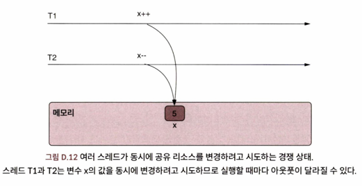
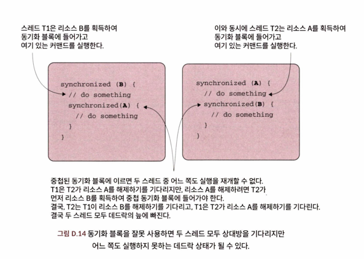

멀티스레드 아키텍처는 예기치 못한 다양한 동작이 자주 발견되곤 한다...

- **경쟁 상태**(race condition): 둘 이상의 스레드가 공유된 리소스를 서로 고치려고 경쟁한다.
- **데드락**(deadlock): 둘 이상의 스레드가 서로를 기다린다.
- **리브락**(livelock): 둘 이상의 스레드가 중단 조건을 만족하지 못하여 아무런 의미 있는 일을 하지 못한채 계속 실행된다.
- **기아**(starvation): JVM이 다른 스레드를 실행하는 동안 스레드가 지속적으로 차단된다. 이렇게 차단된 스레드는 커맨드를 실행할 수 없다.

## 1. **경**쟁 상태
경쟁 상태는 여러 스레드가 동일한 리소스를 변경하려고 다툴 때 일어난다. 결국 예기치 않은 결과 또는 예외가 발생할 수 있다.
이를 피하기 위해 동기화 기법을 사용하는 것이다.

## 2. **데**드락
데드락은 둘 이상의 스레드가 자신의 실행을 재개하려고 각자 상대방을 기다리는 경우다. 이런 상황에서는 앱 전체 또는 일부가 정지되어 기능을 실행할 수 없게 된다.

## 3. **리**브락
두 개 이상의 스레드가 서로를 방해해 계속 작업을 재시도하지만, 실제로는 아무 일도 진행되지 않는 상태입니다.
이 상태에서는 스레드가 멈춰있지 않고 활동하고 있지만, 의미 있는 진전이 없는 것이 특징이다.

## 4. **기**아
요즘 앱에서는 발생할 가능성이 낮긴 하지만, 특정 스레드가 실행 가능한 상태임에도 실행에서 지속적으로 배제되는 문제이다.
JVM이 계속 다른 스레드에게 시스템 리소스를 주는 것이다. 결국 커맨드 집합을 실행할 수 없게 된 스레드는 밥을 먹지 못하는 기아 상태라고 볼 수 있다.

JVM 초기 버전 시절, 개발자가 특정 스레드에 우선순위를 낮게 설정하면 이런 일이 발생할 때도 있었지만, 최신 JVM 구현체는 똑똑하게 일처리를 하기 때문에 
스레드가 기아 상태가 될 가능성은 별로 없다.