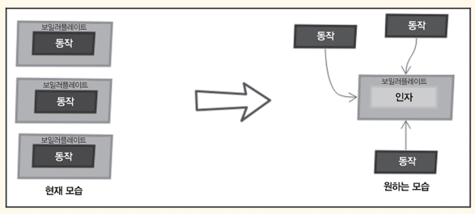

<!-- Date: 2025-01-10 -->
<!-- Update Date: 2025-01-10 -->
<!-- File ID: 0d5966ca-8f21-4c4a-b308-571113842414 -->
<!-- Author: Seoyeon Jang -->

# 개요

자바 함수형 스타일 프로그래밍을 다루는 문제를 생각해보자. 먼저 함수형 인터페이스로 발전해 나가는
단계를 보여주는 문제로 시작한다. 이어서 GoF의 여러가지 디자인 패턴을 자바 함수형 스타일로 해석한다.

함수형 스타일로 작성된 일반적인 디자인 패턴을 능숙히 다루며 함수형 인터페이스를 활용해 코드를 발전시키는
방법에 대해 익숙해질 필요가 있다.

다음 문제를 통해 함수형 스타일로 프로그래밍하는 실력을 테스트해보자.

> 문제 166. **함수형 인터페이스 작성하기**: 유의미한 예제 집합을 통해 함수형 인터페이스로 발전하는 과정을
> 처음부터 정의하는 프로그램을 작성하라.

이 해법에서는 여러가지 대안을 비교하며 함수형 인터페이스의 목적과 유용성을 강조한다.
유연하지 못한 구현에서 함수형 인터페이스에 기반한 구현으로 어떻게 코드를 진화시키는지 알아본다.
다음 Melon 🍈클래스를 예로 살펴보겠다.

```java
public class Melon {
    private final String type;
    private final int weight;
    private final String origin;

    public Melon(String type, int weight, String origin) {
        this.type = type;
        this.weight = weight;
        this.origin = origin;
    }
}
```

멜론 판매 사업을 준비중인 마크라는 고객에게서 의뢰가 들어왔다. 위 클래스는 마크의 설명에 따른 것이다.
고객은 자신의 아이디어와 결정을 반영할 수 있는 재고 애플리케이션을 원하므로 비즈니스 요구 사항과 발전에 따라
애플리케이션도 진화해야 한다. 날짜 단위로 애플리케이션 개발 과정을 살펴보자.

### 첫째날(품중에 따라 멜론 필터링)

어느 날 마크는 품종에 따라 멜론을 필터링하는 기능을 넣어달라고 요청했다.
그래서 Filters 라는 클래스를 만들어 멜론 리스트와 필터링할 품목을 인수로 받는 **static** 메서드를 구현했다.

```java
import java.util.ArrayList;

public static List<Melon> filterByType(List<Melon> melons, String type) {
    ArrayList<Melon> result = new ArrayList<>();
    for (Melon melon : melons) {
        if (melon != null && type.equalsIgnoreCase(melon.getType())) {
            result.add(melon);
        }
    }
    return result;
}
```

다음처럼 품종으로 간단히 멜론을 필터링할 수 있다.

```java
List<Melon> bailans = Filters.filterByType(melons, "Bailan");
```

### 둘째날(무게로 멜론 필터링)

마크는 무게로 멜론을 찾는(예를 들어 무게가 1200그램인 모든 멜론) 또 다른 필터를 요청했다.
멜론 품종 필터와 비슷하게 새 static 메서드를 만들었다.

```java
import java.util.ArrayList;

public static List<Melon> filterByWeight(List<Melon> melons, int weight) {
    ArrayList<Melon> result = new ArrayList<>();
    for (Melon melon : melons) {
        if (melon != null && melon.getWeight() == weight) {
            result.add(melon);
        }
    }
    return result;
}
```

`filterByType()`과 비슷한데 조건과 필터가 다르다. 이런 작업을 계속하다가는,
같은 코드를 반복하면서 조건만 다른 메서드가 Filters 클래스를 가득 채울 것임을 직감했다.

### 셋째 날(품종과 무게로 멜론 필터링)

상황이 더 악화됐다. 마크가 품종과 무게로 멜론을 필터링하는 새 필터를 빨리 추가해달라고 요청해왔다.

```java
import java.util.ArrayList;

public static List<Melon> filterByTypeAndWeight(List<Melon> melons, String type, int weight) {
    ArrayList<Melon> result = new ArrayList<>();
    for (Melon melon : melons) {
        if (melon != null && type.equalsIgnoreCase(melon.getType()) && melon.getWeight() == weight) {
            result.add(melon);
        }
    }
    return result;
}
```

... 가관이다.

### 넷째 날(동작을 인자로 넣기)

이렇게 계속 필터를 추가할 수는 없다! 온갖 속성을 필터링하다보면 너무 많은 인자와 반복되는
**보일러플레이트** 코드가 삽입된 크고 복잡한 메서드들 때문에 거대한 Filters 클래스가 만들어질 것이다.

가장 큰 문제는 보일러플레이트 코드로 감싼 여러가지 동작들이다. 바꿔 말해 **보일러플레이트**코드를 한 번만 작성하고 **동작을 인자로 넣으면 좋겠다.**
이렇게 하면 선택 조건이나 기준을 **동작으로 만들어 요구에 맞게 효율적으로 조직할 수 있다.**
코드는 더 명쾌하고 유연하고 **유지보수하기 쉬워지며 인자도 줄어든다.**

이를 `동작 매개변수화`라고 부른다.



각 선택 조건이나 기준을 하나의 동작으로 보면 아주 직관적으로 **각 동작을 인터페이스의 구현으로
간주할 수 있다.** 기본적으로 모든 동작에는 선택 조건이나 기준과 boolean타입 반환(프레디케이트, Predicate)이라는 공통점이 있다.
인터페이스 관점에서는 아래처럼 계약으로 작성할 수 있다.

```java
public interface MelonPredicate {
    boolean test(Melon melon);
}
```

이 외에 MelonPredicate의 다른 구현도 작성할 수 있다. 예를 들어 다음 코드는 Gac 품종의 멜론을 필터링한다.

```java
public class GacMelonPredicate implements MelonPredicate {
    @Override
    public boolean test(Melon melon) {
        return "gac".equalsIgnoreCase(melon.getType());
    }

}
```

혹은 5000그램보다 무거운 멜론도 필터링할 수 있다.

```java
public class HugeMelonPredicate implements MelonPredicate {

    @Override
    public boolean test(Melon melon) {
        return melon.getWeight() > 5000;
    }

}
```

이러한 기법을 전략 디자인 패턴이라 부른다. GoF에 따르면 이러하다.

> `같은 목적`의 알고리즘군을 정의하고 각 `알고리즘을 캡슐화`하여 상호 교환이 가능하게 한다.
> 전략패턴을 사용하면 고객마다 다양하게 독립적으로 알고리즘을 사용할 수 있다.

**즉, 런타임에 동적으로 알고리즘의 동작을 선택하는 것이 핵심 개념이다.**
MelonPredicate 인터페이스는 멜론을 필터링하는 데 필요한 모든 알고리즘을 통합하고, 이때 **각각의 구현이
바로 전략**이다.

이제 전략은 있는데 MelonPredicate 인자를 받을 메서드가 없다.
다음처럼 `filterMelons()` 메서드가 필요하다.

즉, 인자 하나와 동작 여러 개가 필요하다. filterMelons()의 소스코드를 살펴보자.

```java
import java.util.ArrayList;

public static List<Melon> filterMelons(List<Melon> melons, MelonPredicate predicate) {
    ArrayList<Melon> result = new ArrayList<>();
    for (Melon melon : melons) {
        if (melon != null && predicate.test(melon)) {
            result.add(melon);
        }
    }
    return result;
}
```

이제 여러가지 동작에 filterMelons() 메서드를 재사용할 수 있다.

```java
List<Melon> gacs = Filters.filterMelons(melons, new GacMelonPredicate());
List<Melon> huge = Filters.filterMelons(melons, new HugeMelonPredicate());
```

### 다섯째 날(다른 필터 100개 구현)

마크가 필터 100개를 더 만들어달라고 요청했다. 코드가 유연해졌으니 임무를 완수하기 쉽다.
하지만 각 선택 기준마다 MelonPredicate를 구현하려면 여전히 전략 또는 클래스 100개를 작성해야 한다.
뿐만 아니라 이러한 전략의 인스턴스를 생성해 `filterMelons()`메서드에 전달해야 한다.

다시 말해 코드와 시간이 많이 든다는 뜻이다. 둘 다 아끼려면 자바 익명 클래스를 활용한다. 즉 선언과 동시에 인스턴스가 생성되는 이름이 없는 클래스를 생성한다.

```java
List<Melon> europeans = Filters.filterMelons(melons, new MelonPredicate() {
    @Override
    public boolean test(Melon melon) {
        return "europe".equalsIgnoreCase(melon.getOrigin());
    }
});
```

약간의 진전은 있었으나 여전히 대량의 코드를 작성해야 하니 의미있는 변화는 아니다.
여전히 불편하다. 익명 클래스는 상당히 복잡하다.

### 여섯째 날(익명 클래스는 람다로 작성할 수 있다)

날이 밝으니 새 아이디어가 떠올랐다! 고급 IDE라면 나아갈 길을 제시해준다. IDE는 익명 클래스를
람다식으로 작성할 수 있다고 조언한다.

```java
List<Melon> europeans = Filters.filterMelons(melons, m -> "europe".equalsIgnoreCase(melon.getOrigin()));
```

한결 낫다! 자바 8 람다식이 훌륭히 제 몫을 해냈다. 앞으로는 마크의 필터를 더 유연하고 빠르게 작성할 수 있다.

### 일곱째 날(List 타입 추상화)
다음 날 마크로부터 좋은 소식이 들려왔다. 사업을 확장해 멜론 말고 다른 과일도 팔게 됐다는 것이다.
잘된 일이지만 앞서 개발했던 프레디케이트는 Melon 인스턴스만 지원한다.

다른 과일도 지원하려면? 각각의 프레디케이트를 모두 따로 만들 수는 없다. 결국 원점으로 돌아간다.

명백한 해법은 List 타입 추상화다. 새 인터페이스를 정의해서 Predicate 라고 명명하자(이름에서 Melon을 뺐다).

```java
@FunctionalInterface
public interface Predicate<T> {
    boolean test(T t);
}
```

이어서 `filterMelons()`의 이름을 `filter()`로 바꿔 다시 작성하자.

```java
import java.util.ArrayList;
import java.util.List;
import java.util.function.Predicate;

public static <T> List<T> filter(List<T> list, Predicate<T> predicate) {
    List<T> result = new ArrayList<>();
    for (T t : list) {
        if (t != null && predicate.test(t)) {
            result.add(t);
        }
    }
    return result;
}
```

이제 Melon 필터를 작성할 수 있다.

```java
import java.util.List;

List<Melon> watermelons = Filters.filter(melons, (Melon m) -> "Watermelon".equalsIgnoreCase(m.getType()));
```

수에 대해서도 똑같이 할 수 있다.

```java
List<Integer> numbers = Arrays.asList(1, 13, 15, 2, 67);
List<Integer> smallThan10 = Filters.filter(numbers, (Integer i) -> i < 10);
```

잠시 한 발 물러나 처음에 어떻게 시작했고 지금은 어떻게 하고 있는지 살펴보자.
자바 8 함수형 인터페이스와 람다식이 불러온 차이가 엄청나다. Predicate 인터페이스의 @FunctionalInterface 애너테이션을 눈치챘는가?
함수형 인터페이스를 표시하는 매우 유익한 애너테이션이다. 표시된 인터페이스가 함수형이 아니면 오류를 발생시켜준다.

개념상 함수형 인터페이스는 추상 메서드 딱 하나만 포함한다. 특히 앞서 정의한 Predicate 인터페이스는 이미 자바 8에 
java.util.function.Predicate 인터페이스로 존재한다.
java.util.function 패키지는 40개가 넘는 인터페이스를 포함한다. 그러니 새 인터페이스를 정의하기 전에 
이 패키지를 반드시 확인해보자.

대개는 여섯 개의 표준 내장 함수형 인터페이스로 해결할 수 있다.

- Predicate<T>
- Consumer<T>
- Supplier<T>
- Function<T, R>
- UnaryOperator<T>
- BinaryOperator<T>

함수형 인터페이스와 람다식은 환상의 콤비다. 람다식은 함수형 인터페이스의 추상 메서드 구현을 직접 인라인으로 처리한다.
다음 코드에서처럼 표현식 전체를 함수형 인터페이스 구체 구현의 인스턴스로 간주한다.

```java
import java.util.function.Predicate;

Predicate<Melon> predicate = (Melon m) -> "Watermelon".equalsIgnoreCase(m.getType());
```


# 정리


