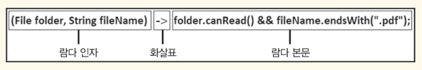
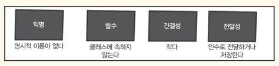

<!-- Date: 2025-01-10 -->
<!-- Update Date: 2025-01-10 -->
<!-- File ID: 010702aa-dcb1-4deb-baf4-1c7c08d2ecc8 -->
<!-- Author: Seoyeon Jang -->

# 개요

람다식을 분해해보면 다음 세가지 핵심 요소로 구성된다.


- 화살표 왼쪽은 람다 본문에 쓰일 람다의 인자다. **FilenameFilter 의 accept(File folder, String fileName)** 메서드의 인자들이다.
- 화살표 오른쪽은 람다 본문으로서 위 예제의 경우 파일이 들어있는 폴더를 읽을 수 있는지, 파일명이 .pdf 접미사로 끝나는지 확인한다.
- 화살표는 람다 인자와 본문의 구분자다.

위 람다식을 익명 클래스로 나타내면 다음과 같다.

```java
FilenameFilter filter = new FilenameFilter() {
    @Override
    public boolean accept(File folder, String fileName) {
        return folder.canRead() && fileName.endsWith(".pdf");
    }
};
```

람다와 람다의 익명 클래스 버전을 비교해보면 메서드에 인수로 전달하거나 변수로 저장할 수 있는 간결한 익명함수를 람다식이라고 결론지을 수 있다.
다음 네가지 단어로 람다식을 설명할 수 있다.


람다는 동작 매개변수화라는 큰 장점을 제공한다.

# 정리


