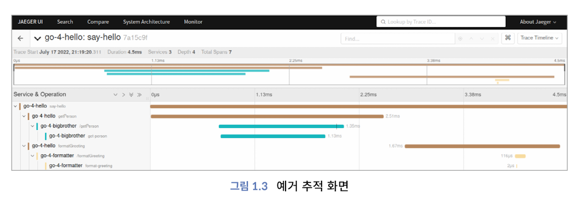

<!-- Date: 2025-02-15 -->
<!-- Update Date: 2025-02-15 -->
<!-- File ID: ced48ca5-5e7f-4ca6-a9a2-a6294ea0be32 -->
<!-- Author: Seoyeon Jang -->

# 📌 관측 가능성 구성 요소

## 1. 메트릭
메트릭은 일정 시간 동안 측정된 데이터를 집계하고 이를 수치화한다. 예를 들어 큐의 대기 메시지 개수, 사용중인 CPU와 메모리의 크기, 서비스에서 초당 처리하는 개수 등이 있다. 메트릭은 전체적인 시스템의 상태를 보고하는 데 특히 유용하며, 일반적으로 히스토그램 또는 게이지 등 차트를 통해 시각적으로 표현한다. 애플리케이션에서 기본으로 제공해주는 메트릭 외에 커스텀 메트릭이 필요한 경우가 있다. 이를 위해서 계측 API와 SDK를 사용해서 커스텀 메트릭을 개발할 수도 있다.

## 2. 로그
로그는 애플리케이션 실행 시 생성되는 텍스트 라인으로, 구조적인 JSON 형식이나 비구조적인 텍스트 형식으로 출력된다. 로그는 애플리케이션 에러와 경고를 확인하고, 문제점에 대한 정확한 원인을 이해하기 위해 필요하다.

## 3. 추적
메트릭과 로그는 이미 많이 사용되고 있는데 반해 추적(tracing)이라는 용어는 좀 생소할 수 있다. 추적은 마이크로 서비스가 시스템을 경유하며 **트랜잭션**을 처리하는 과정에서 발생하는 세부적인 정보를 보여준다. 또한, 트랜잭션이 시스템을 이동하는 경로, 트랜잭션을 처리하는 과정에서 발생하는 대기시간과 지연시간, 병목현상이나 에러를 일으키는 원인을 문맥(context)과 로그, 태그 등의 메타데이터에 출력한다.  

이제 이 책에서 다룰 메트릭, 로그, 추적에 대한 세부 내용을 살펴보자.

- `메트릭`에서는 시계열과 히스토그램 차트를 설명한다. 프로메테우스의 네가지 메트릭 유형 중에서 히스토그램이 특히 중요하다.
- `로그`에서는 오픈텔레메트리를 사용해서 구조화된 로그를 생성하는 방법에 대해 알아본다. 이 책에서는 오픈텔레메트리의 로깅을 사용해서 로그 표준화에 대해 상세하게 기술한다.
- `추적`에서는 콘텍스트 전파를 설명한다.

