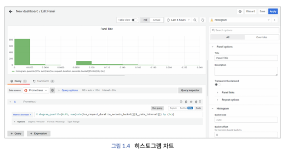
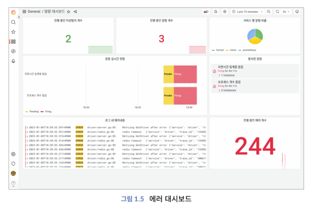
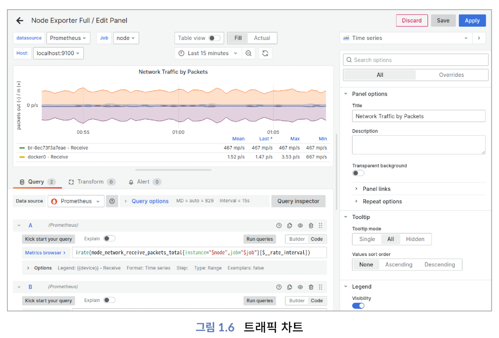

<!-- Date: 2025-02-15 -->
<!-- Update Date: 2025-02-16 -->
<!-- File ID: 38da811d-936b-44b0-9ed0-87522ea6bd46 -->
<!-- Author: Seoyeon Jang -->

<!-- TOC -->
* [📌 메트릭](#-메트릭)
  * [1. 가용성](#1-가용성)
  * [2. 구글의 골든 시그널](#2-구글의-골든-시그널)
    * [지연(latency)](#지연latency)
    * [에러](#에러)
      * [1. `hotrod_frontend_http_requests_total`](#1-hotrod_frontend_http_requests_total)
      * [2. `rate(metric[{{.window}}])`](#2-ratemetricwindow)
        * [3. `sum(rate(...))`](#3-sumrate)
    * [트래픽](#트래픽)
    * [예시 1: 웹서버 트래픽](#예시-1-웹서버-트래픽)
    * [예시 2: 데이터베이스 트래픽](#예시-2-데이터베이스-트래픽)
    * [포화](#포화)
<!-- TOC -->

# 📌 메트릭

## 1. 가용성

가용성은 시스템의 전반적인 상태와 정상 작동 여부를 거시적 관점에서 측정한다.

## 2. 구글의 골든 시그널

주요 지표는 가용성 외에도 지연과 에러가 있다. 구글 SRE팀에서는 메트릭을 수집할 때, 네가지 골든 시그널에 집중해야한다고 강조한다. 골든 시그널은 주로 네트워크에서 발생하는 이벤트와 많은 연관성이 있으며,
`지연`, `에러`, `트래픽`, `포화`가 있다.

### 지연(latency)

지연을 확인할 수 있는 차트는 다양하다. 시계열, 히트맵, 히스토그램 차트는 지연을 시각화할 수 있다. 다음은 그라파나에서 제공하는 히스토그램을 사용하여 지연시간의 분포를 시각화한 것으로, 다양한 유형의
PromQL로 지연을 계산할 수 있다.



사용자가 지연을 자주 경험하면 시스템이 정상적이지 않다는 것을 추론할 수 있다. 지연은 잠재적인 장애를 예측할 수 있는 유용한 신호로, 서비스 요청 후 완료까지 걸리는 시간을 측정한다. 지연이 증가하면 서비스 품질이
저하되는 것을 예측할 수 있다. 1초의 지연을 포함하는 정상응답과 60초의 지연을 포함하는 정상 응답을 동일하다고 판단할 수 없다. 60초 지연은 에러로 판단하거나 타임아웃으로 에러 처리를 하는 것이 현명하다.

### 에러

에러라고 판단할 수 있는 기준이 불분명한 경우가 많으므로 에러(error)의 기준을 명확히 설정한다. USE(Utilization Saturation and Errors)대시보드 외에도 이상치와 에러를 포함한 별도의
**대시보드**를 생성해야 한다.



위 그림은 에러를 출력하고 알람과 연계되는 대시보드의 예를 나타낸 것이다. **단순히 에러의 목록을 출력하는 것뿐만 아니라, 추가적인 기능을 제공**한다.

- 각 에러는 추적 ID와 연결되어 있다. 추적 화면을 통해 보다 상세한 근본 원인을 분석할 수 있다.
- 다양한 유형의 에러를 포함한다. 이상탐지, 인프라, 애플리케이션에서 발생하는 다양한 유형의 에러가 서로 구분되어 출력된다.
- 에러는 세 가지 상태를 가지고 있다. 초기에는 정상(normal)이지만, 에러가 처음 발견되면 대기(pending)상태로 변한다. 에러가 계속 활성(active)상태를 유지할 경우에는 파이어링(firing)
  상태로 변하고, 알람을 전송한다. 에러 대시보드는 에러의 상태 변화를 **시계열**로 출력한다.

에러는 문제점과 에러 내용을 직접적으로 출력한다는 점에서 명시적이다. 하지만 애플리케이션 개발에는 수십 개 유형의 에러가 발생할 수 있다. 이를 분류하고 그룹화(상태코드 200, 500)하는 과정은 중의적이며,
개인의 경험에 따라서 다르게 판단할 수 있다. 즉 개발자와 운영자의 주관이 개입될 수 있는 여지가 크다는 것이다.

다음은 에러 SLO를 계산하는 프로메테우스 PromQL이다. 에러 SLO의 대시보드 제공과 더불어 알람과도 연계되어야 한다.

```text
sum(rate(hotrod_frontend_http_requests_total{status_code="4xx"}[{{.window}}])) 
/ 
sum(rate(hotrod_frontend_http_requests_total[{{.window}}]))
```

위 PromQL 쿼리는 "HotROD 프론트엔드 서비스의 4xx 에러율을 계산하는 쿼리"이다.

#### 1. `hotrod_frontend_http_requests_total`

- HotROD는 Uber의 마이크로서비스 데모 앱
- `hotrod_frontend_http_requests_total` -> HotROD 프론트엔드 서비스의 HTTP 요청 총 개수를 나타내는 프로메테우스 메트릭

#### 2. `rate(metric[{{.window}}])`

- rate(...): 지정된 시간(`{{.window}}`)동안의 초당 요청 비율을 계산한다.
- `[{{.window}}]`: 템플릿 변수로, 그라파나 대시보드나 Alertmanager에서 설정할 수 있는 가변 시간 창을 의미

##### 3. `sum(rate(...))`

- sum(...): 여러 개의 타임 시리즈 데이터를 총합한다
- 즉, `sum(rate(hotrod_frontend_http_requests_total[{{.window}}]))`는 모든 HTTP 요청의 초당 합계를 계산하는 역할을 한다.

위 쿼리는 대시보드(Grafana에서 HTTPt 4xx 에러율 모니터링)나 알람설정(4xx 에러율이 일정 기준(예: 5%)을 초과하면 Alertmanager에서 경고)에서 사용하면 된다. 위 쿼리는 멀티 윈도와 멀티
레이트를 지원한다.

> 윈도?
>
> 윈도는 일반적으로 초,분,시,일 간격으로 분할하는 것을 의미한다. 즉, 10분 간격의 윈도, 2시간 간격의 윈도를 생성해서 해당 윈도 기간 동안 집계 등의 작업을 수행한다. 이렇게 다양한 윈도를 생성해야하므로
> 멀티윈도라 한다. 기업은 다수의 SLO를 관리한다. 애플리케이션마다 가용성 99.99%와 처리속도 0.1초 이내 등 여러 개의 레이트를 관리하므로 멀티 레이트라고 칭한다.

### 트래픽

트래픽(traffic)은 발생하는 요청의 양을 뜻한다. 그것은 관찰되는 시스템의 유형, 초당 요청 수, 네트워크 입출력 등에 따라 다양하다.

### 예시 1: 웹서버 트래픽
- 초당 1,000개의 HTTP 요청이 발생하난 API 서버
- 요청당 10KB의 데이터를 전송

-> 트래픽의 주요 요소 = 초당 요성 수 + 네트워크 전송량

### 예시 2: 데이터베이스 트래픽
- 초당 500개의 쿼리가 실행됨
- 쿼리 결과로 평균 1MB의 데이터가 반환됨

-> 트래픽의 주요 요소 = 쿼리 요청 수 + 읽고 쓰는 데이터 크기

결론은, 트래픽이라는 개념은 단순한 요청 개수가 아니라, 시스템의 유형과 관련된 다양한 요소(요청 빈도, 데이터 크기 등)까지 포함하는 개념이라는 뜻이다.



네트워크 트래픽을 계산하는 프로메테우스 PromQL은 다음과 같다.

```text
irate(node_network_receive_packets_total{instance="$node",job="$job"[$__rate_interval]})
```

트래픽은 양이 적을 때는 문제가 없다. 하지만 양이 급격하게 많아지거나 임계치를 초과하거나 포화상태가 되면 지연과 에러가 발생하며, 최종적으로 장애에 이른다. 트래픽은 다른 신호와 연관성이 많은데, 지연과 에러가 발생하더라도 중단 없이 적정 수준의 트래픽을 처리할 수 있는 시스템을 구축하는 것이 클라우드 네이티브의 사상이다.

골든 시그널의 원칙은 트래픽의 증가에 따른 지연과 에러를 최소화하고 최종적으로 장애에 이르지 않도록 설계하는 것이다. 장애가 발생하더라도 사용자 서비스를 제공하기 위한 최소한의 트래픽은 처리해주는 것을 권고하고 있다.

### 포화
포화(saturation)는 리소스가 '현재 얼마나 채워졌는지'와 '얼마나 가득 채울 수 있는지'를 나타내는 것이다. 전체 총 대역폭과 처리 가능한 트래픽에 대비해서 현재 트래픽 혹은 대역폭이 어느 정도인지 이해할 수 있는 지표인 셈이다. 포화를 통해 향후 트래픽이 증가했을 경우에 이용 가능한 자원 총사용률을 예측할 수 있다. CPU, 메모리, 네트워크와 같이 제약이 큰 리소스에 주로 적용한다.

