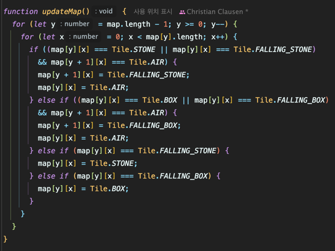

<!-- Date: 2025-02-16 -->
<!-- Update Date: 2025-02-16 -->
<!-- File ID: 17cd00fc-4734-439c-994f-e6cd954c4e49 -->
<!-- Author: Seoyeon Jang -->

# 📌 규칙: if 문은 함수의 시작에만 배치

## 정의
if 문이 있는 경우 해당 if 문은 함수의 첫번째 목록이어야 한다.

## 설명
이미 우리는 함수가 한 가지 일만 해야한다는 것을 안다. 무언가를 확인하는 것은 한가지 일이다. 따라서 함수에 if 가 있는 경우 함수의 첫 번째 항목이어야 한다. 또한 그 후에 아무것도 해서는 안된다는 의미에서 유일한 것이어야 한다. 

다음은 2에서 n까지의 수에서 소수를 출력하는 함수이다.
```typescript
function reportPrimes(n: number) {
    for (let i = 2; i < n; i++)
        if (isPrime(n))
            console.log(`${i} is prime`);
}
```

적어도 두 가지 분명한 작업이 존재한다.

- 숫자를 반복한다.
- 숫자가 소수인지 확인한다.

따라서 최소한 두 개의 함수가 있어야 한다.

```typescript
function reportPrimes(n: number) {
    for (let i = 2; i < n; i++)
        reportIfPrime(i);
}

function reportIfPrime(n: number) {
    if (isPrime(n)) {
        console.log(`${n} is prime`)
    }
}
```

무언가를 확인하는 것은 하나의 작업이며, 하나의 함수에서 처리해야 한다. 그래서 이 규칙이 필요하다.

## 스멜
다섯 줄 제한과 같이, 이 규칙은 함수가 한 가지 이상의 작업을 수행하는 스멜을 막기 위해 존재한다.

`updateMap` 함수에는 현재 함수 중간에 커다란 if 그룹이 있다.



함수의 중간에 떡하니 if 그룹이 있는데, 이를 함수로 빼기 위해서는 추출하려는 코드를 표면적으로 살펴봐야 한다. 이 그룹의 줄에는 map과 tile 이라는 단어가 두드러져보인다. 이미 updateMap이라는 함수를 가지고 있으므로 새로운 함수를 updateTile 이라고 하자.

```typescript
function updateMap() {
    for (let y = map.length - 1; y >= 0; y--) {
        for (let x = 0; x < map[y].length; x++) {
            updateTile(x, y);
        }
    }
}

function updateTile(x: number, y: number) {
    if ((map[y][x] === Tile.STONE || map[y][x] === Tile.FALLING_STONE) && map[y + 1][x] == Tile.AIR) {
        ...
    } else if {
        ...
    } else if {
        ...
    }
}
```

이제 updateMap은 다섯줄 제한을 지키게 되었다.

if 문은 이미 한 줄이고 이어진 else if 를 분리할 수 없다. 하지만 이를 위한 우아한 해결책이 있다.(타입코드 처리하기 메모 참고!)


