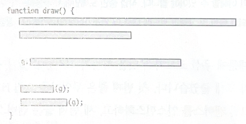
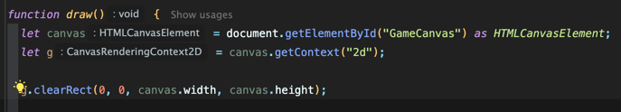

<!-- Date: 2025-02-09 -->
<!-- Update Date: 2025-02-09 -->
<!-- File ID: b89aa74f-a1a9-4df2-944e-739a6db6c613 -->
<!-- Author: Seoyeon Jang -->

# 정의

함수 내에서는 객체에 있는 메서드를 호출하거나 객체를 인자로 전달할 수 있지만 둘을 섞어서 사용해서는 안된다.

# 설명

더 많은 메서드를 도입하고 여러 가지를 매개변수로 전달하기 시작하면 결국 책임이 고르지 않게 될 수 있다. 예를 들어, 함수에서 배열에 인덱스를 설정하는 것과 같은 직접적인 작업을 수행하거나 동일한 배열을 더 복잡한
함수에 인자로 전달할 수도 있다. 그러면 해당 함수는 직접 조작하는 낮은 수준의 작업과 다른 함수에 인자로 전달하는 높은 수준의 호출이 공존해서 메서드 이름 사이의 불일치로 가독성이 떨어질 수 있다. **동일한
수준의 추상화를 유지하는 것이 코드를 읽기가 좋다.**

배열의 평균을 구하는 함수를 생각해보자. 이것은 높은 수준의 추상화 `sum(arr)`와 낮은 수준의 `arr.length` 를 모두 사용한다.

```typescript
function average(arr: number[]) {
    return sum(arr) / arr.length;
}
```

위 코드는 규칙에 위배된다. 배열의 길이를 찾는 것을 추상화한 더 좋은 구현이 있다.

```typescript
function average(arr: number[]) {
    return sum(arr) / size(arr);
}
```

# 규칙 적용


변수 g는 매개변수로 잔달되기도 하고 메서드를 호출하기도 한다. 즉 g는 현재 전달과 호출 모두에 사용되고 있다.



메서드 추출을 사용해서 이 규칙 위반을 수정해보자. 하지만 무엇을 추출할까? 코드에서 빈 줄로 구분된 g.clearRect 줄을 추출하면 결국 canvas를 인자로 전달하면서 canvas.getContext를
호출하게 돼서 다시 규칙을 위반하게 된다.

대신 처음 세 줄을 함께 추출해보자. 메서드 추출을 수행할 때마다 메서드 이름을 지어 코드를 읽기 더 쉽게 만들 수 있다. 이제 코드의 줄을 추출하기 전에 실제 좋은 이름은 무엇일지 생각해보자.

# 좋은 함수 이름의 속성

좋은 이름이 가져야 할 몇 가지 속성이 있다.

- 정직해야 한다. 함수의 의도를 설명해야 한다.

**우선 코드가 무엇을 하는지 고려해야 한다.** 첫번째 줄은 무언가를 그릴 HTML 엘리먼트를 가져오고, 두번째 줄은 무언가를 그릴 캔버스를 인스턴스화하고, 세번째 줄은 캔버스를 지운다. **간단히 말해, 이 세
줄은 그래픽 객체를 만든다.**

```typescript
// 변경 전
function draw() {
    let canvas = document.getElementById("GameCanvas") as HTMLCanvasElement;
    let g = canvas.getContext("2d");
    g.clearRect(0, 0, canvas.width, canvas.height);
...
}

```

```typescript
// 변경 후
function createGraphics() {
    let canvas = document.getElementById("GameCanvas") as HTMLCanvasElement;
    let g = canvas.getContext("2d");

    g.clearRect(0, 0, canvas.width, canvas.height);
    return g;
}

function draw() {
    let g = createGraphics();
    drawMap(g);
    drawPlayer(g);
}
```

빈 줄이 없어도 코드를 이해하기 쉽기 때문에 더 이상 빈줄이 필요하지 않은 것을 확인할 수 있다.

# 스멜

